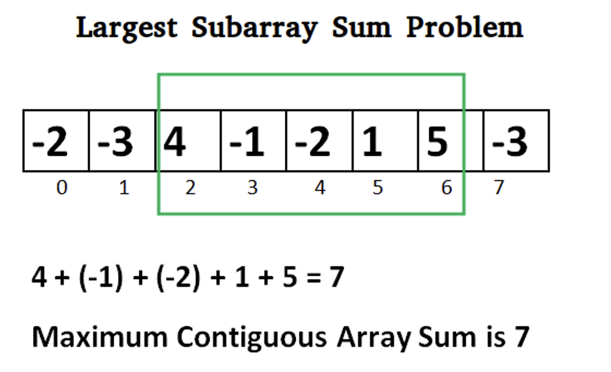

# 最大连续子段和，Largest Continuous Subarray Sum

- [`leet 53.` 最大子数组和](https://leetcode.cn/problems/maximum-subarray)
- [`luogo p1115.` 最大子段和](https://www.luogu.com.cn/problem/P1115)
- [`l4, u14, ex1.` 最大连续子段和](https://oj.youdao.com/course/13/82/1#/1/9465)

注意：子段是连续的



对比：[`leet 918.` 环形子数组最大和](../monotonic-stack-queue/单调队列-leet-918-环形子数组最大和.md)。918 是环形。同样用前缀和法，53 是求 `[0 .. i]` 范围内的最小前缀和，918 是求 `[i-n .. i]` 长度为 n 窗口的最小前缀和。前者打擂台即可，后者用单调队列方便。

多种方法：dp (Kadane's algorithm)、前缀和、分治

# dp 法（Kadane’s Algorithm）

`f[i]` 表示以第 `i` 个元素 `aᵢ` 结尾的最大子段和。

如果 `f[0], …, f[i-1]` 已有，如何计算 `f[i]`?

新增一个数 ai：
* 若 `f[i-1] > 0`，则把 ai 添加到当前子段里，`f[i] = f[i-1] + aᵢ` 可得最大值
* 若 `f[i-1] < 0`，则 `f[i-1] + aᵢ` 反而小于 ai，则从 ai 重新开始新子段更合算，此时 `f[i] = aᵢ` 是最大值

得到所有 `f[i]` 后，遍历一遍，找出其最大值，即为所求。
- 优化：每次得到一个 `f[i]` 后就打擂台，省去再遍历一遍。然后发现算 `f[i]` 只用到了前一个 `f[i-1]`，可只用一个变量，省去 `f[]` 数组。这样优化后，称为 <font color="green">Kadane’s Algorithm</font>。

问题：如果都是负数，答案是最大的负数，还是 0？取决于问题的定义。

```cpp
    int maxSubArray_dp(vector<int>& nums) {
        int dp = -1; // 考虑遍历到 nums 第 0 个元素时的取值
        int ans = INT_MIN;
        for (int i : nums) {
            dp = (dp < 0) ? i : dp + i;
            ans = max(ans, dp);
        }
        return ans;
    }
// 或，不用考虑 dp 和 ans 的初值
    int maxSubArray(vector<int>& nums) {
        int dp = nums[0];
        int ans = dp;
        for (int i = 1; i < nums.size(); i++) {
            dp = (dp < 0) ? nums[i] : dp + nums[i];
            ans = max(ans, dp);
        }
        return ans;
    }
```

# 前缀和法

基本思路：

```cpp
按定义，
    sum[i .. j] = psum[j] - psum[i]
则：在 j 固定时，
    max{ sum[i .. j] } = psum[j] - min{ psum[i] }, ∀ i ∈ [0, j-1]
```

代码
```cpp
// 朴素前缀和
    // s[0] = 0
    // s[1] = a0
    // s[i] = a0 + a1 + ... + a[i-1] = s[i-1] + a[i-1]
    // sum[i .. j] = s[j+1] - s[i]. i:[0-j], i=0 也适用
    int maxSubArray(vector<int>& nums) {
        int n = nums.size();
        vector<int> s(n + 1);
        s[0] = 0;
        for (int i = 0; i < n; i++) {
            s[i + 1] = s[i] + nums[i];
        }
        int minps = INT_MAX;
        int ans = INT_MIN;
        for (int j = 0; j <= n - 1; j++) {
            minps = min(minps, s[j])
            int ansj = s[j + 1] - minps; // s[j+1] - min{s[i]}, ∀ i ∈ [0-j]。该范围不包括 j+1
            ans = max(ans, ansj);
        }
        return ans;
    }

// 或：滚动式前缀和，逻辑更清晰的版本。
// 与上面非滚动版本更新 minps、ps 的顺序一致。可认为是非滚动代码直接翻译过来的。
// 初值：ps 必须为 0 (ps[0])，因后续不是比较而是累加。
// 循环体内，
//   先更新 minps。此时 ps 不含 i，即 ps 不含 nums[j+1]，故 minps 是 ps[0 .. j] 里最小的，
//   符合公式里 min 的范围。
//       s[j+1] - min{s[i]}, ∀ i ∈ [0-j]
//   然后更新 ps，此时 ps 含 i，即 ps 含 nums[j+1]，ps 实为 ps[j+1] = sum[0 .. j]。
    int maxSubArray(vector<int>& nums) {
        int ps = 0; // 前缀和 s[0]
        int minps = INT_MAX; // 最小前缀和
        int ans = INT_MIN;
        for (int i : nums) { // j: 0 ~ n-1
            minps = min(minps, ps); // ps[0 .. j] 里最小的
            ps += i; // ps[j+1] = sum[0 .. j]
            ans = max(ans, ps - minps);
        }
        return ans;
    }

// 或：滚动式前缀和，较绕的版本，与上面非滚动版本更新 minps、ps 的顺序略有不同。
    int maxSubArray_running_prefix_sum(vector<int>& nums) {
        int ps = 0; // 前缀和 s[0]
        int minps = ps; // 最小前缀和
        int ans = INT_MIN;
        for (int i : nums) { // j: 0 ~ n-1
            ps += i; // ps[j+1] = sum[0 .. j]
            ans = max(ans, ps - minps); // 注意，此时 ps 包含了 i，而 minps 没包含 i
            minps = min(minps, ps);
        }
        return ans;
    }
```

# 分治法

将大问题拆分成更小且相似的子问题，通过递归解决这些子问题，最终合并子问题的解，以得到原问题的解。

关键在于“递归函数”的入参、返回值的设计。

左右下标 l 和 r 必然会作为函数入参，表示当前所处理的区间，也就是小问题的范围。

对于本题，仅将最大子数组和（答案）作为返回值并不足够，因为单纯从小区间的解无法直接推导出大区间的解，我们需要一些额外信息来辅助求解。

具体地，返回值为四元组，分别代表：区间和、前缀最大值、后缀最大值、最大子数组和，用 `struct {sum, prefix_sum_max, postfix_sum_max, sub_array_sum_max }` 表示。

分治，根据当前区间 `[l, r]` 长度，分情况讨论：
- 若 `l == r`，只有一个元素，区间和为 `nums[l]`，最大子数组和、前缀最大值、后缀最大值，由于允许“空数组”，因此均为 `max(nums[l], 0)`。
- 若 `l < r`，当前问题划分为两个子问题，分别求解，再合并子问题的解。两个子问题分别处理区间 `lr:[l, mid]` 和 `rr:[mid + 1, r]`。

如何用“子问题”的解合并成“原问题”的解：

- 合并区间和 sum： 当前问题的区间和等于左右两个子问题的区间和之和，即 sum = lr[0] + rr[0]。
- 合并前缀和最大值 prefix_sum_max：可以是左子问题的前缀最大值，或者左子问题的区间和加上右子问题的前缀最大值。即 `this.prefix_sum_max = max(lr.prefix_sum_max, lr.sum + rr.prefix_sum_max)`。
- 合并后缀和最大值 postfix_sum_max：可以是右子问题的后缀最大值，或者右子问题的区间和加上左子问题的后缀最大值。即 `this.post_sum_max = max(rr.postfix_sum_max, rr.sum + lr.postfix_sum_max)`。
- 合并最大子数组和 sub_array_sum_max：可能出现在左子问题、右子问题，或跨左右两个子问题的边界。因此，sub_array_sum_max 可以通过 `max(lr.sub_array_sum_max, rr.sub_array_sum_max, lr.postfix_sum_max + rr.prefix_sum_max)` 来得到。

一些细节：计算 prefix_sum_max, post_sum_max, sub_array_sum_max 时，允许数组为空，而答案要求子数组至少含一个元素。因此，若 nums 全为负数，上述算法错误地得出最大子数组和为 0 的答案。针对该情况，特殊处理，遍历一遍 nums，若最大元素为负数，直接返回其值。

是不是很像 segment tree?

```cpp
    struct my_range {
        int sum; // 区间和
        int prefix_sum_max; // 前缀最大值
        int postfix_sum_max; // 后缀最大值
        int sub_array_sum_max; // 最大子数组和
    };
    my_range dfs(vector<int>& nums, int l, int r) {
        if (l == r) {
            int t = max(nums[l], 0);
            return {nums[l], t, t, t};
        }
        // 划分成两个子区间，分别求解
        int mid = l + (r - l) / 2;
        my_range lr = dfs(nums, l, mid), rr = dfs(nums, mid + 1, r);
        // 组合左右子区间的信息，得到当前区间的信息
        return {
            lr.sum + rr.sum, // 当前区间和
            max(lr.prefix_sum_max, lr.sum + rr.prefix_sum_max), // 当前区间前缀最大值
            max(rr.postfix_sum_max, rr.sum + lr.postfix_sum_max), // 当前区间后缀最大值
            max({lr.sub_array_sum_max, rr.sub_array_sum_max, lr.postfix_sum_max + rr.prefix_sum_max}) // 最大子数组和
        };
    }
    int maxSubArray(vector<int>& nums) {
        int m = *max_element(nums.begin(), nums.end());
        if (m <= 0) {
            return m;
        }
        return dfs(nums, 0, nums.size() - 1).sub_array_sum_max;
    }
```
