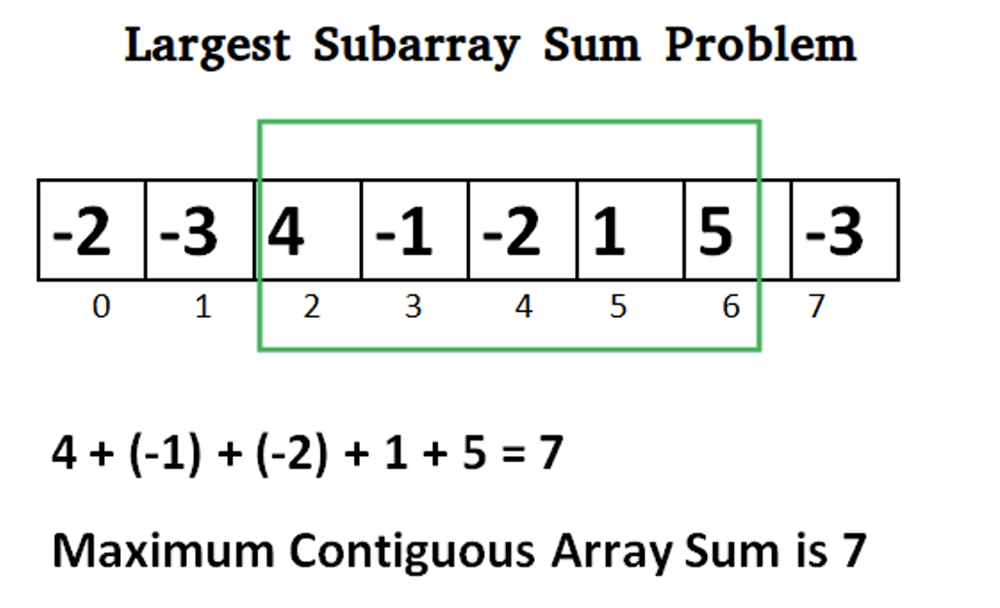

# 动态规划，最大连续子段和，Largest Continuous Subarray Sum

* [L4, u14 动规入门 2, ex1: 最大连续子段和](https://oj.youdao.com/course/13/82/1#/1/9465)
* [leetcode 53. 最大子数组和](https://leetcode.cn/problems/maximum-subarray/)

注意：子段是连续的



# 动态规划法

f[i] 表示以第 i 个元素 ai 结尾的最大子段和。

如果 f[0], …, f[i-1] 已有，如何计算 f[i]? 

新增一个数 ai：
* 若 `f[i-1] > 0`，则把 ai 添加到当前子段里，`f[i] = f[i-1] + ai` 可得最大值
* 若 `f[i-1] < 0`，则 `f[i-1] + ai` 反而小于 ai，则从 ai 重新开始新子段更合算，此时 `f[i] = ai` 是最大值

得到所有 f[i] 后，遍历一遍，找出其最大值，即为所求。
* 优化：每次得到一个 f[i] 后就打擂台，省去再遍历一遍。然后发现算 f[i] 只用到了前一个 f[i-1]，可只用一个变量，省去 f[] 数组。

问题：如果都是负数，答案是最大的负数，还是 0？取决于问题的定义。

```cpp
int maxSubArray_dp(vector<int>& nums) {
    int dp = nums[0];
    int ans = dp;
    for (int i = 1; i < nums.size(); i++) {
        dp = (dp < 0) ? nums[i] : dp + nums[i];
        if (ans < dp) {
            ans = dp;
        }
    }
    return ans;
}
```

# 前缀和法

基本思路：
```cpp
按定义，sum[i,j] = psum[j] - psum[i]
则：max{sum[i,j]} = psum[j] - min{psum[i]}
```
代码
```cpp
// 前缀和
// s[0] = 0
// s[1] = a0
// s[i] = a0 + a1 + ... + a[i-1] = s[i-1] + a[i-1]
// a[j] + ... + a[i] = s[i+1] - s[j]. j:[0-i], j=0 也适用 
int maxSubArray(vector<int>& nums) {
    vector<int> s(nums.size() + 1);
    s[0] = 0;
    for (int i = 1; i <= nums.size(); i++) {
        s[i] = s[i - 1] + nums[i - 1];
    }
    int minps = s[0];
    int ans = nums[0];
    int ansj = s[0]; // 到目前为止的前缀和的最大值
    for (int j = 0; j < nums.size(); j++) {
        if (minps < s[j]) {
            minps = s[j];
        }
        ansj = s[j + 1] - minps; // s[j+1]-min{s[j]}, j:[0-j]
        if (ans < ansj) {
            ans = ansj;
        }
    }
    return ans;
}
```

# Kadane’s Algorithm

<font color="red">to check later</font>

* https://www.geeksforgeeks.org/largest-sum-contiguous-subarray/
* https://www.interviewbit.com/blog/maximum-subarray-sum/

```cpp
    max_curr = a[0];
    begin_curr = 0, end_curr = 0;
    max_so_far = a[0];
    begin_so_far = 0, end_so_far = 0;
    
    for (int i = 1; i < n; i++) {
        max_curr = (max_curr < 0) ? a[i] : (max_curr + a[i]);
        if (max_curr > max_so_far) {
            max_so_mar = max_cur;
        }
    }
```

如何记住起始位置？
