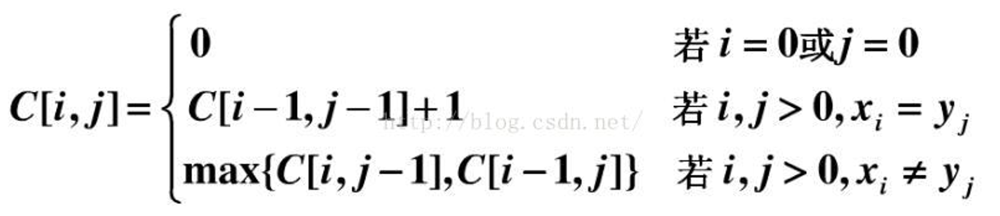

# 最长公共子序列 (Longest Common Sub-sequence, LCS)

注意，子序列不一定是连续的。


# 朴素 dp 方法

* [L4, u14:动规2, 题3:最长公共子序列](https://oj.youdao.com/course/13/82/1#/1/9467)
* [leetcode 1143. 最长公共子序列](https://leetcode.cn/problems/longest-common-subsequence/)

设 `dp[i][j]` 表示 `s[1..i]` 和 `t[1..j]` 的最长公共子序列（从 1 算起；下标 0 作为初值），则答案为 `dp[s.size()][t.size()]`。

三种情况：
* 若 s[i] != t[j]，则 s[i]、t[j] 两者不可能同时出现在公共子序列中，取下面两种中较大的
  * 若 s[i] 不在公共子序列中，则 `dp[i][j] = dp[i-1][j]`
  * 若 t[j] 不在公共子序列中，则 `dp[i][j] = dp[i][j-1]`
* 若 s[i] == t[j]，则 s[i]、d[j] 是公共子序列的最后一个元素，`dp[i][j] = dp[i-1][j-1] + 1`
  * <font color="red">存疑：若 s[i] 或 t[j] 不在公共子序列中呢？换言之，`dp[i][j]` 是否是上面三个的最大值？</font>

初值：`dp[0][j] = 0`，`dp[i][0] = 0`。



显然时间复杂度为 O(n^2)。

```cpp
    int longestCommonSubsequence(string text1, string text2) {
        int m = text1.length(), n = text2.length();
        int dp[m + 1][n + 1];
        for (int i = 0; i <= n; i++) {
            dp[0][i] = 0;
        }

        for (int i = 1; i <= m; i++) {
            dp[i][0] = 0; // 初始化首列
            for (int j = 1; j <= n; j++) {
                if (text1[i - 1] == text2[j - 1]) {
                    dp[i][j] = dp[i - 1][j - 1] + 1;
                } else {
                    dp[i][j] = max(dp[i - 1][j], dp[i][j - 1]);
                }
            }
        }
        return dp[m][n];
    }
```

# 优化：LCS 转成 LIS 问题，并使用优化解法

* [l5, u16: dp进阶2, ex3: 最长公共子序列](https://oj.youdao.com/course/37/285/1#/1/14239)
* [acwing 3510. 最长公共子序列](https://www.acwing.com/problem/content/3513/)

上述朴素 dp 解法，是 O(n^2) 的，会被 10^5 卡死。本改进可以做到 O(nlogn)。

<font color="brown">前提：两个序列中，至少有一个是没有重复元素的。</font>

- 步骤1. 用 map，转换，把 LCS 问题转成 LIS 问题
- 步骤2. 使用优化的 LIS 问题解法（贪心 + 二分）

去除只在某一个序列中出现的元素。（很好理解：公共子序列中的元素，肯定要出现在两个序列中。只在某个序列中出现的元素，肯定不会出现在结果中，直接去掉，也不会影响结果）

假设每个序列都没有重复元素。例如，s: [3, 2, 1, 4, 5], t: [1, 4, 3, 5, 2]。

称没有重复元素的序列为 s。把 s 的各元素，映射成其下标。s -> A: [1, 2, 3, 4, 5]。本质上，是用抽象的“第几个元素”代替了具体的元素值，而且是严格单调递增的。

把另一个序列 t（可以有重复元素）中的各元素，也用 s 中的下标表示。t -> B: [3, 4, 1, 5, 2]。

映射之后的两个新序列，其公共子序列也是 A 的子序列，所以也是严格递增的。只要 B 的某个子序列是递增的，它就也是 A 的子序列。哪个最长呢？自然是 B 的 LIS。

所以问题转变成求 B 的 LIS。其优化的 O(nlogn) 方法见 [这个文档](最长递增子序列-LIS-01-综述.md)，这里不重复。

注意，s、t 可能是任意数据类型，但映射后的 A、B 序列肯定是 int 类型的，因为存放的是下标值，是该元素在 s 中的下标。若 s、t 序列不是 int 类型的，则 A 只能用 unordered_map；若 s、t 是 int 类型的，则 A 可以用数组（当然要知道数据范围），省时间。

代码
* A 用 unorderes_map: [lcs-via-lis-l5-u16-ex3.cpp](code/lcs-via-lis-l5-u16-ex3.cpp)
* A 用数组: [lcs-via-lis-l5-u16-ex3-array.cpp](code/lcs-via-lis-l5-u16-ex3-array.cpp)

核心代码

```cpp
// 求序列 p、q 的最长公共子序列的长度

//// 法 1：A 使用 unordered_map。标记 x 的行是与法 2 不同的。
x   unordered_map<int, int> mp; // 第一个是 p、q 的类型，第二个是 int 类型，存放下标
    int b[n]; // 必须是 int 类型，存放的是下标

    for (int i = 0; i < n; i++) {
        mp[p[i]] = i;
    }
    int m = 0; // 记录 b 的长度。去掉 p 中不存在的元素。
    for (int c : q) {
x       if (mp.count(c) != 0) {
            b[m++] = mp[c];
        }
    }

//// 法 2：A 使用数组。标记 x 的行是与法 1 不同的。
x   int mp[(int) 1e6 + 1]; // int 类型，存放下标
    int b[n]; // 必须是 int 类型，存放的是下标

x   memset(mp, -1, sizeof mp); // mp[i] < 0，表示 p 序列中不存在元素 i
    for (int i = 0; i < n; i++) {
        mp[p[i]] = i;
    }
    int m = 0; // 记录 b 的长度。去掉 p 中不存在的元素。
    for (int c : q) {
x       if (mp[c] > 0) {
            b[m++] = mp[c];
        }
    }

// 至此完成映射，问题转换为求序列 b 的 LIS 长度。下面的 LIS 代码对法 1、法 2 都适用。
    if (m == 0) {
        return 0;
    } // 没有公共元素，直接返回 0。另，若不返回，下面定义 int f[0] 会出错。

    int f[m]; // f[i]: 长度为 i+1 的 LIS，结尾的元素
    int llen = -1;
    for (int i = 0; i < m; i++) {
        if (llen < 0 || b[i] > f[llen]) {
            f[++llen] = b[i];
        } else {
            int j = lower_bound(f, f + llen + 1, b[i]) - f;
            f[j] = b[i];
        }
    }
    int ans = llen + 1;
```


