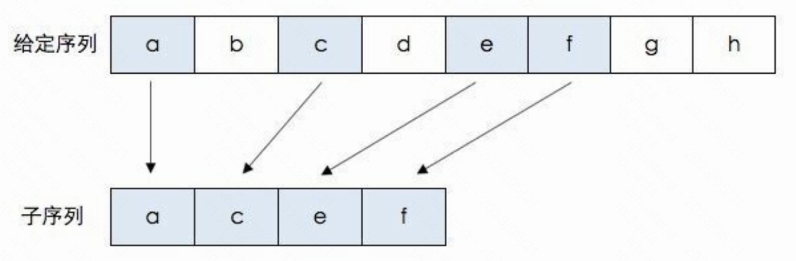

# 最长递增子序列，Longest increasing sub-sequence (LIS)

- [`leet 300.` 最长递增子序列](https://leetcode.cn/problems/longest-increasing-subsequence)

注意，子序列不一定是连续的。比如:



# 法一，朴素 dp，`O(n²)`

`f[i]`: 以第 i 个数结尾的 LIS 长度。i 从 0 开始。注意，不是 0~i 范围内的 LCS，必须是以 i 结尾的 LCS。

假设已经知道了 f[0], f[1], …, f[i]，如何计算 f[i + 1]？

分别看每个子序列
* 0 ~ 0 里的 LIS，再加上一个 i+1，是否构成了一个新的、更长的 LIS？
* 0 ~ 1 里的 LIS，再加上一个 i+1，是否构成了一个新的、更长的 LIS？
* 0 ~ 2 里的 LIS，再加上一个 i+1，是否构成了一个新的、更长的 LIS？
* …
* 0 ~ i 里的 LIS，再加上一个 i+1，是否构成了一个新的、更长的 LIS？

```cpp
    int lengthOfLIS(vector<int>& nums) {
        int n = nums.size();
        // f[i]: 以第 i 个元素结尾的 LIS 长度。i 从 0 开始。
        int f[n];
        int ans = 0;
        for (int i = 0; i < n; i++) {
            f[i] = 1;
            for (int j = 0; j < i; j++) {
                if (nums[i] > nums[j] && f[i] <= f[j]) { // num 更大、LIS 更短，则更新
                    f[i] = f[j] + 1;
                }
            }
            ans = max(ans, f[i]);
        }
        return ans;
    }
```

# 法二，优化 dp，贪心 + 二分搜索，`O(nlogn)`

`f[]` 数组，`f[i]` 表示：长度为 i 的 LIS 的结尾元素的最小值。对于上升子序列，显然其结尾元素越小，越有利于在后面接其他的元素，也就越可能变得更长。

`f[]` 是单调的，且「严格性」与 LIS 的「严格性」一致。若 LIS 严格上升，则 `f[]` 也严格单调上升。（证明略）

如何维护 `f[]` 数组
- `llen`: 表示当前最长的 LIS 长度。
- 若 `a[i] > f[llen]`，也就是 `a[i] > 当前最长 LIS 的结尾元素`，则 `a[i]` 可直接接在当前 LIS 结尾后，得到更长的 LIS，即 `f[++llen] = a[i]`。
- 否则，`a[i]` 不能接到当前最长 LIS 之后。在 `f[]` 里找第一个大于等于 (或「大于」，若所求 LIS 非严格递增) `a[i]` 的 `f[j]`。用 `a[i]` 更新 `f[j]`。（当然，若 `f[j] == a[i]`，相当于什么都没做）因为 `f[j-1] < a[i]`, `f[j] >= a[i]`。找的过程，因为 `f[]` 单调，故可用二分查找。
  - 若所求 LIS 是严格上升的，则 `f[]` 严格上升，用 `lower_bound()`；
  - 若所求 LIS 不是严格上升的，而是可以有相等元素，则 `f[]` 也不严格上升，则用 `upper_bound()`。
  - <font color="green">如何记忆：严格，则尽量更新前面的，故用 `lower`。</font>

为何严格上升用 `lower_bound()`？

```
以 3 6 3 2 4 为例。
a[0]:3, f[]:3，对应 LIS: [3]
a[1]:2, f[]:3,6，分别对应 LIS: [3], [3,6]
a[2]:3, lower_bound() 找到的是与 a[2] 相等的，f[] 的第一个 3，f[j]=a[i] 其实什么都没做。还是分别对应 LIS:[3], [3,6]
若用 upper_bound()，找到的是 f[] 中的 6，更新后，f[]:3,3，对应 LIS:[3], [3,3]。从后者可看出，找的是「非严格上升的」LIS。
```

<font color="red">重要！`f[]` 中的序列并不一定是正确的 LIS！只能得到长度，无法倒推得到序列！</font>

```
例：3, 1, 2, 5, 4, 5, 10, 7。f[] = {1,2,4,5,7}。f[] 恰好是LIS。

例：1, 4, 7, 2, 5, 9, 10, 3。f[] = {1,2,3,9,10}。f[] 不是 LIS。前面的可能已经被更新过了，不是当时决定后面的时的数据了。
```

<font color="red">to add pic</font>

实现时的几个选择：
* f 用数组或 vector。
* `f[i]` 对应的 LIS 长度是 `i` 还是 `i+1`。对应 `i` 更自然，但 `f[0]` 则无用，查找时 `lower_bound()` 的参数不能直接用 `f`，要用 `f+1`。
* `a[i] > f[最后]` 的情况，可以显式判断，也可以用 `lower_bound()` 涵盖，不单独处理。

c++ 代码的两个实现
* [`lis-dp-greedy-bsearch.cpp`](code/lis-dp-greedy-bsearch.cpp)。注意，`f[]` 用数组。按定义，`f[i]` 对应长度为 `i` 的 LIS，`f[0]` 无用，所以 `lower_bound()` 时查找的起点是 `f+1`。
* [`lis-dp-greedy-bsearch-vector.cpp`](code/lis-dp-greedy-bsearch-vector.cpp)，f 用 vector，处理上稍微简单一点，不用维护 llen（到目前为止，发现的 LIS 最长长度），最后直接用 `f.size()` 就行。此时，`f[i]` 对应长度为 `i+1` 的 LIS，而不是长度为 `i` 的 LIS。

`lower_bound()` 寻找时，结果 `j` 可能是「`llen` 之后」。
1. 若 f 用数组或 vector，空间预先开好，则直接给 `f[j]` 赋值也不会出错；
2. 若 f 用 vector，不预先开好空间，而是逐步 `push_back()` 扩大空间，则此时不能直接给 `f[j]` 赋值，需要分情况讨论。
再考虑到法 2 里 `f[i]` 对应「长度为 `i+1` 的 LIS ...」。所以，法 1 最方便。

关键代码三种，主要区别就是 `lower_bound()` 并更新 `f[]` 的写法：

```cpp
// f[] 用数组。f[0] 无用。用 lower_bound() 涵盖 a[i] > f[last] 的情况。
    int lis_greedy(char a[], int n) {
        char f[n + 1]; // f[i]: 长度为 i 的 LIS，结尾元素的最小值。f[0] 无用
        int llen = 0; // 到目前为止，发现的 LIS 最长长度
        for (int i = 0; i < n; i++) {
            int j = lower_bound(f + 1, f + llen + 1, a[i]) - f; // 所求 LIS 严格递增
            if (j > llen) {
                f[++llen] = a[i]; // 其实 llen+1 就等于 j
            } else {
                f[j] = a[i];
            }
        }
        return llen;
    }

// 上一种的优化。最佳方法。f[] 用数组。f[0] 无用。用 lower_bound() 涵盖 a[i] > f[last] 的情况。
    int lengthOfLIS(vector<int>& nums) {
        int n = nums.size();
        int f[n + 1]; // 长度为 i 的 LIS，结尾元素的最小值。下标从 1 开始，f[0] 无用。
        int llen = 0;
        for (int i = 0; i < n; i++) {
            int j = lower_bound(f + 1, f + llen + 1, nums[i]) - f;
            f[j] = nums[i];
            llen = max(llen, j);
        }
        return llen;
    }

// f 用 vector。f[i] 对应长度为 i+1 的 LIS。f[0] 有用。llen 可以用 f.size() 代替，但其实也没用到。
// 需显式判断是否 a[i] > f[last]。
    int lis_greedy(char a[], int n) {
        vector<char> f; // f[i]: 长度为 i+1 的 LIS，结尾元素的最小值。f[0] 有用。
        for (int i = 0; i < n; i++) {
            if (f.empty() || a[i] > f.back()) {
                // a[i] > f.back() 的情况，若在下面用 lower_bound()，则找到是 f.end()，不能直接赋值，故在此单独处理
                f.push_back(a[i]);
            } else {
                int j = lower_bound(f.begin(), f.end(), a[i]) - f.begin(); // LIS 严格递增。lower_bound() 不会返回 f.end()，可放心赋值
                f[j] = a[i];
                // 或 *lower_bound(f.begin(), f.end(), a[i]) = a[i];
            }
        }
        int llen = f.size();
        return llen;
    }
```

相关题目：[`1713.` 得到子序列的最少操作次数](leet-1713-得到子序列的最少操作次数.md)。这个题解没用 `lower_bound()`，而是自己实现了二分法。

这里有个讲解，可参考一下

https://leetcode.cn/problems/longest-increasing-subsequence/solutions/14796/dong-tai-gui-hua-she-ji-fang-fa-zhi-pai-you-xi-jia/

# 法三，树状数组维护

https://blog.csdn.net/lxt_Lucia/article/details/81206439


