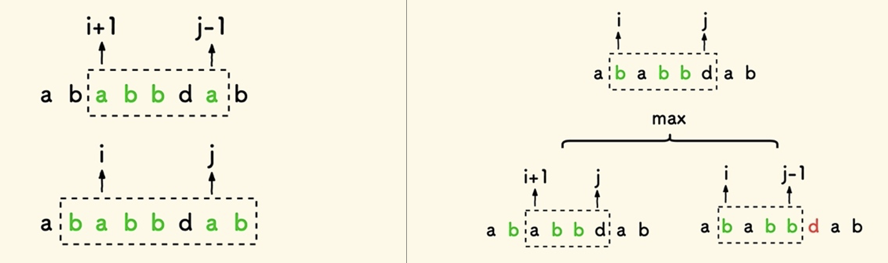
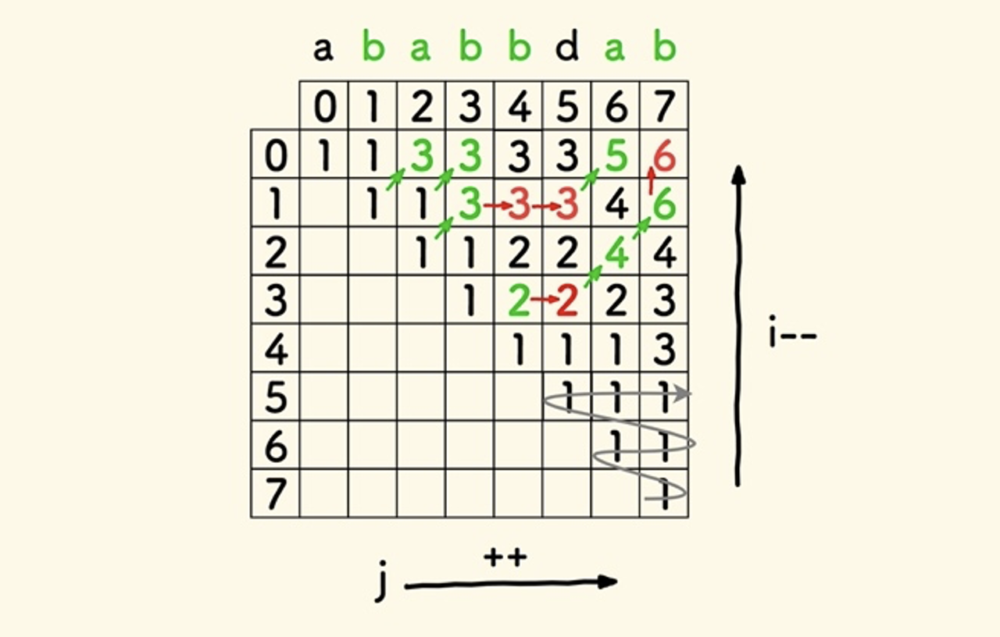

# 动态规划，最长回文子序列，Longest Palindromic Sub-sequence

有道L4-动规入门2-作业

* [l4, u14 动规入门 2, 作业 1: 最长回文子序列](https://oj.youdao.com/course/13/82/2#/1/9470)
* [leetcode 516. 最长回文子序列](https://leetcode.cn/problems/longest-palindromic-subsequence/)

子序列，可能不连续。最长回文子序列，简称 LPS。

dp[i][j] 表示：子串 s[i ... j] 内的 LPS 长度。注意，[i, j] 范围内，不要求以 i、j 结尾。

一、dp数组的递推关系



若子串的首尾两字符相同，则去掉这俩字符后的子串内的 LPS 长度比原来少 2。

即，若 `s[i] == s[j]`，则 `dp[i][j] = dp[i+1][j-1] + 2`。

若首尾两字符不同，则 LPS 要么全落在去掉结尾字符后的左子串内，要么全落在去掉开头字符后的右子串内。

此时 `dp[i][j] = max(dp[i+1][j], dp[i][j-1])`。

最终结果是 `dp[0][n-1]`，其中 n 是字符串长度。

二、遍历顺序

上面两式中，对于 i，要计算 `dp[i][.]`，要先知道 `dp[i+1][.]`。故，i 应逆序遍历。

同理，j 应正序遍历。注意边界条件，`j >= i`。

二维实际递推顺序如下图中箭头所示。



三、初始化

容易想到，任何一个子串的 LPS 长度至少是 1，故可初始化所有的 `dp[i][j] = 1`。

但这没用。递推公式的初始化，需要找到递推公式的起点并赋予初值。

考虑上面的递推公式，计算 `dp[i][j]` 可能需要它左方、左下方、正下方三个元素的值，如图：<font color="red">to do: add pic</font>

经观察，发现，对每行（每个i循环），需要给 `dp[i][i]` 和 `dp[i][i+1]` 赋值，j 初值从 i+2 开始，即可正常递推。

代码：
```c++
int lds(char* s) {
    int n = strlen(s);
    if (n == 0) {
        return 0;
    }
    int dp[n][n];
    for (int i = n - 1; i >= 0; i--) {
        // 这两句是初始化
        dp[i][i] = 1;
        if (i + 1 <= n – 1) {
            dp[i][i + 1] = (s[i] == s[i + 1] ? 2 : 1);
        }
        for (int j = i + 2; j <= n - 1; j++) {
            if (s[i] == s[j]) {
                dp[i][j] = dp[i + 1][j - 1] + 2;
            } else {
                dp[i][j] = max(dp[i][j - 1], dp[i + 1][j]);
            }
        }
    }
    return dp[0][n - 1];	
}
```

另一种初始化方式，要给 `dp[i][i]` 和 `dp[i][i-1]` 赋值，j 初值从 i+1 开始，即可正常递推。下面的代码中，标记 x 的行是不同的。

```cpp
int longestPalindromeSubseq(string s) {
    int n = s.length();
    if (n == 0) {
        return 0;
    }
    int dp[n][n];
    for (int i = n - 1; i >= 0; i--) {
        // 这两句是初始化
        dp[i][i] = 1;
x       if (i - 1 >= 0) {
x           dp[i][i - 1] = 0;
x       }
x       for (int j = i + 1; j <= n - 1; j++) {
            if (s[i] == s[j]) {
                dp[i][j] = dp[i + 1][j - 1] + 2;
            } else {
                dp[i][j] = max(dp[i][j - 1], dp[i + 1][j]);
            }
        }
    }
    return dp[0][n - 1];	
}
```

<font color="red">To add: 找出该序列<font>

https://writings.sh/post/algorithm-longest-palindromic-subsequence


