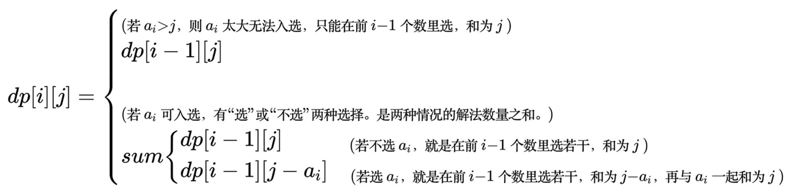

# 动态规划，子集和为某值，Subset sum

- [l4, u15, ex1. 小A点菜](https://oj.youdao.com/course/13/83/1#/1/9426)
- [luogu p1164. 小A点菜](https://www.luogu.com.cn/problem/P1164)

n 个数，可能有值相同。选若干，使其和为 sum。共多少种解法。

其实是个“恰好装满”的 01 背包问题。参考：[背包-1-01背包-恰好装满-分割等和子集](背包-1-01背包-恰好装满-分割等和子集-leet416.md)。状态转移方程基本一致。区别：本题是求方案数量，用加法；参考题是求是否可行，用逻辑或（也算某种加法）。

`dp[i][j]` 表示：前i个数（`1 .. i` 范围）里选若干个，和为 j，的解法数量。

`dp[n][sum]` 即为所求。

一、dp 数组的递推关系

考虑 `dp[i][j]`，第 i 数 ai 是否入选。



二、遍历顺序

i 正序遍历，j 也正序遍历。

三、初始化

从递推公式，发现 `dp[i][j]` 只依赖于上一行 `dp[i-1][.]` 而不依赖本行 `dp[i][.]`。

所以只需初始化首行即可，不用初始化每行首个元素。

`dp[0][j] = 0 (当 j!=0)`: 0 个数和为j，解法数量显然为 0。只有 `dp[0][0]=1`。

```cpp
// 2024.02.22 luogu ac

#include <cstdio>
using namespace std;

// n 个数 a[1 .. n]. 下标从 1 开始。a[0] 不用。
int sumset_sum(int a[], int n, int sum) {
    int dp[n + 1][sum + 1];
    dp[0][0] = 1;
    for (int j = 1; j <= sum; j++) {
        dp[0][j] = 0;
    }

    for (int i = 1; i <= n; i++) {
        for (int j = 0; j <= sum; j++) {
            if (j - a[i] >= 0) {
                dp[i][j] = dp[i - 1][j] + dp[i - 1][j - a[i]];
            } else {
                dp[i][j] = dp[i - 1][j];
            }
        }
    }
    return dp[n][sum];
}

int main() {
    int n, m;
    scanf("%d%d", &n, &m);
    int a[n + 1]; // 下标从 1 开始。a[0] 无用。
    for (int i = 1; i <= n; i++) {
        scanf("%d", &a[i]);
    }
    int ans = sumset_sum(a, n, m);
    printf("%d\n", ans);
    return 0;
}
```
