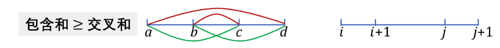
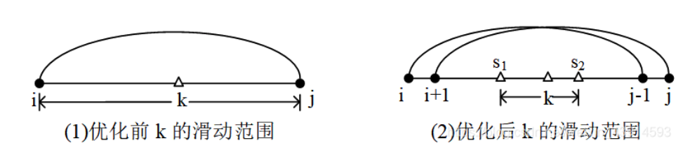

# 区间 dp 的四边形不等式优化
# Knuth-Yao speedup on range dp

https://blog.csdn.net/weixin_43914593/article/details/105150937

四边形不等式（quadrangle inequality）应用于DP优化，是一个古老的知识点。它起源于Knuth（高纳德）1971年的一篇论文1，用来解决最优二叉搜索树问题。1980年，储枫（F. Frances Yao，姚期智的夫人）做了深入研究2，扩展为一般性的DP优化方法，把一些复杂度 `O(n^3)` 的DP问题，优化为 `O(n^2)`。所以这个方法又被称为「Knuth-Yao DP Speedup Theorem」。

适用范围：状态转移公式类似这样的
```cpp
    dp(i,j) = min{ dp(i,k-1) + dp(k,j) } + w(i,j), 对 i ≤ k < j 范围内的所有 k 取 min.（min 也可以改为 max）
```
其中，`w(i,j)` 表示在转移时需要额外付出的代价。其时间复杂度为 `O(n^3)`。

#### 定义：区间包含的单调性

若对于 `i ≤ i' ≤ j ≤ j'`，有 `w(i', j) ≤ w(i, j')`，则称「函数 w 具有区间包含的单调性」。（形象理解：若小区间「包含」于大区间中，则小区间的 w 值不超过大区间的 w 值）



#### 定义：四边形不等式 quadrangle inequality

对于 `i ≤ i' < j ≤ j'`，若有 `w(i, j) + w(i', j') ≤ w(i', j) + w(i, j')`，称「函数 w 满足四边形不等式」。（形象理解：两个交叉区间的 w 的和，不超过小区间与大区间的 w 的和。「交叉 <= 包含」）

#### 「四边形不等式」的另一种定义

对于 `i < i+1 ≤ j < j+1`，若有 `w(i, j) + w(i+1, j+1) ≤ w(i, j+1) + w(i+1, j)`，称「函数 w 满足四边形不等式」。

这两个定义是等价的。

#### 引理一

若上述的 w 函数同时满足「区间包含单调性」和「四边形不等式」性质，则函数 dp 也满足四边形不等式性质。(w -> dp) 

记 `s(i,j) = k` 表示 `dp(i,j)` 取得最优值时对应的下标 k。optimal splitting point。

#### 引理二

若 `dp(i,j)` 满足四边形不等式，则 `s(i,j)`（自变量为 i、j 两个）单调，即 `s(i, j) ≤ s(i, j+1) ≤ s(i+1, j+1)`。

#### 从这两个引理得到的推论

若 w 函数满足「区间包含单调性」和「四边形不等式」，则有 `s(i, j-1) ≤ s(i, j) ≤ s(i+1, j)`。

注意到 s(i, j) 即为 k，则原来的状态转移方程可改写为：

```cpp
    dp(i,j) = min{ dp(i,k-1) + dp(k,j) } + w(i,j), 对 s(i,j-1) ≤ k ≤ s(i+1,j) 范围内所有 k 取 min
```



将 k 的枚举区间由 `[i, j-1]` 优化到了 `[s(i,j-1), s(i+1,j)]`。时间复杂度则由 `O(n^3)` 优化到了 `O(n^2)`。

# 模版代码

注意，其中 `k = opt[i][j-1]; k <= min(j-1, opt[i+1][j]); k++`。k 的上界为何要如此？按理说，`opt[i+1][j]` 是在 `[i+1 ... j-1]` 范围内的最佳分割点，不可能大于 `j-1`。但好像定义里，k 是在 `i<=k<=j` 范围内？<font color="red">to check later.</font>

```cpp
    int solve() {
        int N;
        ... // read N and input
        int dp[N][N], opt[N][N];

        auto C = [&](int i, int j) {
            ... // Implement w function C.
        };

        for (int i = 0; i < N; i++) {
            opt[i][i] = i; // 区间长度为 1 的情况
            ... // Initialize dp[i][i] according to the problem
        }

        // 区间 [i .. j] 长度至少为 2。
        for (int i = N-2; i >= 0; i--) { // i 逆序枚举
            for (int j = i+1; j < N; j++) {
                int mn = INT_MAX;
                int w = C(i, j);
                for (int k = opt[i][j-1]; k <= min(j-1, opt[i+1][j]); k++) { // k 的上界，注意取 min
                    if (mn >= dp[i][k] + dp[k+1][j] + w) {
                        opt[i][j] = k; 
                        mn = dp[i][k] + dp[k+1][j] + w; 
                    }
                }
                dp[i][j] = mn; 
            }
        }

        return dp[0][N-1];
}
```

# 经典例题：[luogu P1775 石子合并，每次两堆](https://www.luogu.com.cn/problem/P1775)

合并两堆，w 等于两堆数量之和 `sum[i ... j]`。w 显然满足单调性。简单推导可发现，其「交错和」==「包容和」，也满足平行四边形不等式。所以可以用此优化。

两种实现，枚举顺序不同。
- 先 i 逆序，再 j 正序：[`merge-stones-line-2-speedup.cpp`](code/merge-stones-line-2-speedup.cpp)
- 先 len 正序，再 (i,j) 正序：[`merge-stones-line-2-len-first-speedup.cpp`](code/merge-stones-line-2-len-first-speedup.cpp)

注意：
- 此种优化，跟枚举顺序无关。
- 两种实现，`s[][]` 和 `dp[][]` 下标都从 0 开始。优化时，k 的范围，注意 `k <= min(j-1, s[i+1][j])`。若无 min，则 luogu 上提交有若干 case 失败。奇怪的是，若下标从 1 开始，k 的范围就不用 min，直接 `k <= s[i+1][j]` 就行。<font color="red">to check later.</font>

核心代码如下。

(1) 先 i 逆序，再 j 正序。

```cpp
    int dp[n][n];
    int s[n][n];
    for (int i = 0; i < n; i++) {
        s[i][i] = i;
    }
    
    for (int i = n - 1; i >= 0; i--) {
        dp[i][i] = 0; 
        for (int j = i + 1; j <= n - 1; j++) {
            dp[i][j] = INT_MAX;
            for (int k = s[i][j - 1]; k <= min(j - 1, s[i + 1][j]); k++) {
                int t = dp[i][k] + dp[k + 1][j] + ps[j + 1] - ps[i];
                if (t < dp[i][j]) {
                    dp[i][j] = t;
                    s[i][j] = k;
                }
            }
        }
    }
    int ans = dp[0][n - 1];
```

(2) 先 len 正序，再 `(i,j)` 正序

```cpp
    int dp[n][n];
    int s[n][n];
    for (int i = 0; i < n; i++) {
        dp[i][i] = 0;
        s[i][i] = i;
    } // 处理 len = 1 的情况

    for (int len = 2; len <= n; len++) { // 枚举 len，从 2 开始
        for (int i = 0, j = i + len - 1; j <= n - 1; i++, j++) {
            dp[i][j] = INT_MAX;
            for (int k = s[i][j-1]; k <= min(j-1, s[i+1][j]); k++) {
                int t = dp[i][k] + dp[k + 1][j] + ps[j + 1] - ps[i];
                if (t < dp[i][j]) {
                    dp[i][j] = t;
                    s[i][j] = k;
                }
            }
        }
    }
    int ans = dp[0][n - 1];
```

# min vs. max

前面讨论的都是 min。若是max，则此时要满足「反」的「四边形不等式」，即「交叉和 >= 包含和」。

<font color="red">to add later</font>

# 一维决策单调性优化

类似这样的状态转移方程

```cpp
    f(i) = min{ f(j) + w(j, i) }, 对 0 ≤ j < i 范围内所有 j 取 min
```
​
若函数 w 满足四边形不等式，则可把 dp 计算 f(i) 的复杂度从 `O(n^2)` 优化到 `O(nlogn)`。

# 斜率优化

https://www.cnblogs.com/dx123/p/17383246.html
