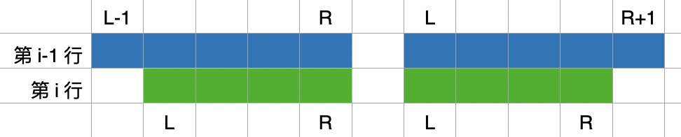

# 漏斗形选数

* [l5-u17-ex3. 漏斗形选数初级](https://oj.youdao.com/course/37/286/1#/1/14405)
* [l5-u17-ex4. 漏斗形选数进阶](https://oj.youdao.com/course/37/286/1#/1/14363)

# [l5-u17-ex3. 漏斗形选数初级](https://oj.youdao.com/course/37/286/1#/1/14405)

所有元素都是非负整数。所以，每行选的数要尽可能多。首行，选所有数；第二行，少选一个；第三行，再少选一个；依次类推。

状态定义 `dp[i][l][R]`：前 i 行（不是“第” i 行），其中第 i 行选了 `[L, R]` 区间，此时的最大总和。

可以简化一下：`dp[i][l]`：前 i 行，其中第 i 行选了“左端点为 L、长度 `m-i+1` 的区间”，此时的最大总和。

第 i 行一定选了 `m-i+1` 个数，故 `R = L+(m-i+1)-1`；随着 i 递增，长度递减。

`dp[i][.]` 如何从 `dp[i-1][.]` 得到？看下图，第 i 行的 [L, R] 范围，只能来自第 i-1 行的这两个区间之一，[L-1, R] 或 [L, R+1]，选其中较大的。

注意 `dp[i][.]` 表示的是“前 i 行的和”而不是“第i行的和”，则选了较大的之后，再加上第 i 行的 [L, R] 范围的和 `sum[L...R]`。



状态转移方程如下，其中用前缀和计算 `sum[L...R]`。
```cpp
dp[i][L] = max(dp[i - 1][L - 1], dp[i - 1][L]) + ps[R] - ps[L - 1];
```
两个滚动就行，不用很多 i。

完整代码：[funnel-01-l5-u17-ex3.cpp](code/funnel-01-l5-u17-ex3.cpp)

# [l5-u17-ex4. 漏斗形选数进阶](https://oj.youdao.com/course/37/286/1#/1/14363)

元素有些是负数。就麻烦了。

完整代码：[funnel-02-l5-u17-ex4.cpp](code/funnel-02-l5-u17-ex4.cpp)