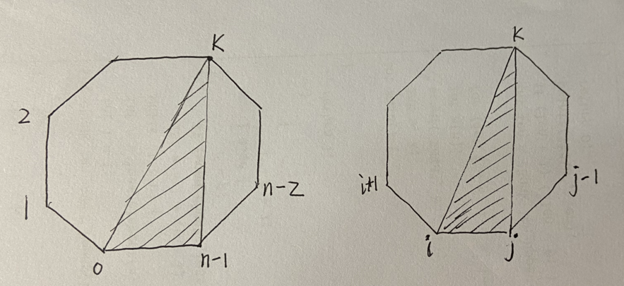

# [1039. 多边形三角剖分的最低得分](https://leetcode.cn/problems/minimum-score-triangulation-of-polygon/)

对于 `[0 ... n-1]` 顶点们组成的凸多边形，从中任选顶点 k，将 k 与首尾两个顶点 0 和 `n-1` 连线，分成三部分。



如左图，`[0 ... k]` 多边形、`[k ... n-1]` 多边形、这两者之间的三角形 `[0, k, n-1]`。

这个划分的妙处在于，k 与本区间的首尾两个顶点构成一个三角形，剩下的两个多边形，其顶点范围仍然是连续的，方便在每个范围内继续这样划分、推递推公式。

如右图，对 `[i ... j]` 顶点们组成的凸多边形，划分的范围是：`[i ... k]` 多边形、`[k ... j]` 多边形、`[i, k, j]` 三角形。

定义：`f(i,j)`：区间 `[i ... j]` 内三角剖分后的最小分数。

递推公式：`f(i,j) = min{ f(i,k) + f(k,j) + i*k*j }, 对所有可能的 k`

注意，`f(i,k)` 和 `f(k,j)` 这两段顶点都是连续的。如果不连续，中间跳过了哪个点，则 `f(k,j)` 的定义和计算方法就很可疑。

算 `f(i,j)` 时，要用到 `f(k,j)`，而 `k > i`。所以 i 需要逆序遍历，先算出 i 较大的各值。

初值：因为要求 min 值，所以先将所有元素初始化为 MAX。`j=i 或 i+1` 时，从划分三角形的角度看，并无意义，故 `f(i,i) = 0`, `f(i,i+1) = 0`。`f(i,i+2) = 三者的积`。要满足 `i<=j`；若 `i>j`，值无意义，不计算，也用不到。

代码：
```cpp
    int minScoreTriangulation(vector<int>& values) {
        int n = values.size();
        int dp[n][n];
        fill_n(&dp[0][0], n * n, INT_MAX);
        for (int i = n - 1; i >= 0; i--) {
            for (int j = i; j <= n - 1; j++) {
                if (j == i || j == i + 1) {
                    dp[i][j] = 0;
                } else if (j == i + 2) {
                    dp[i][j] = values[i] * values[i + 1] * values[j];
                } else {
                    for (int k = i + 1; k <= j - 1; k++) {
                        // dp[i][j] 在一开始初始化为 max，方便这里取 min()
                        dp[i][j] = min(dp[i][j], dp[i][k] + dp[k][j] + values[i] * values[k] * values[j]);
                    }
                }
            }
        }
        int ans = dp[0][n - 1];
        return ans;
    }
```

另法：先遍历长度，再遍历 i。i 不用逆序。

```cpp
    int minScoreTriangulation(vector<int>& values) {
        int n = values.size();
        int dp[n][n];
        fill_n(&dp[0][0], n * n, INT_MAX);
        for (int l = 0; l <= n; l++) {
            for (int i = 0, j = i + l; j <= n - 1; i++, j++) {
                if (j == i || j == i + 1) {
                    dp[i][j] = 0;
                } else if (j == i + 2) {
                    dp[i][j] = values[i] * values[i + 1] * values[j];
                } else {
                    for (int k = i + 1; k <= j - 1; k++) {
                        // dp[i][j] 在一开始初始化为 max，方便这里取 min()
                        dp[i][j] = min(dp[i][j], dp[i][k] + dp[k][j] + values[i] * values[k] * values[j]);
                    }
                }
            }
        }
        int ans = dp[0][n - 1];
        return ans;
    }
```

这两种方法，只有两行改动，对比一下：
```cpp
        for (int i = n - 1; i >= 0; i--) {
            for (int j = i; j <= n - 1; j++) {
// vs. 注意，j=i 或 i+1，对应 l=0 或 1，从划分三角形的角度看，并无意义
        for (int l = 0; l <= n; l++) {
            for (int i = 0, j = i + l; j <= n - 1; i++, j++) {
```
