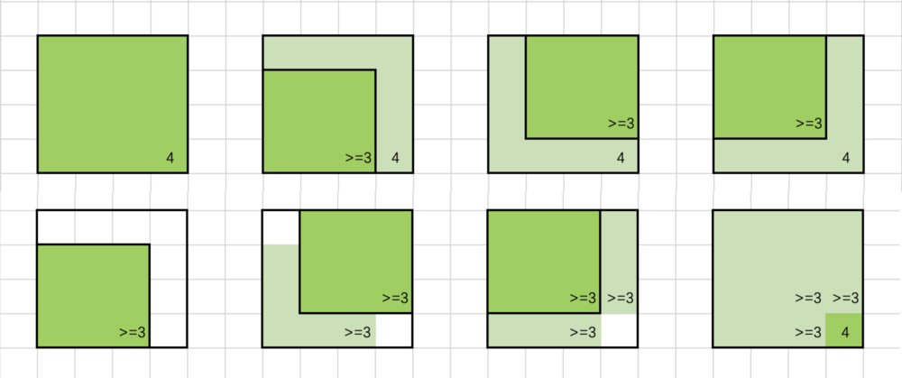

# [1277. 统计全为 1 的正方形子矩阵](https://leetcode.cn/problems/count-square-submatrices-with-all-ones/)
# [221. 最大正方形](https://leetcode.cn/problems/maximal-square/)

# 思路
f[i][j] 表示以 (i, j) 为右下角的正方形的最大边长。



如上半图，若对于位置 `(i,j)` 有 `f[i][j] = 4`，以 `(i,j)` 为右下角、边长为 4 的正方形涂上色，则可直观看出，其左上、左、上三个位置，均可作为一个边长为 `4-1=3` 的正方形的右下角；也就是说，这些位置的的 f 值「至少」为 3。

```cpp
    f[i][j-1]   ≥ f[i][j] - 1
    f[i-1][j]   ≥ f[i][j] - 1
    f[i-1][j-1] ≥ f[i][j] - 1
```
即，`min(..) ≥ f(i,j)-1` (式 1)

如下半图，换个角度，固定 `f[i][j]` 相邻位置的值，得到另外的限制条件。

设 `f[i][j-1]`，`f[i-1][j]` 和 `f[i-1][j-1]` 中的最小值为 3，也就是说，(i,j-1)，(i-1,j) 和 (i-1,j-1) 均可以作为一个边长为 3 的正方形的右下角。将这些边长为 3 的正方形上色，发现，如果位置 (i, j) 的元素为 1，那么它可以作为一个边长为 4 的正方形的右下角，f 值至少为 4，

`f(i,j) ≥ min(..) + 1` (式 2)

由式 (1)(2) 可得，`f(i,j) = min(..) + 1`。

<font color="red">to think more: [容斥原理](https://leetcode.cn/problems/number-of-ways-of-cutting-a-pizza/solutions/2387392/qie-pi-sa-de-fang-an-shu-by-leetcode-sol-7ik7/)能否用在这里？</font>

# 代码

两题代码基本一样，只有细微不同。

1277 代码，总共有多少这样的正方形

```cpp
    int countSquares(vector<vector<int>>& matrix) {
        int m = matrix.size(), n = matrix[0].size();
        vector<vector<int>> f(m, vector<int>(n));
        int ans = 0;
        for (int i = 0; i < m; ++i) {
            for (int j = 0; j < n; ++j) {
                if (i == 0 || j == 0) {
                    f[i][j] = matrix[i][j]; // 靠边，边长最多为 1，直接用方格里的值
                } else if (matrix[i][j] == 0) {
                    f[i][j] = 0;
                } else {
                    f[i][j] = min({f[i][j - 1], f[i - 1][j], f[i - 1][j - 1]}) + 1;
                }
                ans += f[i][j];
            }
        }
        return ans;
    }
```

221 代码，找最大正方形

```cpp
    int maximalSquare(vector<vector<char>>& matrix) {
        if (matrix.size() == 0 || matrix[0].size() == 0) {
            return 0;
        }
        int m = matrix.size(), n = matrix[0].size();
        vector<vector<int>> dp(m, vector<int>(n, 0));
        int maxl = 0;
        for (int i = 0; i < m; i++) {
            for (int j = 0; j < n; j++) {
                if (matrix[i][j] == '1') {
                    if (i == 0 || j == 0) {
                        dp[i][j] = 1;
                    } else {
                        dp[i][j] = min({dp[i - 1][j], dp[i][j - 1], dp[i - 1][j - 1]}) + 1;
                    }
                    maxl = max(maxl, dp[i][j]);
                }
            }
        }
        int ans = maxl * maxl;
        return ans;
    }
```
