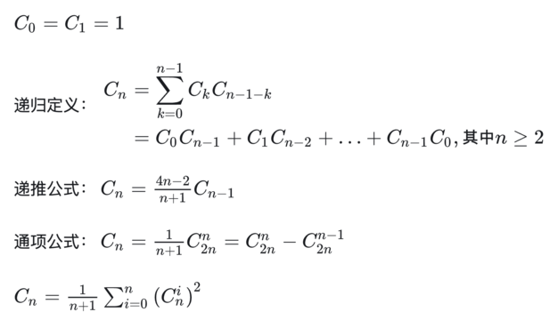
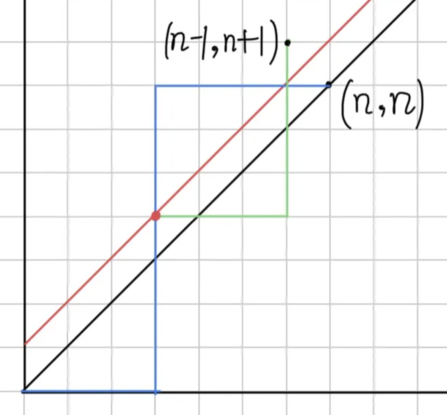
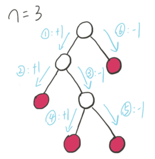
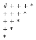

# 卡特兰数

# 定义

`C(n)`: n 个 +1、n 个 -1，构成的序列，任何位置的前缀和要 >= 0。也就是，任何位置，+1 的累计数量不少于 -1 的累计数量。这样的序列的个数，就是 `C(n)`。

这样的数，称为 Dyck word。

下标从 0 开始！

`c(0):1, c(1):1, 2, 5, 14, 42, 132, 429, 1430, 4862, 16796, 58786, 208012, 742900, 2674440, 9694845, 35357670 ...`



多种公式。若编程求解，显然递推公式 `f(n) = (4n-2)/(n+1) * f(n-1)` 最方便。

### ★ n 个数入栈后，可能的出栈顺序，有 `C(n)` 种。

#### 数学思路

每个数，都先进栈一次、再出栈一次。进栈记为 1 (in)，出栈记为 0 (out)。n 个数完整入栈、出栈序列，对应 n 个 1、n 个 0 组成的 2n 位序列。从左往右扫描，在任一位置，1 的个数不能少于 0 的个数。

在 2n 位中，填入 n 个 1，所有方案数为 `C(2*n, n)`。

不符合要求的序列，由左而右扫描时，必在某一奇数 2m+1 位上，首次出现 m+1 个 0、m 个 1。此后的 `2(n-m)-1` 位上，有 `n-m` 个 1、`n-m-1` 个 0。若把后面这 `2(n-m)-1` 位上的 0 和 1 互换，则，得到一个由 `n+1` 个 0 和 `n-1` 个 1 组成的 `2n` 位序列。即，一个不合要求的序列，对应一个由 n+1 个 0 和 n-1 个 1 组成的排列。

反过来，任何一个由 n+1 个 0 和 n-1 个 1 组成的 2n 位序列，由于 0 的个数多 2 个，2n 为偶数，故必在某奇数位上，首次出现 0 的累计数量超过 1 的累计数量。同样，在后面部分 0 和 1 互换，使其成为由 n 个 0 和 n 个 1 组成的 2n 位序列。即，n+1 个 0 和 n-1 个 1 组成的 2n 位序列，必对应一个不符合要求的序列。

所以，不符合要求的 2n 位序列，与 n+1 个 0、n-1 个 1 组成的 2n 位序列，一一对应。其数量为：`C(2*n, n-1)`。

故，符合要求的 2n 位序列，数量为 `C(2*n, n) - C(2*n, n-1)`。

#### 编程思路：dp

- [题解](luogu-p1044-栈的输出序列有多少种.md)

#### 编程思路：catalan number 递推

`f(i)` 表示 i 个数按 1~n 的顺序入栈且合法出栈的全部可能性。`f[0]=1`, `f[1]=1`。

设 x 为当前出栈序列的最后一个数字，则 x 有 n 种取值。由于 x 是最后一个出栈的，故可将已出栈的数分成两部分：
- 比 x 小，有 x-1 个，它们的全部出栈可能为 `f[x-1]`
- 比 x 大，有 n-x 个，它们的全部出栈可能为 `f[n-x]`

一个确定的 x 值能得到的所有可能性为上两项的乘积 `f[x-1]*f[n-x]`

由于 x 有 n 个取值，所以 `ans = f[0] * f[n-1] + f[1] * f[n-2] + ... + f[n-1] * f[0]`。

### ★ 在 `n×n` 网格中，从 `(0,0)` 出发去 `(n,n)`，每次可向上或向右走一格，始终不能越过对角线。有 `C(n)` 种合法路径。

 

思路一：这个限制条件，意思是，路径不能与 `y=x+1` 有交点，最多只能「碰到」`y=x`。若不考虑这个限制，共 `C(2*n, n)` 种路径。对于与 `y=x+1` 有交点的路径，把第一个交点（图中红色点）之后的路径沿 `y=x+1` 对称过去，可发现，每条与 `y=x+1` 有交点的路径，都唯一对应一条从 `(0,0)` 到 `(n-1,n+1)` 的路径，这样的路径共 `C(2*n, n-1)` 条。故，合法路径有 `C(2*n, n) - C(2*n, n-1)` 条。

思路二：往右走记为 `+1`，往上走记为 `-1`，则一条路就对应一个 n 个 `+1` 和 n 个 `-1` 的序列。需要保证，在任一时刻，前 k 步中，+1 的个数不少于 -1 的个数。这就是 Catalan 数的定义。

### ★ 括号匹配：有 n 个左括号，n 个右括号，使所有括号都能合法匹配的括号序列，有 `C(n)` 种

序列每一个前缀中，左括号数目不少于右括号数目。这是 catalan 数的直接定义。

另一种思路：第 0 个必定为左括号。若第 0 个与第 k 个匹配（k 为奇数，`0..k` 为偶数个）则 `1 .. k-1` 和 `k+1 .. 2n` 都是合法序列。若 `k=2i+1, i∈[0,n-1]`，则 k 对应的数目为 `f(2i)*f(2n-2i)`。对所有i，则为 `f(2n) = ∑f(2i)*f(2n-2i), ∀i∈[0,n-1]`。令 `g(i)=f(2i)`，则所求为 `g(n) = ∑g(i)*g(n-i), ∀i∈[0,n-1]`，就是 catalan 数的定义。

### ★ 多种括号匹配：长度为 n (n为偶数)、由 `"()[]{}"` 六种字符组成、并能合法匹配的序列的数量

只考虑括号匹配，共 `C(n/2)` 种。每对匹配的括号，有 3 种可能，故总共为 `C(n/2) * 3^(n/2)` 种。

### ★ n 个数连乘，乘法顺序，有 `C(n-1)` 种

例如，三个数，`(ab)c`、`a(bc)`，两种。

跟 1、0 序列建立映射关系。n 个数，对应 n-1 个 1、n-1 个 0 组成的序列。「当前」指针开始指向第一个数，1 表示「当前」指针右移一位，0 表示「当前」数与其左边的数相乘。显然得先右移，才能有「左边」供「当前」数相乘，所以 1 的数量不能少于 0 的数量。是 catalan 数的定义。

例如，abcd 四个数，`101100` 表示 `((ab)(cd))`。

### ★ n 个节点的二叉树，所有可能的形态数，为 `C(n)`。

任取一个节点为 root，其左边和右边的子节点数量就确定了。若根节点编号为 k，则左子树由 k-1 个节点构成，共 `f(k-1)` 种；右子树由 n-k 个节点构成，共 `f(n-k)` 种。两者需相乘。k 从 1 取到 n，求和。`∑f(k-1)*f(n-k), ∀k∈[1..n]`，变换一下，就是 `∑f(k)*f(n-1-k), ∀k∈[0 .. n-1]`，就是 catalan 的递归定义，所以答案为 `C(n)`。

### ★ 满二叉树（full，每个 node 有 0 个或 2 个 child），有 n 个内部节点（也就是 n+1 个叶节点、总共 2n+1 个节点），共有 `C(n)` 种形态。




用 dfs 遍历二叉树，往左记为 1，往右记为 0。每个内部节点对应 1、0 各一次，而且先 1 后 0。显然，任何时刻，1 的数量要不少于 0 的数量。

### ★ n 个节点的二叉树，给定先序遍历，其可能的形态有 `C(n)` 种

已知，前序序列和中序序列可以唯一确定一棵二叉树。把前序序列看作为入栈次序，把中序序列看作为出栈次序，相当于「给定入栈顺序，有多少种出栈顺序」。

### ★ 由 n 个节点组成、且节点值从 1 到 n 互不相同的二叉搜索树，有 `C(n)` 种。

参考 [leet-96-不同的二叉搜索树](leet-96-不同的二叉搜索树.md)

### ★ 凸 n+2 边形，只连接顶点对，用 n-1 条直线，每条直线不能相交，形成 n 个三角形，有 `C(n)` 种划分方式


正确思路：n 个顶点的凸多边形，任一条边，必属于某三角形，所以以某一条边为基准，将其两个顶点记为「起点」1、「终点」n。找其他任何一点 k，`2 ≤ k ≤ n`，构成一个三角形。用此三角形把整个凸多边形划分成两个凸多边形，分别由点 `[1 .. k]`、`[k+1 .. n]` 构成。`∑f(k)*f(n-k+1), ∀k∈[2 .. n-1]`，换元，`i=k-2`，得 `∑f(i)*f(n-i+1), ∀i∈[0 .. n-1-2]`，再换元，`m=n-2`，得到 `∑f(i)*f(m-1-i), ∀i∈[0 .. m-1]`，就是 `C(m) = C(n-2)`。（实际画一下，发现 `f(2) = 0`，不等于 `C(0)`。这是唯一不同的。）

对照 [`leet 1039.` 多边形三角剖分的最低得分](leet-1039-多边形三角剖分的最低得分.md)

另一种<font color="red">不正确的</font>思路：为啥中间要用个三角形分隔？很自然想到，完全可以用一条对角线分隔。设 n+2 个顶点，编号 1 ~ n+2，共 `f(n+2)` 种。连接 1 和 k，分成两部分。第一部分，k 个顶点，f(k) 种；另一部分，`n+2-k+2` 个顶点，`f(n+2-k+2)` 种。求和：`∑f(k)*f(n-k+2), 对满足 3≤k≤n+1 的所有 k 求和`。k 的范围，作为起点的 1、作为起点相邻的 2、n+2 不能选，所以是 `[3 .. n+1]`。初看挺对，仔细画图后发现，这种划分方式，必然有一条对角线经过顶点 1，遗漏了「1 无对角线经过」的情况。对比之下，上一种正确思路，确实是包括了这两种情况。几何问题还是有点神奇的。

### ★ 集合 `{1, 2, ..., 2n}` 的不交叉划分，数目 `C(n)`。

「不交叉划分」：两个区间 `[a,b]` 和 `[c,d]`，若「包含」或「相离」，则称它俩「不交叉」。

对于集合 `{1, 2, ..., 2n}`，将其元素两两分为一子集，共 n 个，若任两子集都不交叉，则称此时的划分为一个「不交叉划分」

将每个子集中较小的数用左括号代替，较大的用右括号代替，就变成了「括号合法配对」问题。

### ★ n 层的矩形阶梯，分为 n 个矩形，有 `C(n)` 种方法

 

以 n=5 为例，右图。每个切割出来的矩形，都必定包括一块边界上的 `*` 块。枚举每个 `*` 与 `#` 作为两个角的矩形，剩下的两个小阶梯，就是两个更小的子问题了。所以，`f5 = f0 * f4 + f1 * f3 + f2 * f2 + f3 * f1 + f4 * f0`，符合 catalan 的递归定义。

### ★ 不相交弦问题：圆周上有 2n 个点，两两配对，两点间连一条弦，使所得到的 n 条弦不相交，有 `C(n)` 种方法

或：平面上，连接可以形成凸包的 2n 个点，分成 2 个一组，连成 n 条线段，两两线段之间不相交，有 `C(n)` 种方法。

参考 [`leet 1259.` 不相交的握手](leet-1259-不相交的握手.md)。

### ★ standard Young tableaux: `[1, 2n]` 排成 `2*n` 矩形，每行、每列都上升，共 `C(n)` 种方式

或：高矮排队问题：2n 个高矮不同的人,排成两排,每排必须是从矮到高排列,而且第二排比对应的第一排的人高,问排列方式有多少种?

或：在一个2*n的格子中填入1到2n这些数值使得每个格子内的数值都比其右边和上边的所有数值都小的情况数

将 2n 个人从低到高排序。每个人，若放在第一排，标为 0；放在第二排，标为 1。两排构成一个 01 序列。画图，发现，为满足「每排都从低到高，且第二排比第一排对应的人高」，生成 01 序列在任意位置，0 的累计数都不能少于 1 的累计数。

### ★ 甲乙两人比赛乒乓球，最后结果为20∶20，问比赛过程中甲始终领先乙的计分情形的种数。

即甲在得到1分到19分的过程中始终领先乙

https://blog.csdn.net/u011080472/article/details/51162768

### ★ 饭后，姐姐洗碗，妹妹把姐姐洗过的碗一个一个放进碗橱摞成一摞。一共有n个不同的碗，洗前也是摞成一摞的，也许因为小妹贪玩而使碗拿进碗橱不及时，姐姐则把洗过的碗摞在旁边，问：小妹摞起的碗有多少种可能的方式？

答：得数是第n个卡特兰数Cn。

### ★ 一个汽车队在狭窄的路面上行驶，不得超车，但可以进入一个死胡同去加油，然后再插队行驶，共有n辆汽车，问共有多少种不同的方式使得车队开出城去？


### ★ 在图书馆一共6个人在排队，3个还《面试宝典》一书，3个在借《面试宝典》一书，图书馆此时没有了面试宝典了，求他们排队的总数？


### ★ 排队买票、找钱

n+m 个人排队买票，n > m。票价为 50 元。n 人各手持一张 50 元钞票，m 人各手持一张 100 元钞票。初始，售票窗口没有钱，一直需要买票者的 50 元来给 100 元找零。有多少种排队的顺序，能让大家都买到票。

要求，在任一位置，50 的累计次数都不小于 100 的累计次数。

是 catalan 的变形。若 m=n，就是标准的 catalan。

设最早买不到票的人编号是 k（奇数），他手持 100 元，售票处无法找零。若将前 k 个人的钱 50、100 互换，就有 n+1 人手持 50 元，m-1 人手持 100 元。<font color="green">是前面翻转，不是后面翻转。</font>所以，无法买票的顺序数量为 `C(n+m, n+1)`，可买票的顺序数量为 `C(n+m, n) - C(n+m, n+1)`。记忆：`前翻转，50元少 -> 50元多 -> n+1`。

<font color="green">编程如何算？</font>

状态定义：`f(m,n)`

边界条件：
- 当 `m=0`, 没有 100 排队，找得开钱，`f(0,n) =1`
- 当 `m > n`，100 人数 > 50 人数，找不开钱，`f(m,n)=0`

普遍情况，`0 < m ≤ n`。又分为两种情况：
- 若第 m+n 人手持 100 元，他之前的 m+n-1 人，有 m-1 人手持 100 元，n 人手持 50 元，对应 `f(m-1,n)`
- 若第 m+n 人手持 50 元，他之前的 m+n-1 人，有 m 人手持 100 元，n-1 人手持 50 元，对应 `f(m,n-1)`
所以，`f(m,n) = f(m-1,n) + f(m,n-1)`。

递归代码，无记忆化：

```cpp
    int f(int m, int n) {
        if (m == 0) {
            return 1; // 没有 100 元的
        } else if (m > n) {
            return 0;
        } else {
            return f(m, n - 1) + f(m - 1, n);
        }
    }
```

递推代码：

```cpp
    int f(int m, int n) {
        int g[m + 1][n + 1];
        fill_n(&g[0][0], (m + 1) * (n + 1), 0);
        for (int j = 0; j <= n; j++) {
            g[0][j] = 1; // 没有 100 元的
        }
        for (int i = 1; i <= m; i++) {
            for (int j = i; j <= n; j++) {
                g[i][j] = g[i][j - 1] + g[i - 1][j];
            }
        }
        return g[m][n];
    }
```


reference:

http://lanqi.org/interests/10939/  good pics, mappings

https://zhuanlan.zhihu.com/p/360260065  to read again, different understandings
