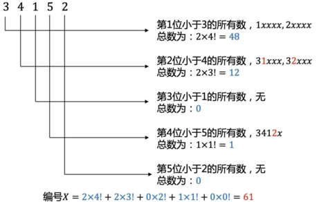
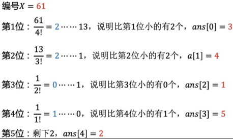

# 康托展开 Cantor Expansion
# 逆康托展开 inverse Cantor expansion, Cantor inverse

`1~n` 的全排列，所有排列按字典序排序。某个排列的排名，就是该排列的「康托展开」。

如：`(1, 2, 3, 4, 5)` 这 5 个数字的全排列里，从小到大排序，`34152` 是第几个？

这里的编号其实是「小于 34152 的排列的数量」。34152 是第 61+1 个。当然，如果编号从 0 开始，编号就不用加 1，就是 61 了。

反过来，根据编号（比它小的排列的数量），求对应的排列，就是「逆康托展开」。

 


代码：展开

```cpp
    static const int FAC[] = {1, 1, 2, 6, 24, 120, 720, 5040, 40320};
    
    int cantor(int a[], int n) {
        int c = 0;
        for (int i = 0; i < n; ++i) {
            int smaller = 0;
            for (int j = i + 1; j < n; j++) {
                if (a[j] < a[i]) {
                    smaller++;
                }
            }
            c += FAC[n - i - 1] * smaller;
        }
        return c;
    }
    
    int main() {
        int a[] = {3, 4, 1, 5, 2};
        int c = cantor(a, sizeof a / sizeof(int));
        cout << c << endl;
        return 0;
    }

    // 或
    int cantor(int a[], int n) {
        int c = 0, fac = 1;
        for (int i = n - 2; i >= 0; i--) {
            for (int j = i + 1; j < n; j++) {
                if (a[j] < a[i]) {
                    c += add;
                }
            }
            fac *= (n - i);
        }
        return c;
    }
```

此法时间复杂度为 `O(n²)`。主要是内层 j 循环要遍历导致。可改用 segment tree，则时间复杂度降为 `O(nlogn)`。

代码：逆展开

```cpp
    #include <iostream>
    #include <vector>
    using namespace std;
    
    static const int FAC[] = {1, 1, 2, 6, 24, 120, 720, 5040, 40320};
    
    vector<int> inverse_cantor(int x, int n) {
        vector<int> v; // 排列包含的各元素。本例中恰好是1~n
        vector<int> a; // 结果
        for (int i = 1; i <= n; i++) {
            v.push_back(i);
        }
        for (int i = n; i >= 1; i--) {
            int t = x / FAC[i - 1];
            a.push_back(v[t]);      // 放入第t+1个数，下标为t
            v.erase(v.begin() + t); // 从候选元素中去掉第t+1个数
            x %= FAC[i - 1];
            // cout << t << " ... " << x << endl;
        }
        return a;
    }
    
    int main() {
        int n = 5, x = 61;
        vector<int> p = inverse_cantor(x, n);
        for (vector<int>::iterator i = p.begin(); i != p.end(); i++) {
            cout << *i << " ";
        }
        cout << endl;
        return 0;
    }
```

references:
- https://www.cnblogs.com/sinkinben/p/15847869.html
- https://baike.baidu.com/item/康托展开
- https://zh.wikipedia.org/zh-cn/康托展开
- https://mathhelpforum.com/threads/cantor-expansion.11151/
- https://blog.fearcat.in/a?ID=00001-56689855-a4c1-4c8d-b559-038fe0574577

- https://programs.wiki/wiki/cantor-expansion.html
- https://oi-wiki.org/math/combinatorics/cantor/

- https://blog.forec.cn/2016/09/27/duplicate-cantor/

- https://www.cs.princeton.edu/courses/archive/spr10/cos226/assignments/8puzzle.html
- https://en.wikipedia.org/wiki/15_puzzle

