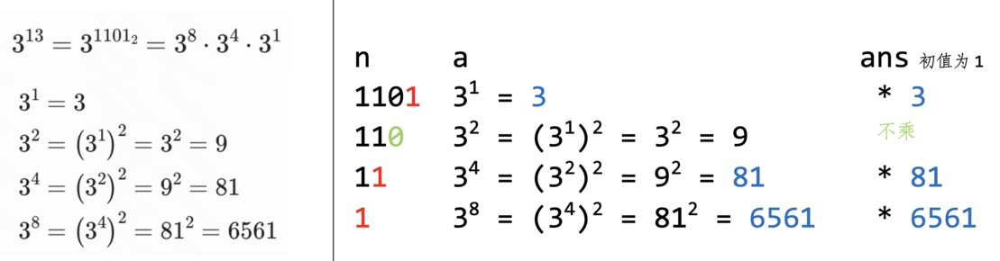
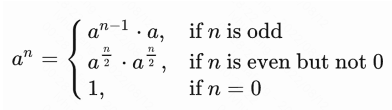

# 快速幂、平方求幂
## Binary exponentiation, exponentiation by squaring

```
exponent n. 指数
exponentiation n. [数学]求幂
```

# 非递归方法



```cpp
    // 非递归快速幂
    long long binpow(long long a, long long n) {
        long long ans = 1;
        while (n > 0) {
            if (n & 1) {   // 如果n当前末位为1
                ans *= a;  // ans乘以当前a（其实是原始a的若干次方）
                // 若求模：ans = (ans * a) % M;
            }
            a *= a;        // a自乘，给下次循环做准备
            // 若求模：a = (a * a) % M;
            n >>= 1;       // n/=2; n右移一位，给下次循环做准备
        }
        return ans;
    }
```

注意 `n >>= 1` 这句
目的：看 `n` 的每一位是1还是0
方法：每次 `n` 右移一位，看其最后一位是 `1` 还是 `0`

# 递归方法



```cpp
    // 递归快速幂
    int binpow(int a, int n) {
        if (n == 0) {
            return 1;
        } else if (n % 2 == 1) {
            return binpow(a, n - 1) * a;
        } else {
            int t = binpow(a, n / 2);
            return t * t;
        }
    }
```

# 例题

监狱有 n 个房间，每个房间关押一个犯人，每个犯人信仰 m 种宗教中的一种。如果相邻房间的犯人的宗教信仰相同，就会越狱。求有多少种状态会发生越狱。答案对 100003 取模。1 ≤ n ≤ 108, 1 ≤ m ≤ 1012。

解：乘法原理，答案为 `mⁿ – m × (m-1)ⁿ⁻¹`。第一项好理解。第二项：第一个房间有 `m` 个选择，以后每个房间只要不跟前一间一样就行，故有 `m-1` 个选择。两项分别取模后相减，结果可能小于 `0`，要处理一下。

```cpp
    // 这里的 qpow() 是取模的版本
    const long long M = 100003;
    long long ans = qpow(m, n) - (m * qpow(m - 1, n - 1)) % M;
    if (ans < 0) { ans += M; }
    // 或
    ans = (ans + M) % M;
```
