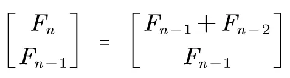
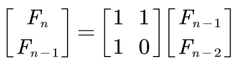
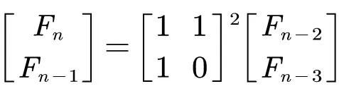
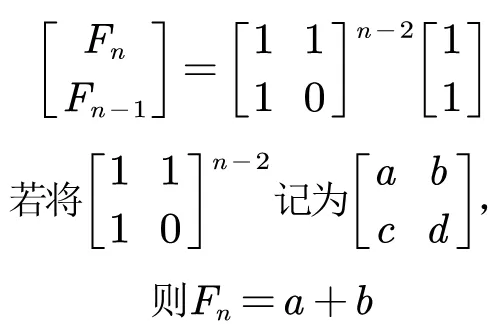
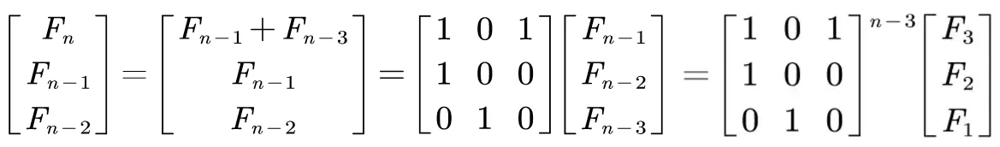
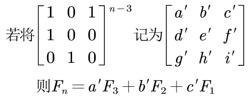
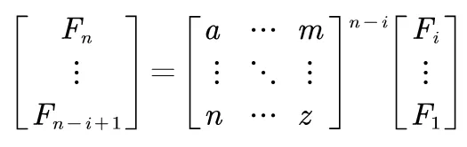

# 用快速幂求 Fibonaci 数列

将相邻两项写成矩阵形式



也就是



递推，得到



递推到底，得到



完整代码：[`fibonaci-by-binary-exp.cpp`](code/fibonaci-by-binary-exp.cpp)

```cpp
    // 两个矩阵相乘，结果放在第一个里
    template<int N>
    void produce(int64_t (&a)[N][N], int64_t (&b)[N][N]) {
        int64_t ans[N][N];
        fill_n(&ans[0][0], N * N, 0);

        for (int i = 0; i < N; i++) {
            for (int j = 0; j < N; j++) {
                for (int c = 0; c < N; c++) {
                    ans[i][j] += a[i][c] * b[c][j];
                }
            }
        }
        copy_n(&ans[0][0], N * N, &a[0][0]); // 从 ans 复制到 a[][]
    }

    template<int N>
    void matrix_power(int64_t (&m)[N][N], int p) {
        // 构造单位矩阵 E
        int64_t res[N][N];
        fill_n(&res[0][0], N * N, 0);
        for (int i = 0; i < N; i++) {
            res[i][i] = 1;
        }

        // 与计算数的高次幂方法一致
        for (; p != 0; p >>= 1) {
            if ((p & 1) != 0) {
                produce(res, m);
            }
            produce(m, m);
        }
        // 返回计算出的高次幂矩阵
        copy_n(&res[0][0], N * N, &m[0][0]); // 从 res 复制到 m
    }

    int64_t f(int n) {
        if (n < 1) {
            return 0;
        }
        if (n == 1 || n == 2) {
            return 1;
        }
        int64_t base[2][2]= { { 1, 1 }, { 1, 0 } };
        // 计算系数矩阵的高次幂
        matrix_power(base, n - 2);
        // base 中 00 和 01 位置求和，即 a+b
        return base[0][0] + base[0][1];
    }

    int n = 46;
    int64_t ans = f(n);
```

# 推广一

若 `f(n) = f(n-1) + f(n-3)` 而不是 `... + f(n-2)`，则




在最终式子里，只用到了最终系数矩阵的第一行。

完整代码：[`fibonaci-by-binary-exp-f13.cpp`](code/fibonaci-by-binary-exp-f13.cpp)。比较一下，发现，只有 `f()` 里有些改动，另两个函数没有改动。

```cpp
int64_t f(int n) {
    if (n < 1) {
        return 0;
    }
    if (n == 1 || n == 2 || n == 3) {
        return n; // 不是 1
    }
    int64_t base[3][3]= { { 1, 0, 1 }, { 1, 0, 0 }, { 0, 1, 0 } };
    matrix_power(base, n - 3);
    return 3 * base[0][0] + 2 * base[0][1] + base[0][2];
}
```

# 推广二

若 `f(n)` 是多个前项相加，`f(n) = f(n-1) + f(n-2) + ... + f(n-i)`，可将 `i` 项组成一个向量，做矩阵乘法求解。



代码略。
