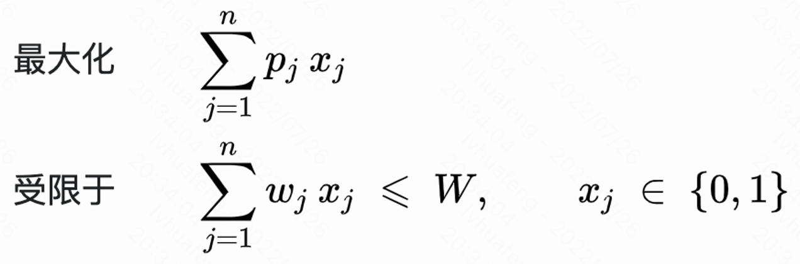
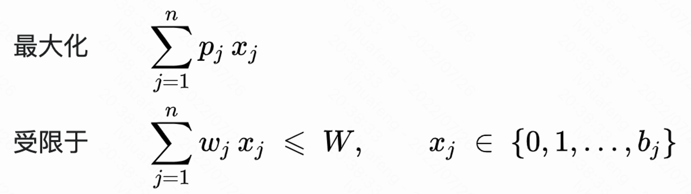
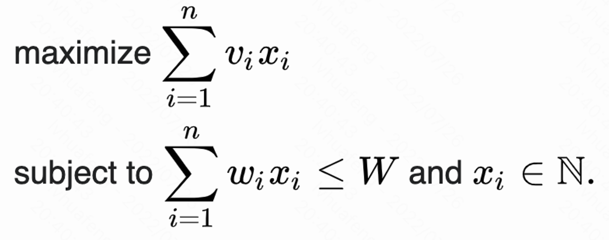

# 背包问题 knapsack

有 n 种物品，物品 j 的重量为 wj，价格为 pj 或 vj (price 或 value)，取的数量为 xj。

所有物品的重量、价格都是非负的。背包所能承受的最大重量为 W。

选择放进背包的物品总价格最高。

类型 | 描述 | 描述
---- | ---- | ----
0-1 背包问题 0-1 knapsack problem | 每种物品只能选择 0 件或 1 件 | 
有界背包问题 bounded knapsack problem (BKP) | 物品 j 只能选择 b[j] 件 | 
无界背包问题 unbounded knapsack problem (UKP) | 不限制每种物品的数量 | 
 | | | 三个公式，只有最后 x[i] 取值范围不同
多重背包问题 | |
分组背包问题 | |
| | |
不是背包问题 | 物品可以连续分割，取一部分 | 按价重比排序，最后一种物品可以取一部分
不是背包问题 | 物品不能分割 | 取尽可能多的物品放入。先取轻的，再取重的。
| | | 以上两类，其实是简单的贪心问题

