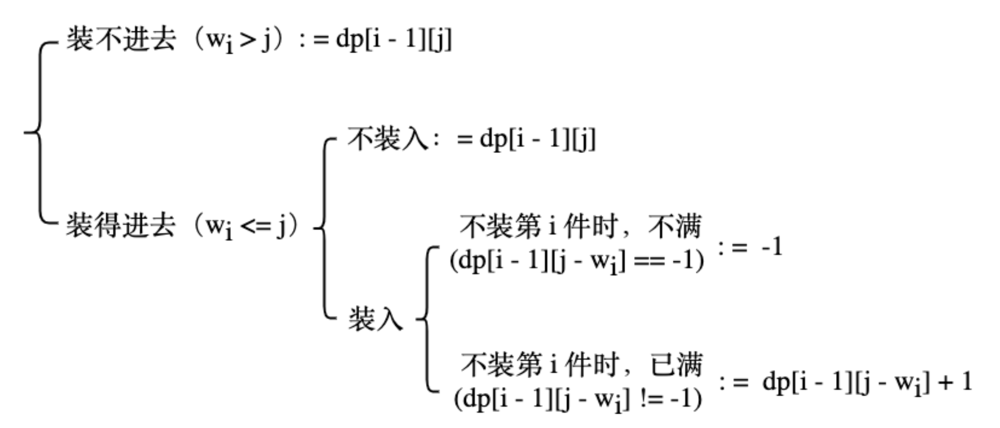

# 0-1背包问题变形（装满），劲歌金曲

[L4, U13, ex4: 劲歌金曲](https://oj.youdao.com/course/13/81/1#/1/9461)

唱 KTV，一般不会在“时间到”时鲁莽地把正在唱的歌切掉，而是会等它放完。

你正在唱，还剩 t 秒。先只从 n 首歌（其中不含《劲歌金曲》）中选，在时间结束前再唱一个《劲歌金曲》，使唱的总曲目（包含《劲歌金曲》）尽量多，在此前提下尽量晚离开 KTV。求最多能唱多少首。

## 分析

可以称为“0-1装满背包问题”

其dp[i][j]表示：前 i 件物品、背包容量为j、背包恰好装满、没有剩余空间时，所得到的最大价值。

也就是：前 i 首歌、时长为 j、恰好唱完若干首歌、没有剩余时间时，所唱的最多首歌。（每首歌价值为 1）

dp[i][j] = -1 或其他特殊值，表示 j 没装满。大于等于 0，表示 j 是装满的。

（对比普通背包问题，dp[i][j] 并不要求背包恰好装满，而是允许剩一点空间。）

其值的初始化：
* dp[i][0] = 0, 与普通背包问题相同。
* dp[0][j] = -1 （除了 dp[0][0] = 0），与普通背包问题不同，但也容易理解。
* 其他元素不需初始化，任何值都可以，会在循环过程中逐步填充。与普通背包问题相同。

当增加第 i 件物品：

* 若 wi > j，物品i放不进去，dp[i][j] = dp[i-1][j]，可能是 -1 或其他值
* 若能放进去：
  * 若不放入：dp[i][j] = dp[i-1][j]，可能是 -1 或其他值
  * 若放入：dp[i-1][j – wi] 要注意，若 j-wi 没装满，则在j-wi的基础上增加第i件物品也是装不满的，所以

```cpp
    // 能放入，且放入
    if (dp[i-1][j – wi] == -1) {
        dp[i-1][j] = -1;    
    } else {
        dp[i-1][j] = dp[i-1][j – wi] + 1;
    }
```

简化一下，能放进去（wi <= j）的情况下，

```cpp
    // 能放入 (wi <= j)
    dp[i][j] = max(
        dp[i - 1][j], 
        (dp[i - 1][j - wi] == -1 ? -1 : dp[i - 1][j - wi] + 1)
    );
```



计算完毕的 dp 矩阵的每一行，对普通背包问题来说，每一行从左到右（j 从小到大）值是不减的。但对现在这种装满背包问题来说，中间有一段一段的 -1（未装满）。即使不考虑这些 -1 空洞，也不是不减的。所以，要找 dp[n][j] 的最大值，且 j 也最大，只能 j 从大到小遍历一遍。

奇技淫巧：dp 初始化为特别小的数，`memset(dp, 0x8f, sizeof dp)`，对应每个元素值为 `(int) 0x8f8f8f8f = -1886417009`。此时可直接用 `max(dp[i-1][j], dp[i-1][j-wi] + 1)`。因为值特别小，+1 也还是特别小，还是可以用 `>=0` 区分开。

核心代码
```cpp
  int dp[n + 1][t];
  memset(dp, -1, sizeof dp); // 初始化dp：-1: 未装满
  dp[0][0] = 0; // 初始化dp

  for (int i = 1; i <= n; i++) {
    dp[i][0] = 0; // 初始化dp
    for (int j = 1; j <= t - 1; j++) {
      if (len[i] > j) {
        dp[i][j] = dp[i - 1][j];
      } else { // 可以放入
        dp[i][j] = max(dp[i - 1][j], (dp[i - 1][j - len[i]] == -1 ? -1 : dp[i - 1][j - len[i]] + 1));
      }
    }
  }
```

完整代码：[golden-songs-l4-u13-ex4.cpp](code/golden-songs-l4-u13-ex4.cpp)

空间优化（用一维数组）核心代码

```cpp
        memset(f, -1, sizeof f);
        f[0] = 0;
        for (int i = 1; i <= n; i++) {
            for (int j = t - 1; j >= hh; j--) {
                if (f[j - hh] != -1) {
                    f[j] = max(f[j], f[j - hh] + 1);
                }
            }
        }
```

完整代码：[golden-songs-l4-u13-ex4-space1d.cpp](code/golden-songs-l4-u13-ex4-space1d.cpp)

