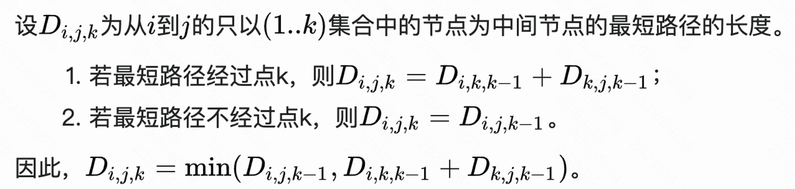

# Floyd-Warshall 最短路算法

是求 all-pair shortest path，「任何两个顶点之间」的 shortest path。

# 综述

经典动态规划思路



改写一下 dp 数组的定义，把 k 挪到最外层，`dp[k][i][j]` 表示「i、j 之间，通过编号为 `1...k` 的顶点」的最短路径。

显然 `dp[0][i][j]` 表示「不以任何顶点为中间顶点」的最短路径，其实就是原图的邻接矩阵。

递推关系：
```cpp
    dp[k][i][j] = min(dp[k-1][i][j], dp[k-1][i][k] + dp[k-1][k][j])
```
从最外层看，`dp[k]` 只与 `dp[k-1]` 有关，所以最外层可以省掉，滚动，节省空间。

时间复杂度：`O(n^3)`，空间复杂度：`O(n^2)`。

注意，`dist[i][j]` 初始化为 inf，不能直接用 INT_MAX，因为后续有 dist 中两元素相加的情况，会超出范围。所以改用一个「足够大」的数 `const int INF = 99999` 之类的。

# c++ 代码

完整代码：[`floyd-warshall-dp.cpp`](code/floyd-warshall-dp.cpp)
- 输入为邻接矩阵，dist 无需初始化，直接用邻接矩阵赋值即可。
- dist 初始化时，注意不能直接用 INT_MAX。
- 完整路径推导，需要递归。

核心部分：
```cpp
//// 初始化 dist[][]。当然，如果输入是邻接矩阵，则该邻接矩阵直接就是 dist 的初值，不用初始化。
    int n = 10; // 顶点数
    int dist[n][n]; // 二维，省空间
    const int INF = 99999;
    for each (i, j):
        dist[i][j] = inf // 初始化: 任两顶点间距离为inf。注意，不能直接用 INT_MAX。
    for each vertex v:
        dist[v][v] = 0 // 自己到自己，距离为0
    for each edge (u,v):
        dist[u][v] = w(u, v)  // weight of edge (u,v)

//// 求 shortest path 核心代码，没精简
    for (int k = 0; k < n; k++) {
        for (int i = 0; i < n; i++) {
            for (int j = 0; j < n; j++) {
                int t = dist[i][k] + dist[k][j];
                if (dist[i][j] > t) {
                    dist[i][j] = t;
                }
            }
        }
    }

//// 求 shortest path 核心代码，精简一下，只有四行
    for (int k = 0; k < n; k++) {
        for (int i = 0; i < n; i++) {
            for (int j = 0; j < n; j++) {
                dist[i][j] = min(dist[i][j], dist[i][k] + dist[k][j]);
            }
        }
    }

// 若要求完整路径，在更新 dist 时，同时记录途经的顶点 k
                if (dist[i][j] > t) {
                    dist[i][j] = t;
                    path[i][j] = k; // 记录途经的顶点
                }
//// 求完整路径时，需要递归一下
    vector<int> get_path(int path[][V], int i, int j) {
        if (path[i][j] == -1) {
            return vector<int>({i, j});
        } else {
            int k = path[i][j];
            vector<int> v1 = get_path(path, i, k);
            // why vs.begin() + 1？因 v1 最后一个元素与 v2 第一个元素是同一个，所以跳过一个
            vector<int> v2 = get_path(path, k, j);
            v1.insert(v1.end(), v2.begin() + 1, v2.end());
            return v1;
        }
    }
```


十字计算法

另一种理解思路

# 适用范围

- 不存在「负权环」negative cycle 的情况。（若有负权环，则可以不断走负权环，所谓最短路径便无意义了）
- 可以处理「有负权边、但不构成负权环」的情况

https://houbb.github.io/2020/01/23/data-struct-learn-03-graph-floyd