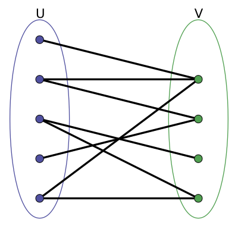
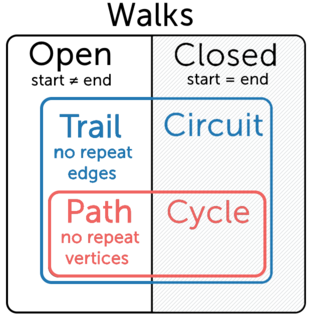
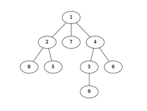
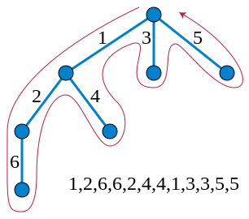

# 图论 Graph Theory

图，由顶点和边组成。
- 图 graph
- 顶点 vertex, vertices（特殊复数形式）。用 V 表示 graph 中 vertices 的数量
- 边 edge, edges。用 E 表示 graph 中 edges 的数量

边 edges
- 有方向的 directed
- 无方向的 undirected

方向
- 有向图 (directed graphs)
- 无向图 (undirected graph)
- 完全无向图 (complete graph): 每两个顶点之间，都有一条边相连。一个完全无向图，若有 `n` 个顶点，则有 `n(n-1)/2` 条边。

路径的长度 (length of a path): 该 path 经过的边数。(若每条边长度为 1)

稀疏、稠密
- 稀疏图 sparse graph：边或弧数量很少，通常 `E << V²`
- 稠密图 dense graph：反之，边的数量 `E` 接近 `V²`

有向无环图 DAG (directed acyclic graph)
- 有向图，从任意顶点出发，无法再回到该点，则为 DAG。（直观：没有 cycle）
- DAG 中，从一个点到另一个点，可能有多条 path，因此，DAG 未必能转化成 tree。
- 但任何「有向树」均为 DAG
- DAG 的拓扑排序：见专门的文档

对比：
- 一个无向 graph 中，如果没有 cycle，则成为 tree。直观理解：没有闭环
- tree 的任意两个节点（顶点）之间，只有一条 path。(否则会有闭环) (想想binary tree的样子)

# 二分图 bipartite graph

偶图、二分图、双分图、二部图 bipartite graph

- 定义一：其顶点可以分成两个互斥的独立集 U 和 V，使得所有边都是连结一个 U 中的点和一个 V 中的点。U 内部或 V 内部都没有边。
- 定义二：图中所有的环都有偶数个顶点。

所有的树都是二分图。

如果两个集合中的点分别染成黑色和白色，可以发现二分图中的每一条边都一定是连接一个黑色点和一个白色点。即，二分图就是 vertex 2-colorable 图。

二分图不存在长度为奇数的环，因为每一条边都是从一个集合走到另一个集合，只有走偶数次才可能回到同一个集合。

如何判定一个图是不是二分图？直接枚举太慢。可用 dfs 或 bfs 遍历这张图。如果发现了奇环，那么就不是二分图，否则是。

# 图着色问题 graph coloring

顶点着色 vertex coloring: 任意两个相邻 vertex 的颜色不同

边着色 edge coloring: 任意两条相邻 edge 的颜色不同

face coloring: 平面图，任意两个相邻的 face/region 的颜色不同。
- 平面图 planar graph: 可以画在平面上，且不同的边可以互不交叠

## vertex coloring

(proper) k-coloring: 用最多 k 种颜色。（实际可能少于 k 种颜色就能完成 coloring）

图是 k-colorable: 用最多 k 种颜色就能完成 coloring。

点染色数 chromatic number：完成 coloring 所需颜色种类的最小值。`γ(G)` 或 `χ(G)` 

图是 k-chromatic：最少用 k 种颜色就能完成 coloring。是 k-colorable 但不是 (k-1)-colorable 的。
- 英语学习：chromatic [krə'mætɪk] adj. 彩色的；着色的；[生] 易染的；染色质的；[音] 半音的，半音阶的；变音的；变音体系的

k-coloring 相当于把各顶点分成 k 个独立部分（same as a partition of the vertex set into k independent sets）

k-partite 与 k-colorable：这两个术语，意思其实一样。（所以，二分图 2-partitle 或 bipartite 与 2-colorable 是一样的）

## edge coloring

k-edge-coloring：用最多 k 种颜色。等价于：把 edge set 划分为 k 个 matching。

边染色数 chromatic index 或 edge chromatic number：完成 edge coloring 所需颜色种类的最小值。`χ′(G)`。

# 行走：walk; trail, circuit; path, cycle

walk: 最宽泛。open walk, closed walk。

trail: 若 walk 中没有重复的 edge。（Euler 风格）
- open trail, closed trail（又称 circuit）

path: 若 walk 中没有重复的 vertex（除了起点、终点可能相同）（自然也不可能有重复的 edge）（Hamilton 风格）
- open path, closed path（通常称为 cycle）

另一种定义
- path 可以有重复的 vertex/edge（相当于上面的 walk）
- 没有重复顶点（自然也就没有重复的边）的 path 叫 simple path（相当于上面定义的 path）

walk, trail, path, circuit, cycle 不一定要用到每个 edge 或 每个 vertex。但若用到了，如下：

## Euler

- Eulerian trail：若 trail 包括所有 edge 恰好一次，且没有重复 edge。（但可能有重复的 vertex）
- Eulerian circuit：类似地。起点、终点相同。

若存在 Eulerian trail，则该 graph 称为 traversable（可遍历的）或 semi-Eulerian（半欧拉图）

若存在 Eulerian circuit，则该 graph 称为 unicursal 或 Eulerian。（欧拉图）

有些文献里也称为 Eulerian path/cycle。不用管，重点是「欧拉」二字。

图是可遍历的 (traversable)，定义为：可以不重复地经过每条 edge 恰好一次。(从而必然经过每个顶点，且顶点可能重复)

俗称「一笔画」：一笔经过所有 edge 恰好一次，且没有重复的 edge。但中间顶点可能重复。

判断图是否可遍历 (traversable)、是否可一笔画：用欧拉定理 Euler’s Circuit Theorem
- 某顶点的度 (degree): 与该顶点相连的边的数量。
  - 奇顶点 odd vertex: degree 为奇数；关联奇数条边
  - 偶顶点 even vertex: degree 为偶数；关联偶数条边
- 如何判断：若奇顶点数为 0 或 2，则可遍历。否则不可遍历。两种情况：
  - 只有两个奇顶点：起点、终点不同。Euler’s trail.
  - 全是偶顶点：起点、终点相同。Euler’s circuit.

## Hamilton

- 某图的 Hamiltonian path (traceable path): 一条 path，访问每个顶点恰好一次。起点、终点不同；可以不访问某些边。
- 某图的 Hamiltonian cycle: 一条 path，访问每个顶点恰好一次，但起点、终点相同是个例外；可以不访问某些边。（或者这样想：都闭环了，无头无尾，就没有重复了。）

有时也称为 Hamilton circuit：因为 cycle 肯定是 circuit。

## Euler vs. Hamilton

Euler
- traversable
- 无重复 edge；访问每个 edge 恰好一次
- thus 有些 vertex 可能被访问多次

Hamilton
- traceable
- 无重复 vertex；访问每个 vertex 恰好一次
- thus 有些 edge 可能没经过

如何记忆：欧拉更厉害，欧拉的范围更大。欧拉研究了七座桥问题，是走遍每座桥、而不是走遍每个岛。

# 连通

连通图 connected graph: 任意两个顶点，都是连通的，有 path 连接这两个顶点。适用于：无向图、有向图。
- 直观：连通图是「一整块」。不连通的图是「若干互不相连的块」。

连通分量 connected component 或 component：无向图的「最大连通子图」maximal connected subgraph。

如果一个图只有一个连通分量，该图就是连通的；反之依然。

对于「有向图」，有强连通、弱连通之分。也有 strong component。

- 强连通 strongly connected：对任意两个顶点 u, v，都有 u->v 和 v->u 的 path 存在。
- 单向连通 unilaterally connected、半连通 semiconnected：对任意两个顶点 u, v，都有 u->v 或 v->u 的 path 存在。
- 弱连通 weakly connected：把所有有向边替换为无向边，可以得到一个（无向）连通图。跟半连通什么关系

connected graph vs. complete graph
- 任两个顶点有路径相连 vs. 任两个顶点直接相连

## 割点、割边：单个

割点 cut vertex, 连接点 articulation point：如果去掉一个点（以及与它连接的边），该点原来所在的图被分成不连通的两部分（或：极大连通分量数增加了），则称该点为割点。

割边 cut-edge，割弧 cut arc、桥 bridge、地峡 isthmus：如果去掉一条边，该边原来所在的图被分成不连通的两部分（或：极大连通分量数增加了），则称该边为「割边」或「桥」。

若去掉一个点或边不够，则可能需要去掉多个点或边。如下，英语术语颠倒了顺序（cut vertex/edge -> vertex/edge cut）；不过也看到变成复数的（cut vertices/edges）。

## 多个

vertex 相关：
- 图的 vertex cut 又称为 separating set：若干顶点的集合；去掉这些顶点后，该图就变得不连通了。
- 图的 vertex connectivity `κ(G)`: 该图的最小 vertex cut 的 size。
- 一个图，称为 k-vertex-connected 或 k-connected，若其 `κ(G) >= k`。
- 两个顶点 u, v 的 vertex cut：去掉这些顶点后，u, v 就变得不相连了。
- local connectivity `κ(u, v)`：u, v 的最小的 vertex cut 的 size。

edge 相关：
- 图的 edge cut：是若干 edge 的集合；去掉这些边，将使图变为不连通的。
- 图的 edge-connectivity `λ(G)`
- 两个顶点的 local edge-connectivity `λ(u, v)` 

# 双连通图 biconnected graph，2-connected

点双连通 vs. 边双连通

- 一个点双连通图是一个连通且「不可分离（nonseparable）」的图，意思是，如果任何一个顶点被去除，图仍是连通的。所以，它是没有「割点」的。（也就是说，至少去掉两个顶点，图才可能变成不连通的，正是上面 2-connected 的定义）
- 若一个有向图是点双连通的，则对任何两个顶点 u, v，都有两条 u->v 的有向 path。

边双连通，类似：一个无向连通图，去掉任一条边，图都仍是连通的。即，没有「割边（桥）」。

# 树的 DFS 序列（深搜序）vs. 欧拉序

- 深搜序：从 root 开始，深搜，每个节点入栈、出栈都放到序列里。
- 欧拉序：从 root 出发，到回到 root 为止，按深度优先遍历的顺序所经过的所有点的顺序。

- 一个深搜序：`1 4 6 6 3 9 9 3 4 7 7 2 5 5 8 8 2 1`
- 一个欧拉序：`1 2 8 2 5 2 1 7 1 4 3 9 3 4 6 4 1`

注意两点：

首先，一棵树的DFS序不唯一。因为深搜的时候选择哪个子节点的顺序是不一样的。

其次，对于一棵树进行DFS序，需要把回溯的时候的节点编号也记录一下，这就是为什么每个数字在DFS序中会出现两遍的原因。

很容易发现的是，树的DFS序的长度是 2n。

并且，可以探究出的性质是，每个点在欧拉序中出现的次数等于这个点的度数，因为DFS到的时候加进一次，回去的时候也加进。

所以欧拉序的长度是 2n-1。

## 欧拉序列 tree's Euler tour representation (ETR) 的另一个定义

将 tree 视为一个有向图，树的每条边对应 graph 的两条有向边。则 tree 可用该有向图的 Eulerian circuit 来表示，以一系列的 edge 的序列，称为 tree 的 ETR。如图：

注意，给每条边而不是顶点编号，ETR 也表示为一堆 edge 的序列。

# 树的重心 a tree's center of gravity

如果在树中选择某个节点并删除，这棵树将分为若干棵子树。统计子树节点数并记录最大值。取遍树上所有节点，使此「子树节点数的最大值」取到最小的节点，被称为整个树的重心。

重点：去掉该节点后，得到的几个子树应该尽可能「均匀」。

树的重心如果不唯一，则至多有两个，且这两个重心相邻（即，这两个重心通过一条边直接相连）。

以树的重心为根时，所有子树的大小都不超过整棵树大小的一半。否则可以通过平移使最大子树的大小缩小至整树的一半，剩下子树的大小最大为 `n/2 - 1`。此时新平移到的点才是真正的重心。
- 反证法：如果某个子树超过了原树规模的一半，那么，除去「这棵子树」以外，当前节点、当前节点的其他子树，加起来，不够原树规模的一半。那么，以「这棵子树」的根代替「当前节点」会更均匀。

树中所有点到某个点的距离和中，到重心的距离和是最小的；如果有两个重心，那么到它们的距离和一样。

把两棵树通过一条边相连得到一棵新的树，那么新的树的重心在连接原来两棵树的重心的路径上。

在一棵树上添加或删除一个叶子，那么它的重心最多只移动一条边的距离。

求法：在 DFS 中计算每个子树的大小，记录「向下」的子树的最大大小，利用总点数 - 当前子树（这里的子树指有根树的子树）的大小得到「向上」的子树的大小，然后就可以依据定义找到重心了。

# 树的直径 diameter of a tree

一棵树上最长的路径叫做树的直径

一棵树可以有多条直径，他们的长度相等

可以用两次 DFS 或者树形 DP 的方法在 O(n) 时间求出树的直径。

# 例题

2020 CSP-S 初赛第 8 题：单选：二分图是指能将顶点划分成两个部分，每一部分内的顶点间没有边相连的简单无向图。那么，24个顶点的二分图至多有（144）条边。

2023 CSP-S 初赛第 6 题：单选：以下连通无向图中，(A) 一定可以用不超过两种颜色进行染色：
- A. 完全三叉树
- B. 平面图
- C. 边双连通图
- D. 欧拉图

解析：任何树都可以使用两种颜色进行点染色

2024 CSP-S 初赛，小图灵模拟，第 1 题：单选：对于图，以下何种说法是正确的 (B)
- A. 2-可染色的图不是二分图
- B. 一个点只能属于一个强连通分量
- C. 欧拉图可能有奇数个点
- D. 边双连通分量删掉一个点后一定是点双连通分量

解析：
- A. 两者等价。
- B. 正确。若一个点属于两个强连通分量，那么这两个强连通分量可以合并成更大的一个。
- C. 不可能。
- D. 不一定, 简单环就是反例。

