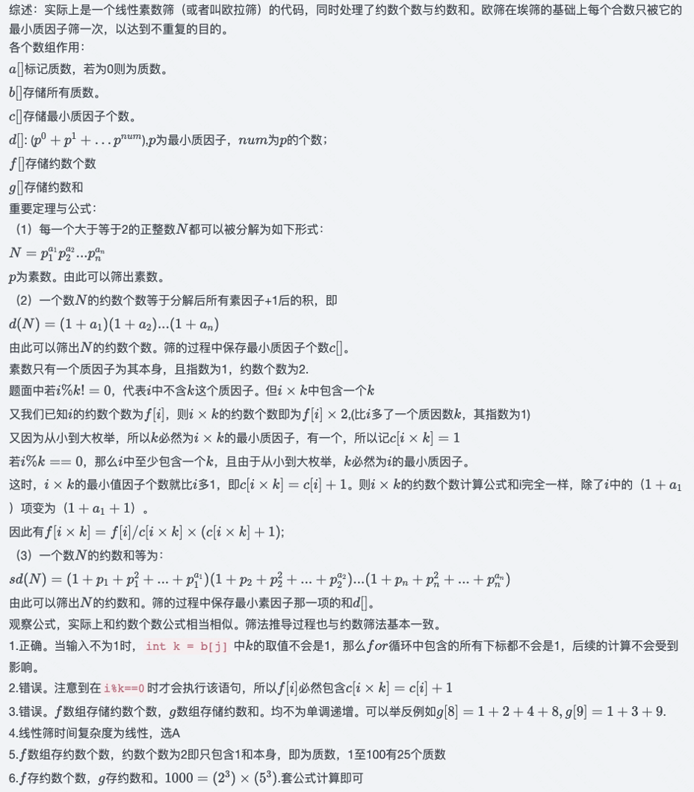

# 埃拉托斯特尼筛法（Sieve of Eratosthenes）

耗时：`O(nloglogn)`。注意，<font color="green">log 了两次！</font>

```cpp
    int n;
    vector<bool> is_prime(n+1, true);
    is_prime[0] = false;
    is_prime[1] = false;
    for (int i = 2; i <= n; i++) {
        if (is_prime[i] && i * i <= n) {
            for (int j = i * i; j <= n; j += i)
                is_prime[j] = false;
        }
    }
```

# 欧拉筛法（Sieve of Euler），又称 线性筛法（Linear Sieve）

核心思想：每个合数被其最小质因数筛掉。只用最小质因数筛，保证只筛一次，省时间。

耗时：`O(n)`，线性。

```
初始：每个数都标记为质数，`is_prime[i]=true`。
从 2 开始，遍历每个数 i：
   若 i 被标记为质数，则放入质数列表中（巧在，第一个数 2 是个质数，标记正确）
   遍历质数列表中每个数 p:
      把 `p*i` 标记为合数（p 作为「最小质因数」）, `is_prime[i]=false`
      若 i 是 p 的倍数，则停止遍历 p
```

解释：

i 是 p 的倍数，换言之，i 之前被 p 筛过了。

p 是 i 的质因数里最小的（否则 i 是以前某个 `pₛₘₐₗₗ` 的倍数，已经 break 了），`i=r*p`

如果此时不 break，则后续的 `p_big` 比当前 `p` 大，

像 `i * p_big = r * p * p_big` 这样的合数，虽可以在当前 `i` 中被 `p_big` 筛掉，

但也必然能将来在某个 `i_big` 中被 `i_big * p` 筛掉 (`i_big = r * p_big`)。

考虑到我们的原则（只筛一次，用最小质因数筛），应该将来被 `p(*i_big)` 筛，而不是现在被 `p_big` 筛。所以这里 break 即可。

```cpp
    void euler_sieve(int n, vector<int>& primes) {
        bool is_not_prime[n + 1];
        fill_n(is_not_prime, n + 1, false); // 初始化：是质数
        for (int i = 2; i <= n; i++) {
            if (!is_not_prime[i]) {
                primes.push_back(i);
            }
            for (int p : primes) {
                if (p * i > n) {
                    break;
                }
                is_not_prime[p * i] = true;
                if (i % p == 0) { // 为何break？看上面解释
                    break;
                }
            }
        }
    }

    int n = 100;
    vector<int> primes; // 质数表
    euler_sieve(n, primes);
```

# 欧拉筛法（Sieve of Euler）法二

对上法稍加改动。除了得到质数表，还能得到每个数的最小质因数。

上法：`is_not_prime[]` 表示 i 是否「不是质数」。0：质数；1：不是质数。

现在改为存放 i 的最小质因数，名字也相应改为 `lp[]`。初始化为 0，表示「没有质因数、是质数」。算法完成后，若 i 为质数，`lp[i]=i`，表示「是质数」。
代码与法一几乎完全一样，除了一行增加、一行不同（见注释）。

```cpp
    void euler_seive(int n, vector<int>& pr) {
        int lp[n + 1];
        fill_n(lp, n + 1, 0); // 初始化为 0，表示「没有质因数、是质数」
        for (int i = 2; i <= n; i++) {
            if (lp[i] == 0) {
                lp[i] = i;  // 此行新增
                pr.push_back(i);
            }
            for (int j = 0; i * pr[j] <= n; j++) {
                lp[i * pr[j]] = pr[j];
                if (pr[j] == lp[i]) {  // 此行不同
                    break;
                }
            }
        }
        for (int i = 2; i <= n; i++) {
            cout << i << ", " << lp[i] << endl;
        }
    }
```

# 欧拉筛法，2021 年 CSP-J 初赛第 18 题

```cpp
01     #include <stdio.h>
02 
03     #define n 100000
04     #define    N n+1
05 
06     int m;
07     int a[N], b[N], c[N], d[N];
08     int f[N], g[N];
09 
10    void init() 
11    {
12        f[1] = g[1] = 1;
13        for (int i = 2; i <= n; i++) {
14            if (!a[i]) {
15                b[m++] = i;
16                c[i] = 1, f[i] = 2;
17                d[i] = 1, g[i] = i + 1;
18            }
19            for (int j = 0; j < m && b[j] * i <= n; j++) {
20                int k = b[j];
21                a[i * k] = 1;
22                if (i % k == 0) {
23                    c[i * k] = c[i] + 1;
24                    f[i * k] = f[i] / c[i * k] * (c[i * k] + 1);
25                    d[i * k] = d[i];
26                    g[i * k] = g[i] * k + d[i];
27                    break;
28                }
29                else {
30                    c[i * k] = 1;
31                    f[i * k] = 2 * f[i];
32                    d[i * k] = g[i];
33                    g[i * k] = g[i] * (k + 1);
34                }
35            }
36        }
37    }
38
39    int main() 
40    {
41        init();
42        
43        int x;
44        scanf("%d", &x);
45        printf("%d %d\n", f[x], g[x]);
46        return 0;
47    }
```

假设输入的心是不超过 1000 的自然数，完成下面的判断题和单选题：（答案：T F F A C C）
判断题
1. 若输入不为 "1"，把第 12 行删去不会影响输出的结果。
2. 第 24 行 `f[i*k] = f[i] / c[i * k] * (c[i * k] + 1)` 中的 "f[i] / c[i*k]" 可能存在无法整除而向下取整的情况。
3. 在执行完 `init()` 后，f 数组不是单调递增的，但 g 数组是单调递增的。

单选题

31. `init` 函数的时间复杂度为（ ）。
A. `θ(n)`
B. `θ(nlogn)`
C. `θ(n√n)`
D. `θ(n²)`

32. 在执行完 `init()` 后，`f[1], f[2], f[3] ... f[100]` 中有（ ）个等于 2。
A. 23
B. 24
C. 25
D. 26

33. (4分) 当输入为 "1008" 时，输出为（ ）。
A. "15 1340"
B. "15 2340"
C. "16 2340"
D. "16 1340"


