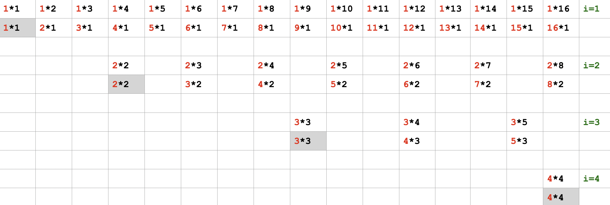

# 求约数个数

经典算法问题

两种求解目标：
- 求「一个数」正整数 N 有多少个约数
- 求 1 到 N 整个区间内，「每个数」有多少个约数

随着数据规模的大小不同，可以有多种解法

# 前置知识：分解质因数

参见：[分解质因数](求质因数.md)

# 求「一个数」正整数 N 有多少个约数

## 法一，暴力法，N ≤ 10⁹

```cpp
    #include <cstdio>
    #include <cmath> // sqrt()
    using namespace std;

    int main () {
        int n;
        scanf("%d", &n);
        int cnt = 0;

        for (int i = 1; i * i <= n; i++) {
            if (n % i == 0) {
                cnt += 2;
            }
        }
        int m = int(sqrt(n));
        if (m * m == n) {
            cnt--;
        }
        printf("%d\n", cnt);
        return 0;
    }
```

## 法二，分解质因数、再用乘法原理求约数个数，N ≤ 10¹⁸

例，若 n 分解为 `2ᵃ * 3ᵇ`，则 n 的约数个数为 `(a+1)(b+1)`。

[最佳写法代码](code/prime-factors-80.cpp)：

```cpp
#include <cstdio>
using namespace std;

int main() {
    long long n;
    scanf("%lld", &n);
    long long cnt = 1;

    // 不从 1 开始，因为 n /= 1 将永无尽头
    for (long long i = 2; i * i <= n; i++) {
        long long t = 0;
        while (n % i == 0) {
            printf("%lld ", i); // 输出质因数
            n /= i;
            t++;
        }
        cnt *= (t + 1);
    }
    if (n != 1) { // 最后剩下一个质因数
        cnt *= 2;
        printf(" %lld", n); // 输出质因数
    }
    printf("\n");
    printf("%lld\n", cnt);
    return 0;
}
```

注意，for 循环的终止条件。

```cpp
// 最佳写法：
    for (long long i = 2; i * i <= n; i++) { ... }

// 另一种更直观写法，但仔细想想，其实是不需要 n0 的。
    long long n0 = n;
    for (long long i = 2; i * i <= n0 && n > 1; i++) { ... }
```

# 求某个范围内「每个数」的约数个数

增加一个外层循环，那么时间复杂度也会多出一个规模。所以，数据规模稍大，就需要寻找更优化的方法。

## 法一，用上面「分解质因数、乘法原理」方法，N ≤ 10⁶

[代码](code/prime-factors-ii-80.cpp)：
```cpp
#include <cstdio>
using namespace std;

long long dfs(long long n) {
    long long cnt = 1;
    for (long long i = 2; i * i <= n; i++) {
        long long t = 0;
        while (n % i == 0) {
            n /= i;
            t++;
        }
        cnt *= (t + 1);
    }
    if (n != 1) { // 最后剩下一个质因数
        cnt *= 2;
    }
    return cnt;
}

int main() {
    long long n;
    scanf("%lld", &n);

    long long cnt = 0;
    for (long long i = 1; i <= n; i++) {
        cnt += dfs(i);
    }
    printf("%lld\n", cnt);
    return 0;
}
```

时间复杂度：`O(2/3 * N * sqrt(N))`，也就是 时间复杂度：`O(2/3 * N¹˙⁵)` <font color="red">如何得到的？</font>

## 法二，数论分段方法

例如，要求 1-20 之间每个数的约数个数总和。以 `i` 为约数的数，有 `N/i` 个。枚举 i，总数为 `sum{ N/i }, ∀ i ∈ [1, N]`。用 python 代码，则是
```python
    sum([int(n / i) for i in range(1, n + 1)])
```

[优化的 C++ 代码](code/prime-factors-ii-sol2.cpp)：<font color="red">to do: 补充原理</font>
```cpp
    #include <cstdio>
    using namespace std;

    int main() {
        long long n;
        scanf("%lld", &n);

        long long cnt = 0;
        for (int i = 1, j; i <= n; i = j + 1) {
            j = n / (n / i);
            cnt += (n / i) * (j - i + 1);
        }
        printf("%lld\n", cnt);
        return 0;
    }
```

时间复杂度：`O(sqrt(N))`。<font color="red">to do: 补充原理</font>。可轻松应对 1e14 这样的数据范围。

## 法三，容斥法

对某数 `n`，分解成 `n = i * j`，`i`、`j` 不必互质。

例，`n = 16`。


当 `i = 1`，从 `1 * 1` 到 `16`，可以写成 `1 * j` 形式的数，共 `cnt = 16 / 1` 个。对应约数个数，为 `cnt` 个 `1`，以及 `cnt` 个不同的 `j = k / 1`。（`k` 是从 `1` 到 `n` 的每个数）（就是两行里标为红色的数）注意要去掉 `k = 1 * 1` 时重复的一个 `1`（灰色底色格子）。共 `16 / 1 * 2 - 1` 个约数。

当 `i = 2`，从 `2 * 2` 到 `16`，可以写成 `2 * j` 形式的数，共 `cnt = 16 / 2 - 1` 个。对应约数个数，为 `cnt` 个 `2`，以及 `cnt` 个不同的 `j = k / 2`。（就是两行里标为红色的数）注意要去掉 `k = 2 * 2` 时重复的一个 `2`（灰色底色格子），共 `(16 / 2 - 1) * 2 - 1` 个约数。

当 `i = 3`，从 `3 * 3` 到 `16`，可以写成 `3 * j` 形式的数，共 `cnt = 16 / 3 - 2` 个。对应约数个数，为 `cnt` 个 `3`，以及 `cnt` 个不同的 `j = k / 3`。（就是两行里标为红色的数）注意要去掉 `k = 3 * 3` 时重复的一个 `3`（灰色底色格子），共 `(16 / 3 - 2) * 2 - 1` 个约数。

一般地，对任意 `i ≤ sqrt(n)`，对应 `1 ~ n` 各数的约数总数是 `2(⌊n/i⌋ - (i-1)) - 1 = 2⌊n/i⌋ - (2i-1)`。对所有 i 求和，得 `2 * sum{ ⌊n/i⌋ } - m²`，其中 `m = ⌊sqrt(n)⌋`。

[对应 C++ 代码](code/prime-factors-ii-sol3.cpp)
```cpp
    #include <cstdio>
    #include <cmath> // sqrt()
    using namespace std;

    int main() {
        int n;
        scanf("%d", &n);
        int cnt = 0;
        for (int i = 1; i * i <= n; i++) {
            cnt += n / i;
        }
        int m = sqrt((double) n);
        cnt = cnt * 2 - m * m;
        printf("%d\n", cnt);
        return 0;
    }
```

时间复杂度：`O(sqrt(N))`。

## 法四，欧拉筛法

[代码](code/prime-factors-ii-sol4.cpp)：<font color="red">to do: 补充原理</font>

```cpp

```


