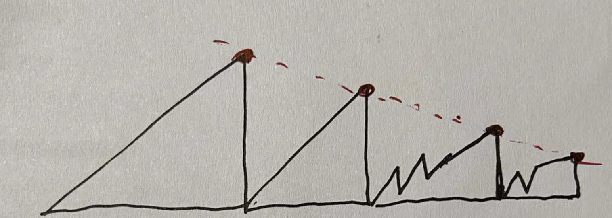
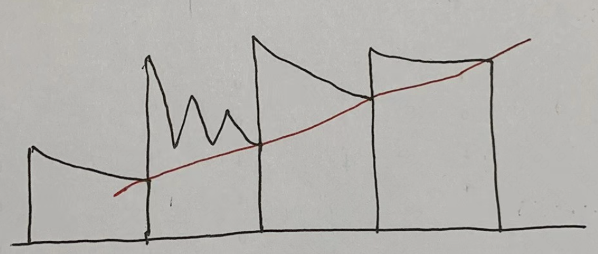

# 单调栈、单调队列 monotonic stack, monotonic queue

单调栈
* 单调递增栈 (monotonic increasing stack)：从底到顶递增 (increasing from bottom to top)，即，先入栈的小，后入栈的大
* 单调递减栈 (monotonic decreasing stack)

单调队列：
* 单调上升队列：increasing monotonic queue
* 单调下降队列：decreasing monotonic queue

单调栈 vs.  单调队列
* 相同：递增、递减的定义：栈底->栈顶；队头->队尾。
* 相同：新加入、旧弹出，发生在栈顶、队尾。新来的必须入栈(队)，为此可能需要弹出栈顶、队尾弹出若干元素。
* 相反：单调队列：从队头取；单调栈：从栈顶（类似队尾）取，与队列相反。

底层实现，可用 `linked list`、`stack` 或 `deque`。通常用 `deque`。

新元素来时，队里所有比新元素大（小）的，都弹出，新元素再入队。

但这子序列也不能仅满足“单调”就可以了！

为了形成单调上升子序列，有两种方法：
* 新元素若比队尾元素小，则新元素不入队，跳过；
* 新元素若比队尾元素小，则把队尾比新元素大的所有元素都弹出，新元素入队。

单调上升队列（以及单调上升栈）采取的是第二种方法。

可以记忆为：<font color="red">新元素有高优先级！每个新元素来了都强势入队，为此不惜去掉一些队尾元素！但过一会儿可能作为旧元素被干掉！</font>

若以队头为 `q0`，队内元素依次为 `q1, q2, …`，则在任一时刻，单调上升：`q0 < q1 < q2 < … < qn`。

队里某元素 q<sub>i</sub>，是 ( q<sub>i-1</sub>, q<sub>i</sub> ] 左开右闭范围内的最小值。

注意该范围不包含 q<sub>i-1</sub>；显然 q<sub>i-1</sub> 比 q<sub>i</sub> 还小。

特别地，`q0` 是 `[a0, q0]` 范围内的最小值。

注意：从建栈过程可知，栈底元素不一定是 `a[0]`，而是全局最小的元素。（凭直觉，很自然认为可能单调栈从 `a[0]` 开始，得到 `5, 12` 这样的单调栈。但并不是。）

单调下降 | 单调上升
---- | ----
 | 

感觉跟 `heap` 有点像。流式处理，新元素到来，加入，动态调整，调整完后，栈顶始终是当前最大（小）元素。

## 基本代码：如何形成单调栈、单调队列

如下，单调递增栈、单调递增队列，两者代码，除了 stack/deque 的函数名字不同，其实是完全一样的。

单调增，要求栈顶、队尾最大，所以若 st.top() 或 q.back() 大于新元素，则弹出 top 或 back。

这里判断用 ">" 而不是 ">="，不是严格单调。

stack 或 deque 里存储“值”而不是“下标”。（后面会看到存储“下标”的例子）

```cpp
    int a[] = { 3, 1, 2, 3, 1, 4, 5, 6 };
    int n = sizeof arr / sizeof(int);

    stack<int> st;
    for (int i = 0; i < n; i++) {
        while (st.size() > 0 && st.top() > a[i]) {
            st.pop();
        } // 比我大的，都弹出，给我腾地方
        st.push(a[i]);
    }

    deque<int> q;
    for (int i = 0; i < n; i++) {
        while (!q.empty() && q.back() > a[i]) { 
            q.pop_back();
        } // 比我大的，都弹出，给我腾地方
        q.push_back(a[i]);
    }
```

遍历完整个序列，得到了一个单调栈（队列），但好像也什么用。

真正的用处，是在遍历过程中、维护这个单调栈（队列）的过程中，干点事情。
* 单调栈：在遍历过程中，给每个数组元素找它的 next/previous greater/smaller 元素（右边第一个比它大的）。
* 单调队列：在遍历过程中，求一个滑动窗口范围内的最大值、最小值。

