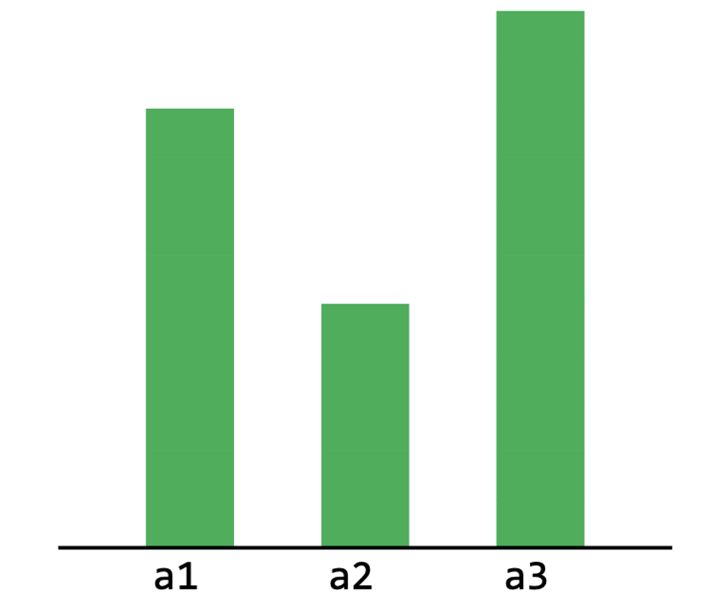
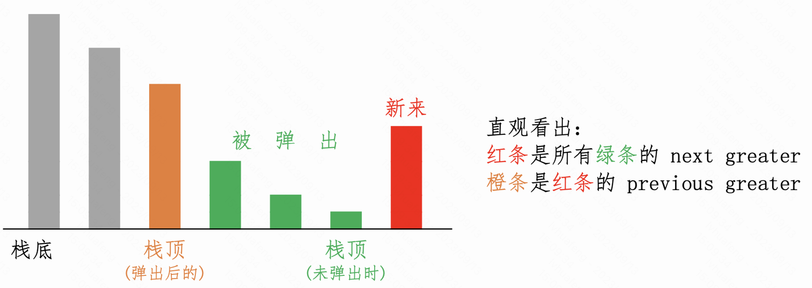

# 单调栈

## 单调栈：给每个数组元素找它的 next greater（右边第一个比它大的）

用单调递减栈（“递减 ↘ ”与 “greater” 恰好相反）

所有元素的 next greater 都初始化为 -1，表示“无 next greater；后续所有元素都比它小”。

单调降 ↘ ，流式处理每个新来的元素。新来的必须要入栈。若当前栈 top 元素比新来的还小，为了满足“降”，则它必须被弹出，给新来的腾地方。此时，“新来的”就是“被弹出者”的 next greater。

<font color="blue">（反过来不一定成立：“被弹出者”不一定是“新来者”的 previous smaller。如下图，a1 的 next greater 是 a3，但 a3 的 previous smaller 不是 a1 而是 a2。）</font>



如果栈 top 有多个都比“新来的”小，则都被弹出。所有“被弹出者”的 next greater 都是这个“新来的”。

<font color="blue">（反过来，不成立。“新来的”显然不可能有多个 previous smaller。）</font>

如果当前栈 top 比“新来的”大或相等，不需要弹出。也就是说，“新来的”不是当前栈顶元素的 next greater。

单调栈里存储下标而不是值，方便更新 `next_greaters[]` 或 `ngt[]` 数组。

```cpp
// r[i]: 第 i 个元素的 next greater 是第 r[i] 个
vector<int> next_greaters(const vector<int>& a) {
    stack<int> st; // 栈里存放元素下标，而不是元素值。
    vector<int> r(a.size(), -1); // 初始化为-1(无next greater)。必须要初始化，因有些元素确实没有 next greater。
    // 在构建单调下降栈的过程中，同步构建 next greater 列表。
    for (int i = 0; i < a.size(); i++) {
        while (!st.empty() && a[st.top()] < a[i]) { // 注意：< 而不是 <=
            r[st.top()] = i;
            st.pop();
        }
        st.push(i);
    }
    return r;
}

int main() {
    vector<int> a = {4, 5, 2, 25, 7, 18};
    vector<int> r = next_greaters(a); 
    return 0;
}
```

## 单调栈：给每个数组元素找它的 previous smaller 元素（左边第一个比它小的）

用单调递增栈 ↗ ，与 smaller 恰好相反。

从左到右遍历。“新来的”的 previous smaller，就是“新来的”要入栈时（该弹出的都已经弹完了）的栈顶元素。

若栈为空，则“新来的”没有 previous smaller。

```cpp
vector<int> prev_smallers(const vector<int>& a) {
    stack<int> st; // 单调上升栈，存下标
    vector<int> r(a.size()); // 存下标。不用初始化
    for (int i = 0; i < a.size(); i++) {
        while (!st.empty() && a[st.top()] >= a[i]) { // 注意: >=。相等的弹出，保证栈内没有相等的。否则找到的是 smaller or equal。
            st.pop();
        }
        r[i] = st.empty() ? -1 : st.top();
        st.push(i);
    }
    return r;
}
```

重要！

注意，求 next greater 时，比较时是 `<` 而不是 `<=`；求 previous smaller 时，比较时用 `>=`，包含了相等的情况。为何？可以这么理解：

求的是 greater/smaller than 而不是 greater/smaller than or equal to，所以求 next 时的 `r[st.top()] = i` 要保证 st.top() 与 i 不相等，所以 `while (!st.empty() && a[i] > a[st.top()])` 这句里比较时不能包含相等的情况。

求 previous 时，`r[i] = st.top()`，要保证 i 与 st.top() 不同，故 while 比较时要包含相等的情况。

简单记忆：
* next: 赋值在 while 里，所以 while 里的 condition 不能包含相等的。
* previous: 赋值在 while 之后，需要在 while 里把相等的 pop 掉，所以 while 里的 condition 要包含相等的。

## 单调栈：给每个数组元素找它的 next greater 和 previous greater

对比
* next greater: 使用单调下降栈
* prev smaller: 使用单调上升栈

发现，若用同一种栈，如单调下降栈，可同时得到 next greater 和 previous greater。



```cpp
    vector<int> a = {4, 5, 2, 25, 7, 18};
    stack<int> st; // 单调下降栈，存下标
    vector<int> ng(a.size(), -1), pg(a.size());
    for (int i = 0; i < a.size(); i++) {
        while (!st.empty() && a[i] > a[st.top()]) {
            ng[st.top()] = a[i];
            st.pop();
        }
        pg[i] = st.empty() ? -1 : a[st.top()];
        st.push(i);
    }
```

注意：while 比较时，没包含相等的情况，保证了 next 是严格 greater 的。但导致 previous 不是严格 greater 的，而是 greater-or-equal 的。

若想 previous 也是严格 greater 的，怎么办？

如果 `a[]` 里各元素不同，没问题。

若有相同的，需要如下改动：
```
  pg[i] = st.empty() ? -1 : a[st.top()];
  改为
  pg[i] = (st.empty() || st.top() == i) ? -1 : a[st.top()];
```
<font color="red">这里应该有误。st.top == i 时，不应该得 -1，而是 stack 靠下的某个。但这里也不能 pop，会破坏求 next greater 的流程。貌似只能遍历两遍？</font>

或者干脆遍历两遍。正着遍历，得到 next greater；倒着遍历，还是求 next greater，得到的其实是 previous greater。

若一遍遍历，想求出 next greater-or-equal 和 previous greater-or-equal 呢？

while 循环应该包含相等的情况。但相等的被 pop 出去了，导致 previous 不好算。能否把被 pop 出去的保留一下？懒得想了。干脆就遍历两遍吧。

https://zhuanlan.zhihu.com/p/447209490 如何处理相等值。<font color="red">To think more. 感觉跟我想的基本一样，但他的遣词造句太差。</font>

```
这时候栈中的每一个元素都是一个list，我们把相等元素（如果在栈中相邻）的下标可以存储到这个list中。在弹出结算时，这几个相等值被视为同一个值，他们左/右第一个小的数是一致的。（所以第一个小/大指的是严格小/大于）

什么情况下相同的数会挨在一起形成一个list：要么这两个数在数组中就相邻，要么在这两个数间的数都比他们大。

什么时候需要处理相等值
在做题过程中，我们发现有时候并不需要处理相等值。如503. 下一个更大元素 II 这题题解中，我们发现并没有处理重复元素但是也通过了，对这一问题我们进行了分析。

先说结论：如果我们需要左边（或左右都需要）第一个更大/小元素，那就需要处理重复值。如果我们只需要右边第一个更大/小元素，那么就不需要处理重复值。（如此题情况）

解释：
这和我们是如何获取左/右第一个更大/小元素有关。
当我们获取右边第一个更大元素的时候，是通过“谁使得当前栈顶元素pop出来”这种方式。如果我们不处理相同元素（按不处理相同值版本的代码，相同的元素会被依次入栈），那么我们pop时数组中的那个元素，它必定会将栈中紧挨的相同元素都pop出去，所以这些相同元素右边的第一个更大元素都是正确的。
但是我们获取左边的第一个更大元素就会出现问题。我们在获取左边第一个更大元素时，是在弹栈时找更靠近栈底位置的那个元素。而如果出现相同元素，当他们相邻的时候左边的那个元素就会与栈顶元素相等，这就明显不是更大的元素了，就出错了，所以必须使用上面列表的方式进行重复值处理。
```

