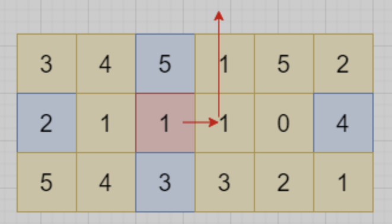

# [`407.` 接雨水 II](https://leetcode.cn/problems/trapping-rain-water-ii/)

二维方格上接。或叫「3D 接雨水」。

# 2D 思路的自然直观扩展，<font color="red">错误的</font>

按「2D 接雨水」的思路扩展。2D 时，求当前柱子顶上能装多少水，要找它的「左最高」和「右最高」中较低的那个。按此思路，3D 应该是「左最高」、「右最高」、「上最高」、「下最高」四者中最低的那个。但不对。因 3D 时需「周围一圈」柱子都围住才行，只有这四个是不够的。



如图，粉色 1 的上下左右最高（灰色）中的最小者是左边的 2，按此思路，粉色 1 顶上可以存水到 2 的高度。但实际上，会按箭头方向流出。

# 上述思路修正

不应该只比较四个方向，应该比较周围一整圈。仿效「2D 接雨水」里的「堆方法」，代码基本一致，只是开始把「左右两侧入堆」改成「整个外边界入堆」，「每次看左右两个方向」改成「每次看上下左右四个方向」。

用「虚拟柱」表示：柱，及其顶上的水。

每弹出一个，只要不是最后一个，堆内肯定还有比它高的，所以它旁边比它矮的，可以存水到它的高度。如果 p 是当前刚从 pq 里取出的「虚拟柱」，`(i,j)` 是 p 周围某方向的相邻位置，则大概逻辑如下。（实际代码中有所简化）
```cpp
    if (height[i][j] < p.h) {          // (i,j) 比较矮，可装水
        res += (p.h - height[i][j]);   //   (i,j) 装水可一直装到 p.h 那么高
        pq.push({i, j, p.h});          //  （i,j) 虚拟柱的高度，是自己装了水后的高度，也就是 p.h
    } else {                           // (i,j) 比较高，装不了水
        pq.push({i, j, height[i, j]}); //   (i,j) 虚拟柱的高度，就是实际高度
    }
```

完整代码：[`trapping-rain-ii-leet-407-vertical-pq.cpp`](code/trapping-rain-ii-leet-407-vertical-pq.cpp)

```cpp
    struct pole {
        int i, j; // 位置索引
        int h;   // 虚拟柱的高度
    };

    // 矮的在堆顶，min heap，与缺省的相反，所以比较函数也相反
    bool operator<(const pole &a, const pole &b) {
        return a.h > b.h;
    }

    int trapRainWater(vector<vector<int>>& heightMap) {
        if (heightMap.size() <= 2 || heightMap[0].size() <= 2) {
            return 0;
        }
        int m = heightMap.size();
        int n = heightMap[0].size();
        priority_queue<pole> pq;
        // visit 含义为「计算我自己顶上能放多少水」
        vector<vector<bool>> visited(m, vector<bool>(n, false));
        for (int i = 0; i < m; ++i) {
            for (int j = 0; j < n; ++j) {
                if (i == 0 || i == m - 1 || j == 0 || j == n - 1) {
                    pq.push({i, j, heightMap[i][j]});
                    visited[i][j] = true;
                }
            }
        } // 以上：把边界四条边的柱子放入 pq

        int res = 0;
        int dirs[] = {-1, 0, 1, 0, -1}; // 这个 trick 有点意思
        while (!pq.empty()) {
            pole p = pq.top();
            pq.pop();
            // 这里不用判断 p 是否 visited（计算过）；放入时已设置为 visited（计算过）；现在是以 p 为基础 visit 它周围的
            for (int k = 0; k < 4; ++k) {
                int i = p.i + dirs[k], j = p.j + dirs[k + 1];
                if (i >= 0 && i < m && j >= 0 && j < n && !visited[i][j]) {
                    if (heightMap[i][j] < p.h) {
                        res += p.h - heightMap[i][j];
                    }
                    visited[i][j] = true;
                    pq.push({i, j, max(heightMap[i][j], p.h)});
                }
            }
        }

        return res;
    }
```

# dfs 思路

某处看到：

对于 3D 柱子，可通过 Z 轴拆分维度，比如当 Z 等于 1 时，计算能接到的雨水；当 Z 等于 2 时，计算能接到的雨水；以此类推。Z 等于 1 时，怎么计算有多少雨水呢？可用 dfs 染色，当有雨水时，这些雨水一定是不和外界联通的，即是被一圈墙围起来的，所以 dfs 跑一遍就能算出来了。但是这个方法超时了。

