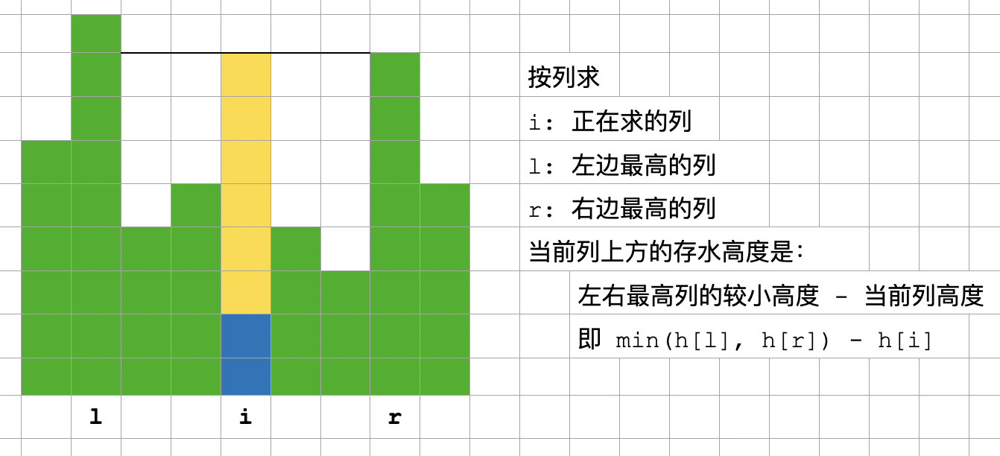
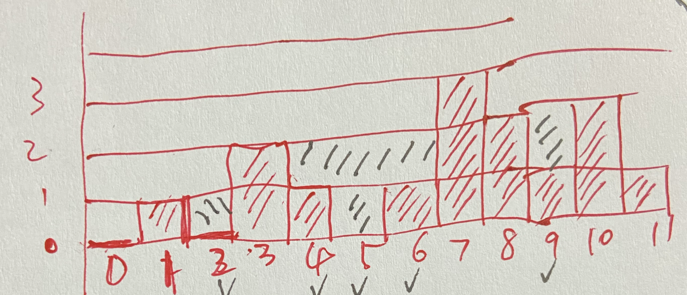

# [leetcode 42. 接雨水](https://leetcode.cn/problems/trapping-rain-water/)

references:
- [四种方法](https://mp.weixin.qq.com/s/XyiYcDwEv3VW5Zs-WmRbDQ)
- [水平方向解法的一种理解](https://mp.weixin.qq.com/s/epYmfWy5BEOYOxF8kKj9Gw)

目录
- [solution 1. 按列（竖直方向），每个柱子顶上竖直方向能存多少水](#sol-1-vertical)
- [solution 2. 最佳解法，1 的改进](#sol-2)
- [双指针扫描一次](#sol-2ptr)
- [面积法](#sol-2-area)
- [堆法，按列](#sol-2-heap)
- [solution 3. 按行](#sol-3)
  - [直观解法](#sol-3-1)
  - [不直观解法，leetcode 官方解法](#sol-3-2)

# <a id="sol-1-vertical"></a>solution 1. 按列（竖直方向），每个柱子顶上竖直方向能存多少水



如何得到左边最高、右边最高，有多种方法。

- 最基本的方法，简单遍历。超时。[trapping-rain-leet-42-vertically-01-naive-tle.cpp](code/trapping-rain-leet-42-vertically-01-naive-tle.cpp)
- 优化一下，预处理。[trapping-rain-leet-42-vertically-02-preprocess.cpp](code/trapping-rain-leet-42-vertically-02-preprocess.cpp)
- 变形的单调栈，求 prev greatest 和 next greatest（注意是 greatest 不是 greater）。但有些硬套公式、为了使用单调栈而使用的感觉。[trapping-rain-leet-42-vertically-03-mono-stack.java](code/trapping-rain-leet-42-vertically-03-mono-stack.java)

# <a id="sol-2"></a>solution 2. 最佳解法，1 的改进

与 1 基本相同，按列（竖直方向），每个柱子顶上竖直方向能存多少水。但求左最高、右最高的方法不同。

先找出最高的柱子高度 `maxh`。最高的可能有多个，其中最左边（第一个）的下标为 l，最右边（最后一个）的下标为 r。

整个序列可分成三部分：
1. 左：l 左边的（含不含 l 均可）
2. 右：r 右边的（含不含 r 均可）
3. 中：l、r 中间的（含不含 l、r 均可）。如果最高的 maxh 只有一个，则不存在这一部分。但不影响逻辑和计算结果。

然后依次遍历这三个部分。

- 正序，从下标 0 开始，遍历「左」部分，记录「到目前为止的最大柱子高度」 为 `mh`。对每根柱子而言，它左边最高的柱子就是 `mh`，右边最高柱子就是 `maxh`。每个柱子顶上竖直方向能存的水，就是 `min(maxh, mh) - h[i]`，也就是 `mh - h[i]`。如果自己恰好就是当前最高的，则自己顶上竖直方向不能存水，`mh - h[i]` 也恰好是 0。
- 逆序，从下标 n-1 开始，遍历「右」部分，方法类似。
- 「中」部分，左右最高均为 `maxh`，柱子顶上竖直方向能存的水是 `maxh - h[i]`。

<font color="green">这个思路，应该是所有思路中的最佳。</font>代码 [trapping-rain-leet-42-vertically-12-perfect.cpp](code/trapping-rain-leet-42-vertically-12-perfect.cpp)。注意，开始遍历一遍求 maxh 的过程中，没有记录 l、r 的位置，是在后面遍历左、右两部分时，跟 maxh 比较而确定的。当然也可以在求 maxh 时就记录。

```cpp
    int trap(vector<int>& height) {
        int n = height.size();
        int maxh = 0; // 全局最高
        for (int i = 0; i < n; i++) {
            maxh = max(maxh, height[i]);
        }

        int sum = 0;
        int mh = 0; // 到目前为止，最高
        int i;
        for (i = 0; i < n && height[i] < maxh; i++) {
            mh = max(mh, height[i]);
            sum += (mh - height[i]) * 1;
        } // 以上遍历左部分

        int l = i; // l: 从左边数，第一个 maxh 的位置
        mh = 0;
        for (i = n - 1; i > l && height[i] < maxh; i--) {
            mh = max(mh, height[i]);
            sum += (mh - height[i]) * 1;
        } // 以上遍历右部分
        int r = i; // r: 从右边数，第一个 maxh 的位置
        for (i = l + 1; i <= r - 1; i++) {
            sum += (maxh - height[i]) * 1;
        } // 以上遍历中间部分
        return sum;
    }
```

稍微改进一下，在开始遍历求 maxh 的过程中，记录了 l、r 的位置；后面再遍历求和时，直接用 l、r 位置，不用跟 maxh 比较来确定位置。该思路的 [c++ 代码](code/trapping-rain-leet-42-vertically-12-perfect-02.cpp) 和 [go 代码](code/trapping-rain-leet-42-vertically-12-perfect.go)。

```cpp
    int trap(vector<int>& height) {
        int n = height.size();
        int maxh = 0; // 全局最高
        int l = -1, r = -1; // l, r: 从左、右边数，第一个 maxh 的位置
        for (int i = 0; i < n; i++) {
            if (height[i] > maxh) {
                l = i, r = i, maxh = height[i];
            } else if (height[i] == maxh) {
                r = i;
            }
        }

        int sum = 0;
        // 下面两部分，mh 都表示「到目前为止，最高」。第三部分不需要 mh
        for (int i = 0, mh = 0; i <= l - 1; i++) {
            mh = max(mh, height[i]);
            sum += (mh - height[i]) * 1;
        } // 以上遍历左部分
        for (int i = n - 1, mh = 0; i >= r + 1; i--) {
            mh = max(mh, height[i]);
            sum += (mh - height[i]) * 1;
        } // 以上遍历右部分
        for (int i = l + 1; i <= r - 1; i++) {
            sum += (maxh - height[i]) * 1;
        } // 以上遍历中间部分
        return sum;
    }
```

该思路甚至可以再简化些。对某个位置 `i`，其实就是找「`i` 往左最高的」和「`i` 往右最高的」。换个方向，就是「从左起点往右，直到 `i`，最高的」和「从右终点往左，直到 `i`，最高的」。上个思路，要统计全局最高的，这样一个或两个方向的最高的就不用显式统计了，但代码逻辑较多。现在再简化一下，分别用两个数组记录所有的，代码能少很多。该思路的 [c++ 代码](code/trapping-rain-leet-42-vertically-12-perfect-03.cpp) 和 [go 代码](code/trapping-rain-leet-42-vertically-12-perfect-more.go)。

```cpp
    int trap(vector<int>& height) {
        int n = height.size();
        // hl[i]: 从左边界统计，到 i 为止，最大的。max{ height[i] }, ∀ i ∈ [0, i]
        // hr[i]: 从右边界统计，到 i 为止，最大的。max{ height[i] }, ∀ i ∈ [i, n-1]
        vector<int> hl(n), hr(n);
        hl[0] = height[0], hr[n - 1] = height[n - 1];
        for (int i = 1, j = n - 1 - 1; i <= n - 1; i++, j--) {
            hl[i] = max(hl[i - 1], height[i]);
            hr[j] = max(hr[j + 1], height[j]);
        }
        int sum = 0;
        // 去掉头尾，因头尾两柱肯定无法盛水
        for (int i = 1; i <= n - 1 - 1; i++) {
            sum += min(hl[i], hr[i]) - height[i];
        }
        return sum;
    }
```

# <a id="sol-2ptr"></a>双指针扫描一次

一种只需要遍历一次即可的解法，需要两个指针 l 和 r，开始分别指向首尾位置，从两边向中间扫描。若 l 较低，则从左向右扫，l++；若 r 较低，则从右向左扫，r--。若二者等高，谁移动都可以。

左右两边各维护一个「当前最高」maxl、maxr。以左边为例，若 `maxl > h[l]`，则「maxl 所在位置」与「maxl 的 next higher 所在位置」构成了一个槽，且 maxl 是较矮的一端。（考虑阶梯形状；见 2024.05.28 图 1）。当前 l 在这个槽内，顶上可装水 `maxl - h[l]`。不用知道「maxl 的 next higher」具体在什么位置。右边类似。

直到 l、r 重合，结束。<font color="green">为什么要两个指针、低的先移动？因为阶梯是从两边往中间逐步升高，这种移动方式可以让 l、r 在中间碰头。</font>

一个小误解：若 l、r 高度相同，说明 l、r 都已在最高位置处，此时可以停止移动。遍历 l、r 中间的位置，每个位置可以装水 `maxh - h[i]`。后来一想，不对。l、r 若都到了 maxh，是等高的；但「等高」不代表就在 maxh 位置，我们实际上也不知道 maxh 是多少。所以上面逻辑不成立。见 2024.05.28 图 2。

代码中注意：先处理 l，再 l++；r 类似。

代码：[`trapping-rain-leet-42-2ptrs.cpp`](code/trapping-rain-leet-42-2ptrs.cpp)

```cpp
    int trap(vector<int>& height) {
        int l = 0, r = height.size() - 1;
        int maxl = 0, maxr = 0;
        int ans = 0;
        while (l < r) {
            if (height[l] < height[r]) {
                if (height[l] > maxl) {
                    maxl = height[l];
                } else {
                    ans += maxl - height[l];
                }
                l++;
            } else {
                if (height[r] > maxr) {
                    maxr = height[r];
                } else {
                    ans += maxr - height[r];
                }
                r--;
            }
        }
        return ans;
    }
```

# <a id="sol-2-area"></a>面积法

inspired by 3leaf

所有柱子中，最高的可能有若干。我们只关心最左边、最右边的两根，分别称为 lh、rh。
- lh 以左（不含 lh），称为「左部」
- rh 以右（不含 rh），称为「右部」
- lh 和 rh 之间（含它俩），称为「中部」

退化情况，若最高的只有一根，称为 h，则「中部」退化为 h 自己。

面积公式推导过程：

```cpp
    l_area = 左柱 + 左雨 + 中全 + 右全 (1)
    r_area = 右柱 + 右雨 + 中全 + 左全 (2)

    注意到 中全 = 中柱 + 中雨 (3)

    (1) + (2)，得
    l_area + r_area
        = (左柱 + 左雨 + 中全 + 右全) + (右柱 + 右雨 + 中全 + 左全)
        = (左柱 + 左雨 + 中全 + 右柱 + 右雨) + (右全 + 中全 + 左全)
        = (左柱 + 左雨 + 中全 + 右柱 + 右雨) + 全     // 将 3 代入
        = (左柱 + 左雨 + 中柱 + 中雨 + 右柱 + 右雨) + 全
        = 柱 + 雨 + 全

    所以，雨 = l_area + r_area - 柱 - 全
```

代码： [`trapping-rain-leet-42-area.cpp`](code/trapping-rain-leet-42-area.cpp)

```cpp
    // p_area: 柱面积
    // full: 整个矩形全面积
    // l_area: 左面积
    // r_area: 右面积

    int trap(vector<int>& height) {
        int n = height.size();

        int p_area = 0, maxh = 0;
        for (int h : height) {
            p_area += h;
            maxh = max(maxh, h);
        }
        int full = maxh * n;

        int l_area = 0, l_max = 0;
        for (int i = 0; i < n; i++) {
            l_max = max(l_max, height[i]);
            l_area += l_max;
        }

        int r_area = 0, r_max = 0;
        for (int i = n - 1; i >= 0; i--) {
            r_max = max(r_max, height[i]);
            r_area += r_max;
        }

        int ans =  l_area - full - p_area + r_area; // 考虑到 C++ 溢出报错, 先减后加
        return ans;
    }
```

# <a id="sol-2-heap"></a>堆法，按列

用 heap (priority queue)。

堆内存储 `{柱子位置, 柱子及其顶上竖直水总高度}`。

先将左右边界柱入队；持续从队中弹出最矮的 p，看 p 两边（实际只能有一边）柱子 p1：
- 若 p1 比 p 矮，则 p1 可存水至 p 高度。将 p1 及其顶上水总高度（就是 p 的高度）入队；
- 若 p1 比 p 不矮，则 p1 顶上无法存水。则将 p1 入队

用「虚拟柱」表示：柱，及其顶上的水。

每弹出一个，只要不是最后一个，堆内肯定还有比它高的，所以它旁边比它矮的，可以存水到它的高度。

看 2024.05.28 图 3，虚线部分是柱顶上的水，以左边为例，虚拟柱的高度其实就是「从边界到我」这个范围内的最高的柱高，也就是「双指针法」里的 maxl。

两边先入队，所以处理顺序是从两边逐渐往中间蔓延。虽然每个出队的「虚拟柱」，都要看左右两边，但它是从其中一边来的，实际上只能往另一边（向内）走。

如果有比该「虚拟柱」还高的，只能在「向内」的方向。

代码：[`trapping-rain-leet-42-vertically-21-pq.cpp`](code/trapping-rain-leet-42-vertically-21-pq.cpp)

```cpp
    struct pole {
        int idx; // 位置索引
        int h;   // 虚拟柱的高度
    };

    // 矮的在堆顶，min heap，与缺省的相反，所以比较函数也相反
    bool operator<(const pole &a, const pole &b) {
        return a.h > b.h;
    }

    int trap(vector<int>& height) {
        vector<int> dirs = { -1, 1 };

        int n = height.size();
        vector<bool> visited(n, false); // visit 含义为「计算我自己顶上能放多少水」
        priority_queue<pole> pq;
        pq.push({0, height[0]});
        pq.push({n - 1, height[n - 1]});
        visited[0] = true, visited[n - 1] = true;

        int ans = 0;
        while (!pq.empty()) {
            pole p = pq.top();
            pq.pop();

            // 看看左右两边的情况
            for (int d : dirs) {
                int pos = p.idx + d;
                if (pos >= 0 && pos <= n - 1 && !visited[pos]) {
                    if (height[pos] < p.h) {
                        ans += p.h - height[pos];
                    }
                    pq.push({pos, max(height[pos], p.h)});
                    visited[pos] = true;
                }
            }
        }
        return ans;
    }
```

# <a id="sol-3"></a>solution 3. 按行

## <a id="sol-3-1"></a>直观解法

每根柱子，与其 previous greater 和 next greater，构成一个凹槽，水平方向，分层（见图），能存多少水。

水平方向为什么要分层？因为栈内相邻两元素之间的柱子已经被弹出去了，无法得到他们的信息，只能得到相邻两个元素构成的「水平层」。画图有助理解。

两个方向都是严格 greater，一遍遍历不能得到，得两遍。运行时，发现不能处理途中第 4、6 个的情况。4、6 重复计算了。


代码：[`trapping-rain-leet-42-horizonally-01-mono-stack-intuitive-wrong.cpp`](code/trapping-rain-leet-42-horizonally-01-mono-stack-intuitive-wrong.cpp)

怎么办？搞个 set 去重？感觉不优雅。

2023.12.21 感悟：受[「leet-795-区间子数组个数」的直接了当解法](leet-795-区间子数组个数.md)启发，「两端都是 greater」不行，则<font color="green">改成「一端 greater、另一端 greater-or-equal」，就可以把等高的两根柱子分割在不同的区间里，就可以了</font>。改哪端都可以。若从上面的错误代码改，两处 while 条件里，都改成 `>` ，或都改成 `>=`，都可以。当然，最好还是改成遍历一遍，同时求出 next greater 和 previous greater or equal。代码：[`trapping-rain-leet-42-horizonally-01-mono-stack-intuitive.cpp`](code/trapping-rain-leet-42-horizonally-01-mono-stack-intuitive.cpp)

# <a id="sol-3-2"></a>正确、但不直观的解法，也是 leetcode 官方解法

<font color="green">2024.01.22：其实是上面「直观解法」的 running 版本。</font>

优化：考虑到 「`top` 的 previous greater 就是 `top-1`」 这个性质。

单调下降栈。直观：高-低-高，才能盛水。前面的「高-低」是栈内，说明要单调下降，后面的「高」是新来的、尚未入栈的。

每次 `new` 来，就看它是否能构成一个「高-低-高」结构。

- 若 `new > top`，新柱子比 `top` 高，则 `top-1`, `top`, `new` 构成一个以 `top` 为底的凹槽；若 `new > top 多个`，则每次弹出 `top` 后，新的 `top-1`, `top`, `new` 都构成凹槽。弹完所有 `top` 后，`new` 入栈。（<font color="green">2024.01.22：每个 `new` 来，都会入栈；所以，每个 `new` 刚来时，都比 `top` 多 1；当然，弹出 `top` 若干次后，这一点就不成立了。不知是否能利用这一点。</font>）
- 否则，新柱子比 `top` 低或相等，这个 `new` 不构成凹槽，直接入栈即可。

这样，以 `new` 为抓手，依次遍历所有凹槽，不重复，不遗漏。就是官方解法。

<font color="green">这个思路，不是用栈求每个元素的 next greater，而是用栈自身的元素做计算。</font>那么，经典问题：while 循环条件中，`h[i] > h[st.top()]` 这里用 `>=` 还是 `>`？对应问题：栈应该是严格单调的，还是不严格单调的？（因为这个场景我们关心的不是 next greater，所以不说对应「应该求 next-greater 或 next-greater-or-equal」的问题。）

- 若用 `>=`，栈内不会有相同元素，栈是严格单调的，但构成的凹槽里，`new` 和 `top` 可能相同。
- 若用 `>`，栈内可能有相同元素，栈不是严格单调的。构成的凹槽里，`top` 和 `top-1` 可能相同。

不过，这两种相同的情况，对应的 h 都为 0，对所求面积都没有影响。

<font color="green">所以，while 循环条件中，`h[i] > h[st.top()]` 这里用 `>=` 或 `>` 都可以。</font>

<font color="red">但总感觉这个思路不是太直观。</font>

代码：[`trapping-rain-leet-42-horizonally-02-mono-stack-official.java`](code/trapping-rain-leet-42-horizonally-02-mono-stack-official.java)

```java
    public int trap(int[] height) {
        int ans = 0;
        Stack<Integer> st = new Stack<>();
        for (int i = 0; i < height.length; i++) {
            while (!st.isEmpty() && height[i] > height[st.peek()]) { // >= 或 > 均可
                int h0 = height[st.pop()]; // top, 凹槽底部
                if (st.isEmpty()) {
                    break;
                }
                int left = st.peek(); // top-1, left of top
                int h = Math.min(height[i], height[left]) - h0;
                int w = i - left - 1;
                ans += h * w;
            }
            st.push(i);
        }
        return ans;
    }
```

