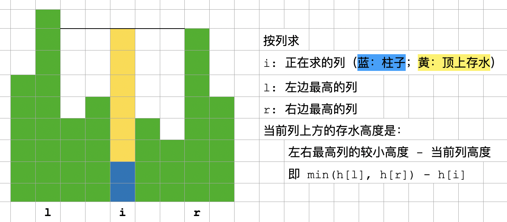

# [leetcode 42. 接雨水](https://leetcode.cn/problems/trapping-rain-water/)

references:
- [四种方法](https://mp.weixin.qq.com/s/XyiYcDwEv3VW5Zs-WmRbDQ)
- [水平方向解法的一种理解](https://mp.weixin.qq.com/s/epYmfWy5BEOYOxF8kKj9Gw)

# solution 1. 按列（竖直方向），每个柱子顶上竖直方向能存多少水。



如何得到左边最高、右边最高，有多种方法。

- 最基本的方法，简单遍历。超时。[trapping-rain-leet-42-vertically-01-naive-tle.cpp](code/trapping-rain-leet-42-vertically-01-naive-tle.cpp)
- 优化一下，预处理。[trapping-rain-leet-42-vertically-02-preprocess.cpp](code/trapping-rain-leet-42-vertically-02-preprocess.cpp)
- 变形的单调栈，求 prev greatest 和 next greatest（注意是 greatest 不是 greater）。但有些硬套公式、为了使用单调栈而使用的感觉。[trapping-rain-leet-42-vertically-03-mono-stack.cpp](code/trapping-rain-leet-42-vertically-03-mono-stack.cpp)

# solution 2. 最佳解法，1 的改进

与 1 基本相同，按列（竖直方向），每个柱子顶上竖直方向能存多少水。但求左最高、右最高的方法不同。

先找出最高的柱子高度 `maxh`。最高的可能有多个，其中最左边（第一个）的下标为 l，最右边（最后一个）的下标为 r。

整个序列可分成三部分：
1. 左：l 左边的（含不含 l 均可）
2. 右：r 右边的（含不含 r 均可）
3. 中：l、r 中间的（含不含 l、r 均可）。如果最高的 maxh 只有一个，则不存在这一部分。但不影响逻辑和计算结果。

然后依次遍历这三个部分。

- 正序，从下标 0 开始，遍历“左”部分，记录“到目前为止的最大柱子高度” 为 `mh`。对每根柱子而言，它左边最高的柱子就是 `mh`，右边最高柱子就是 `maxh`。每个柱子顶上竖直方向能存的水，就是 `min(maxh, mh) - h[i]`，也就是 `mh - h[i]`。如果自己恰好就是当前最高的，则自己顶上竖直方向不能存水，`mh - h[i]` 也恰好是 0。
- 逆序，从下标 n-1 开始，遍历“右”部分，方法类似。
- “中”部分，左右最高均为 `maxh`，柱子顶上竖直方向能存的水是 `maxh - h[i]`。

<font color="green">这个思路，应该是所有思路中的最佳。</font>代码 [trapping-rain-leet-42-vertically-12-perfect.cpp](code/trapping-rain-leet-42-vertically-12-perfect.cpp)。注意，开始遍历一遍求 maxh 的过程中，没有记录 l、r 的位置，是在后面遍历左、右两部分时，跟 maxh 比较而确定的。当然也可以在求 maxh 时就记录。

```cpp
    int trap(vector<int>& height) {
        int n = height.size();
        int maxh = 0; // 全局最高
        for (int i = 0; i < n; i++) {
            maxh = max(maxh, height[i]);
        }

        int sum = 0;
        int mh = 0; // 到目前为止，最高
        int i;
        for (i = 0; i < n && height[i] < maxh; i++) {
            mh = max(mh, height[i]);
            sum += (mh - height[i]) * 1;
        } // 以上遍历左部分

        int l = i; // l: 从左边数，第一个 maxh 的位置
        mh = 0;
        for (i = n - 1; i > l && height[i] < maxh; i--) {
            mh = max(mh, height[i]);
            sum += (mh - height[i]) * 1;
        } // 以上遍历右部分
        int r = i; // r: 从右边数，第一个 maxh 的位置
        for (i = l + 1; i <= r - 1; i++) {
            sum += (maxh - height[i]) * 1;
        } // 以上遍历中间部分
        return sum;
    }
```

该思路的 go 代码版本：[`trapping-rain-leet-42-vertically-12-perfect.go`](code/trapping-rain-leet-42-vertically-12-perfect.go)。与 C++ 版本不同的是，在开始遍历求 maxh 的过程中，记录了 l、r 的位置；后面再遍历求和时，直接用 l、r 位置，不用跟 maxh 比较来确定位置。

```go
func trap(height []int) int {
    var maxh int = -1 // 全局最高柱子高度
    li, ri := -1, -1  // 最左、最右的 maxh 的下标
    for i, h := range height {
        if h > maxh {
            maxh = h
            li, ri = i, i // 同时更新最左边、最右边的 maxh 下标
        } else if h == maxh {
            ri = i // 只更新最右边的 maxh 下标
        }
    }

    sum := 0
    maxh_sofar := height[0]
    for i := 1; i < li; i++ {
        if h := height[i]; h < maxh_sofar { // 这个h的赋值，可以覆盖到下面的 else if
            sum += (maxh_sofar - h) * 1
        } else if h > maxh_sofar {
            maxh_sofar = h
        }
    }
    maxh_sofar = height[len(height) - 1]
    for i := len(height) - 1 - 1; i > ri; i-- {
        if h := height[i]; h < maxh_sofar {
            sum += (maxh_sofar - h) * 1
        } else if h > maxh_sofar {
            maxh_sofar = h
        }
    }
    for i := li + 1; i < ri; i++ {
        sum += (maxh - height[i]) * 1
    }
    return sum
}
```

## 类似思路

来自 https://mp.weixin.qq.com/s/XyiYcDwEv3VW5Zs-WmRbDQ 方法 4，但把简单问题复杂化了。
- [trapping-rain-leet-42-vertically-11.cpp](code/trapping-rain-leet-42-vertically-11.cpp)

# solution 3. 按行

## 直观解法

每根柱子，与其 previous greater 和 next greater，构成一个凹槽，水平方向，分层（见图），能存多少水。

水平方向为什么要分层？因为栈内相邻两元素之间的柱子已经被弹出去了，无法得到他们的信息，只能得到相邻两个元素构成的“水平层”。画图有助理解。

两个方向都是严格 greater，一遍遍历不能得到，得两遍。运行时，发现不能处理途中第 4、6 个的情况。4、6 重复计算了。


代码：[trapping-rain-leet-42-horizonally-01-mono-stack-intuitive-wrong.cpp](code/trapping-rain-leet-42-horizonally-01-mono-stack-intuitive-wrong.cpp)

怎么办？搞个 set 去重？感觉不优雅。

2023.12.21 感悟：受[「leet-795-区间子数组个数」的直接了当解法](leet-795-区间子数组个数.md)启发，「两端都是 greater」不行，则<font color="green">改成「一端 greater、另一端 greater-or-equal」，就可以把等高的两根柱子分割在不同的区间里，就可以了</font>。改哪端都可以。若从上面的错误代码改，两处 while 条件里，都改成 `>` ，或都改成 `>=`，都可以。当然，最好还是改成遍历一遍，同时求出 next greater 和 previous greater or equal。代码：[trapping-rain-leet-42-horizonally-01-mono-stack-intuitive.cpp](code/trapping-rain-leet-42-horizonally-01-mono-stack-intuitive.cpp)

## 正确、但不直观的解法，也是 leetcode 官方解法

优化：考虑到 “`top` 的 previous greater 就是 `top-1`” 这个性质。

单调下降栈。直观：高-低-高，才能盛水。前面的“高-低”是栈内，说明要单调下降，后面的“高”是新来的、尚未入栈的。

每次 `new` 来，就看它是否能构成一个“高-低-高”结构。

- 若 `new > top`，新柱子比 `top` 高，则 `top-1`, `top`, `new` 构成一个以 `top` 为底的凹槽；若 `new > top 多个`，则每次弹出 `top` 后，新的 `top-1`, `top`, `new` 都构成凹槽。弹完所有 `top` 后，`new` 入栈。
- 否则，新柱子比 `top` 低或相等，这个 `new` 不构成凹槽，直接入栈即可。

这样，以 `new` 为抓手，依次遍历所有凹槽，不重复，不遗漏。就是官方解法。

<font color="green">这个思路，不是用栈求每个元素的 next greater，而是用栈自身的元素做计算。</font>那么，经典问题：while 循环条件中，`h[i] > h[st.top()]` 这里用 `>=` 还是 `>`？对应问题：栈应该是严格单调的，还是不严格单调的？（因为这个场景我们关心的不是 next greater，所以不说对应“应该求 next-greater 或 next-greater-or-equal”的问题。）

- 若用 `>=`，栈内不会有相同元素，栈是严格单调的，但构成的凹槽里，`new` 和 `top` 可能相同。
- 若用 `>`，栈内可能有相同元素，栈不是严格单调的。构成的凹槽里，`top` 和 `top-1` 可能相同。

不过，这两种相同的情况，对应的 h 都为 0，对所求面积都没有影响。

<font color="green">所以，while 循环条件中，`h[i] > h[st.top()]` 这里用 `>=` 或 `>` 都可以。</font>

<font color="red">但总感觉这个思路不是太直观。</font>

代码：[trapping-rain-leet-42-horizonally-02-mono-stack-official.java](code/trapping-rain-leet-42-horizonally-02-mono-stack-official.java)

```java
    public int trap(int[] height) {
        int ans = 0;
        Stack<Integer> st = new Stack<>();
        for (int i = 0; i < height.length; i++) {
            while (!st.isEmpty() && height[i] > height[st.peek()]) { // >= 或 > 均可
                int h0 = height[st.pop()]; // top, 凹槽底部
                if (st.isEmpty()) {
                    break;
                }
                int left = st.peek(); // top-1, left of top
                int h = Math.min(height[i], height[left]) - h0;
                int w = i - left - 1;
                ans += h * w;
            }
            st.push(i);
        }
        return ans;
    }
```


