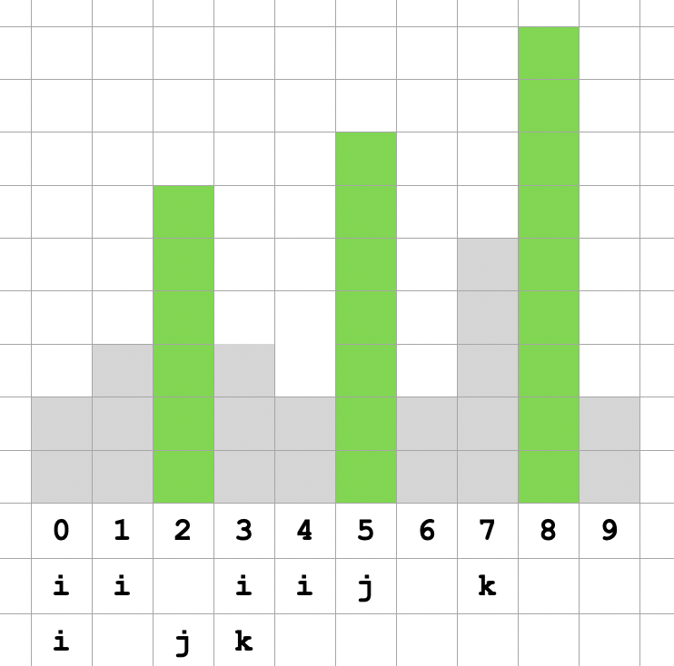

# [`456.` 132 模式](https://leetcode.cn/problems/132-pattern/)

`132` -> `ijk`

从后往前，逆序遍历，维护一个「单调递减」栈。

- 历次被弹出的栈顶里最大的：对应 2k
- 把 2k 弹出的那个「新来的」，也就是 2k 被弹出后入栈的新栈顶，对应 3j
- 新来的：对应 1i

确定了 2k、j3 后，就简单了，只要新来的 i 比 k 小（也肯定比 j 小），就对应至少一个解。

为什么「至少」？因为 k 是「被弹出的最大的」，所以 `(j,k)` 是最大的一组。在它们左边，也有可能有其他较低的 `(j',k')`。满足 `i < (j,k)` 的，也有可能满足 `i < (j', k')`，但不影响结论。选择最大的 `(j,k)`，可以增大 i 的选择（覆盖了所有 i 的选择），而且代码上实现起来也方便。



如图，第一行，`(j=5,k=7)` 是「最大一组」，`i=4,3,1,0` 都可与其匹配。第二行，是一组较小的 `(j=2,k=3)`，只有 `i=0` 可与其匹配。

代码：[`leet-456-pattern-132.cpp`](code/leet-456-pattern-132.cpp)

```cpp
    // 简单版，只返回 true/false。stack 中存放 k 的值，也不记录 j 的位置。（因为只要有 k，就必定有对应的 j）
    bool find132pattern(vector<int>& nums) {
        int n = nums.size();
        int kval = INT_MIN;
        stack<int> st;
        for (int i = n - 1; i >= 0; i--){
            if (nums[i] < kval) {
                return true;
            }
            while (!st.empty() && st.top() < nums[i]) { 
                kval = max(kval, st.top()); // 历次被弹出的最大的
                st.pop();
            }
            st.push(nums[i]);
        }
        return false;
    }
```

为了帮助理解，稍加改动，输出最大的 `(j,k)` 及对应的所有 `i`。`i,j,k` 均为下标。stack 中也存下标。

```cpp
    // 详细版，输出最大的 (j,k) 及对应的所有 i。i,j,k 均为下标。stack 中也存下标。
    bool find132pattern_detail(vector<int>& nums) {
        int n = nums.size();
        int j = -1, k = -1;
        stack<int> st;
        for (int i = n - 1; i >= 0; i--) {
            if (k >= 0 && nums[i] < nums[k]) {
                printf("(%d,%d,%d): (%d,%d,%d)\n", i, j, k, nums[i], nums[j], nums[k]);
                // return true;
            }
            while (!st.empty() && nums[st.top()] < nums[i]) {
                if (k < 0 || nums[k] < nums[st.top()]) {
                    k = st.top();
                    j = i;
                }
                st.pop();
            }
            st.push(i);           
        }
        return false;
    }
```

还有[一种方法](https://leetcode.cn/problems/132-pattern/solutions/676970/xiang-xin-ke-xue-xi-lie-xiang-jie-wei-he-95gt/comments/851015)，代码 [`code/leet-456-pattern-132-sol2.cpp`](code/leet-456-pattern-132-sol2.cpp)，还需理解。<font color="red">to do later</font>