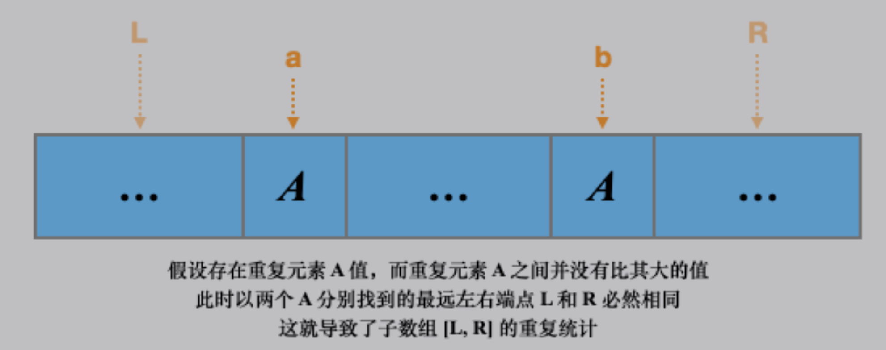

# [795. 区间子数组个数](https://leetcode.cn/problems/number-of-subarrays-with-bounded-maximum/)

两种方法的代码：[number-of-subarrays-with-bounded-maximum-leet-795.cpp](code/number-of-subarrays-with-bounded-maximum-leet-795.cpp)

## 法一，单调栈

最大值范围在 [left, right] 之间的子数组个数，可等价为，每一个符合要求的元素 i 作为最大值时，子数组的个数。

再转换为：每个 i 作为子数组最大值时，最远的合法左右端点的位置。也就是，求每一个 i 左右最近的比它“大”的位置。显然可以用单调栈求 next greaters 和 previous greaters。

但有个问题：若数组有重复元素，则在如图情况下，会重复统计子数组。

如何解决？把「两端都是严格 greater」，改为「一端严格 greater，一端 greater or equal」，就会把两个重复元素分割在两个不同的范围内。这样处理后，还有一个意外之喜，求 next greater 和 previous greater or equal，遍历一遍就可以。另外，next greater 缺省值为 n，previous 缺省值为 -1，都是「比边界远一」，做减法时方便。

## 法二，直接了当

数组元素分为三类，分别用 0、1、2 表示：
- 0: `x < left`
- 1: `x in [left, right]`
- 2: `x > right`

问题转换为：不包含 2、且至少包含一个 1 的子数组数目

两个指针
- p2: 上次 2 出现的位置。-1 表示没有。
- p1: 上次 1 出现的位置。-1 表示没有。

遍历每个元素 i，统计以 i 结尾的数量。
- 若 i 是 type 2: 无
- 若 i 是 type 1: 开始元素范围为 `(p2, i]` 左开右闭，个数为 `i - p2`
- 若 i 是 type 0: 开始元素范围为 `(p2, p1]` 左开右闭，个数为 `p1 - p2`

惊喜地发现，上两式对 `p2 = -1` 时也适用。

又发现，在设置 p1、p2 的情况下，上两式可统一为 `p1 - p2`。不过还是分开写逻辑更清楚。

与这种简捷方法相比，单调栈方法属于持锤找钉了。
