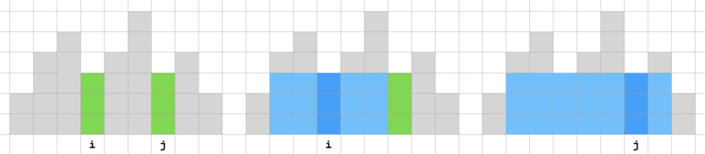

# [`leet 84.` 柱状图中最大的矩形](https://leetcode.cn/problems/largest-rectangle-in-histogram/)

基本思路：对每个柱子 `i`，其高度 `h[i]`。以其为最低柱，往两边扩展，找到所有「不低于」它的范围 w，得到 i 对应的最大矩形，面积为 `h[i] * w`。

<font color="red">问题：为啥是「最低」？其他的，「最高」、「最左」、「最右」，可以吗？</font>

# 法一：直截了当

找左右两边「最远的不低于」，可以先找左右两边「第一个低于」，再回缩一个。也就是，分别找其：左边 previous smaller、右边 next smaller，再回缩一个。
- 左边：previous smaller 为 `l[i]`，则左边「最远的不低于」为 `l[i] + 1`
- 右边：next smaller 为 `r[i]`，则右边「最远的不低于」为 `r[i] - 1`

则 i 对应的最大面积为 `h[i] * ((r[i] - 1) - (l[i] + 1) + 1) = h[i] * (r[i] - l[i] - 1)`。

对所有 i 打擂台，找最大的即可。

求 next smaller 和 previous smaller，用递增栈。两个都是严格 smaller，一遍循环不能都得到。自然可以两遍循环，分别找出。

但是，若用一遍循环，求出来一边是 strictly smaller，另一边是 smaller-or-equal，最后也能得到正确结果。而且，哪边 strict，也不影响结果。



如图，左边找 prev smaller，右边找 next smaller-or-equal。i、j 两柱等高，「以 i 为最低点」算出来的不对，「以 j 为最低点」算出来的是正确的。<font color="green">规律：「哪边」有 equal，则在多个等高柱子中，最「那边」的柱子算出来的是对的，其他的都不对。</font>当然，讨论问题时，假设这些等高柱子中间没有比它们还低的，否则，next smaller 得到的就不是「下一个等高柱」，而是「更低的」真的 smaller，也就不用讨论了。

可以这么理解：这样的多个等高柱子中，最右边的柱子，它的 next smaller-or-equal 是真的 smaller。它的左右两边都是 smaller，结果正确。其他柱子的 next smaller-or-equal 是 equal 的，算出来的是错的。但这个正确的，弥补了其他的错误结果。

甚至可以这么理解，以柱高 h 为下标，`area[h]` 被多次更新，最大的那个是正确的。

也算歪打正着。不过，与其依靠歪打正着，还是直接求双端严格 smaller 逻辑上更清晰。

下面代码，就用了歪打正着的一遍循环。[`largest-rectangle-in-histogram-leet-84.cpp`](code/largest-rectangle-in-histogram-leet-84.cpp)

```cpp
    int largestRectangleArea(vector<int>& heights) {
        int n = heights.size();
        vector<int> left(n), right(n, n);
        
        stack<int> st;
        for (int i = 0; i < n; ++i) {
            while (!st.empty() && heights[st.top()] >= heights[i]) { // 用 >= 或 > 都行
                right[st.top()] = i;
                st.pop();
            }
            left[i] = (st.empty() ? -1 : st.top());
            st.push(i);
        }
        
        int ans = 0;
        for (int i = 0; i < n; ++i) {
            ans = max(ans, (right[i] - left[i] - 1) * heights[i]);
        }
        return ans;
    }
```

# 法二：running

法一是算完所有的 next/previous smaller，再一起算 `area[i]`。法二则是在行进中完成。

还是单调（不严格）递增栈。

每来一个新柱 i，若比栈顶柱（用「top」表示）高或等，则直接入栈。否则，若低于 top，则 i 就是 top 的 next smaller，而「栈顶-1」（用「top_1」表示）就是 top 的 prev smaller，可得到「以 top 为最低」的最宽矩形。top 被弹出后，新的 top （原来的 top_1）仍然适用这个逻辑，可得到「以 top_1 为最低」的最宽矩形。依次弹出所有比 i 高的，然后 i 入栈。

所有柱都处理完后，栈可能还不为空。栈内各柱都是没有「next smaller」的，每个柱子的右边都比它高，其「右边最远的不高于」就是「右边界」。栈内各柱是有「prev smaller」的，就是栈内比自己减 1 的位置。依次弹出栈内每个柱，计算即可。特殊地，剩下的最后一个柱，没有「prev smaller」，其「左边最远的不高于」就是「左边界」。


如图。注意，栈内元素是不严格递增的，可能有相邻元素相等的情况，如图中 t1、t2。可见，「以 t1 为最低点」算出来的其实是错的，但被「以 t2 为最低点」的正确结果弥补了。事实上，若有多个相邻元素相等的情况，只有最靠近栈底（离新来的 i 最远）的 tx 算出来的是正确的。这就是前面说的「歪打正着」。

代码如下。[`largest-rectangle-in-histogram-leet-84-running.cpp`](code/largest-rectangle-in-histogram-leet-84-running.cpp)

```cpp
    int largestRectangleArea(vector<int> &heights) {
        unsigned long n = heights.size();
        if (n == 1) {
            return heights[0];
        }
        int res = 0;
        stack<int> st;
        for (int i = 0; i < n; i++) {
            while (!st.empty() && heights[st.top()] > heights[i]) {
                int h = heights[st.top()];
                st.pop();
                int w = st.empty() ? i : i - st.top() - 1;
                res = max(res, h * w);
            }
            st.push(i);
        }

        // 所有柱子都入栈后，再遍历栈内还剩的柱子
        while (!st.empty()) {
            int h = heights[st.top()];
            st.pop();
            int w = st.empty() ? n : n - st.top() - 1;
            res = max(res, h * w);
        }
        return res;
    }
```

# 法三，法二的优化，running + sentinel

尾部加个哨兵 sentinel，简化代码。头部不加哨兵，以免被坑。

代码如下。也不用特殊判断 `n == 1` 的情况了。while 循环条件，用「`>`」或「`>=`」都行。 [`largest-rectangle-in-histogram-leet-84-running-sentinel.cpp`](code/largest-rectangle-in-histogram-leet-84-running-sentinel.cpp)

```cpp
    int largestRectangleArea(vector<int> &heights) {
        heights.push_back(-1); // 只用尾哨兵，不用首哨兵
        unsigned long n = heights.size();

        int res = 0;
        stack<int> st;
        for (int i = 0; i < n; i++) {
            while (!st.empty() && heights[st.top()] > heights[i]) { // > 或 >= 都行
                int ti = st.top();
                int h = heights[st.top()];
                st.pop();
                int w = st.empty() ? i : i - st.top() - 1;
                res = max(res, h * w);
            }
            st.push(i);
        }
        return res;
    }
```