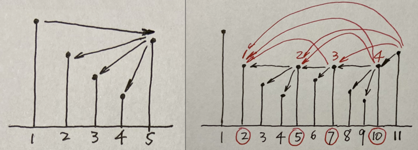
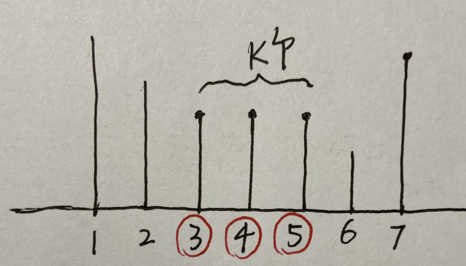

# `luogu P1823 [COI2007]` Patrik 音乐会的等待

- [luogu p1823](https://www.luogu.com.cn/problem/P1823)
- [l5, u9, ex1](https://oj.youdao.com/course/37/278/1#/1/14203)

队列中任意两个人 a 和 b，如果他俩相邻，或他俩之间没有人比他俩高，则他俩可以相互看见。求：有多少对人可以互相看见。

「他俩之间没有人比他俩高」，则，他俩之间即使有跟他们等高的，也不影响他俩相互看见。

# 解法一

严格递减栈，统计 next/previous greaters.



左图，没有等高的情况，栈内严格递减。5 新来，弹出 2、3、4；5 与它们之间都无阻挡，都可互见。（2、3、4 之间可能有已经被弹出栈的元素，但 5 跟他们是不可互相看见的，被 2、3、4 挡住了。）5 与弹完后的 top 间也无阻拦，也可互见。

右图，有等高的情况。红圈的几个是等高的。后来的会把以前跟自己等高的弹出去，但后来的与前面所有等高的都可互见。最后 11 比这些等高的都高，与它们也都互见。所以用 num 记录「我、以及前面跟我等高的，总共有多少个」。每次弹出一个栈顶元素，ans 要增加「跟栈顶元素等高的所有」。

代码，luogu ac：

```cpp
    #include <stack>
    #include <cstdio>
    using namespace std;
    
    struct person {
        int h;
        int num;
    };
    int main() {
        int n;
        scanf("%d", &n);
        stack<person> st;
        long long ans = 0;
        for (int i = 0; i < n; i++) {
            int h;
            scanf("%d", &h);
            int num = 1;
            while (!st.empty() && st.top().h <= h) {
                ans += st.top().num;
                if (st.top().h == h) {
                    num += st.top().num;
                }
                st.pop();
            }
            if (!st.empty()) {
                ans++; // 新来的与栈顶之间无阻挡，可互见
            }
            // printf("i:%d, i.h:%d, i.num:%d\n", i, h, num);
            st.push({h, num});
        }
        printf("%lld\n", ans);
        return 0;
    }
```

To add: 输出所有 pair

To add: 用递增栈、next/previous smaller 统计，如何？

# 思路二（<font color="red">错误</font>）

我的改进：每次增加 num 感觉比较乱，理不清思路。

若无等高的，则简单：我跟我的 next greater 互见，我跟我的 previous greater 互见。



如图，若有 k 个等高的，则它们两两互见，共 `k*(k-1)/2` 组；它们每个与新来的 7 互见，共 k 个。总共 `k*(k-1)/2 + k = k*(k+1)/2` 组（记此数为 `kk`）。

难点是，如何统计 `k`，且只在最后一个等高的元素被弹出时才一起增加 `kk` 次。

用每个元素的 `num` 表示我是等高的第几个。缺省为 `1`，表示就我自己。每次新元素入栈时，先弹完比新来的小的；如果此时 top 与新来的等高，则 `top.num++`，不计数；否则（不等高），计数 `kk`。

代码，luogu 5 test cases passed:

```cpp
    #include <stack>
    #include <cstdio>
    using namespace std;
    
    struct person {
        int h;
        int num;
    };

    int main() {
        int n;
        scanf("%d", &n);
        person a;
        stack<person> st;
        long long ans = 0;
        for (int i = 0; i < n; i++) {
            scanf("%d", &a.h);
            a.num = 1;
            while (!st.empty() && st.top().h < a.h) {
                ans += st.top().num * (st.top().num + 1) / 2;
                st.pop();
            }
            if (!st.empty()) {
                ans++;
            }
            if (!st.empty() && st.top().h == a.h) {
                st.top().num++;
            } else {
                st.push(a);
            }
        }
        printf("%lld\n", ans);
        return 0;
    }
```
