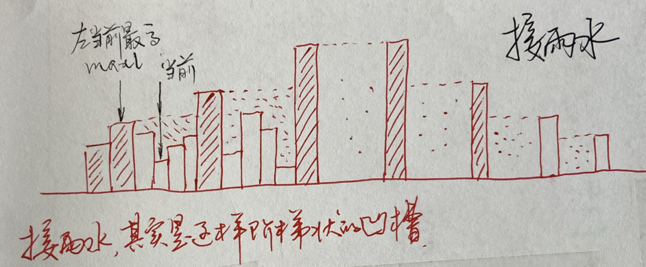

# [od 2654: 2023Q1A-天然蓄水池](https://oj.algomooc.com/problem.php?id=2654)

类似接雨水，但要找出哪个凹槽盛水最多。

通过此题，发现接雨水的特点，是阶梯状的、各不相连的凹槽，两边向中间，逐步升高。但不是「单调递增或递降栈」，而是「保旧、可舍弃新」的这样的「单调栈」，从两边往中间逼近即可。

题目所给 test case 答案不对，我的代码都不能 ac。

# 法一：不用栈，两边往中间逼近

超时。[`od-2654-mine-tle.cpp`](code/od-2654-mine-tle.cpp) 能加速吗？不能用「单调栈」。

# 法二：基于 leet 42 的双指针法

但 while 结束后，还得再判断一下左右的 area。有空再细想如何优化这一点。

[c++ 代码](code/od-2654-mine-2ptrs.cpp)

# 法三：类似接雨水官方解法 running 版本，但要从两边分别求

好像是从哪里找到的「官方」解答？

如何判断凹槽结束？stack empty，说明新来的是目前最高柱，是新凹槽的开始。（考虑图：阶梯上升凹槽）。但这只是左半边；右半边是阶梯下降的，得逆序来一遍。

[`od-2654-water-official.cpp`](code/od-2654-water-official.cpp) 

# 法四：不 running 的版本

？
