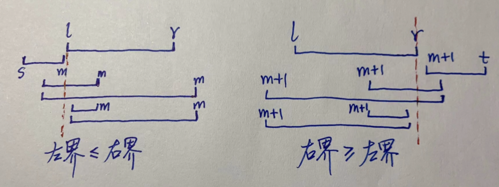

# 线段树 segment tree, statistic tree

如图，统计 sum 的线段树。红色数字为每个 node 的编号，可见是从 1 开始。10、11 两个编号未用。


优点：不用线性遍历每个元素，可在 tree 上迅速找到对应元素或元素范围。(huafeng 总结)

分类：
- sum segment tree: 每个节点存储其对应 array segment 的 sum。
- min/max segment tree: 每个节点的值是其对应 array segment 的 min 或 max 值。
- range update segment tree 或 lazy tree: 用某给定值来更新 array 一个范围的所有元素。

通常，线段编号从 1 开始。用数组实现，则数组下标从 1 开始，编号（数组下标）为 i 的节点，其两个子节点编号（数组下标）分别为 `2i` 和 `2i+1`。

操作
- `push_up`：由子节点计算父节点的信息；
- `push_down`：把当前节点的修改信息下传到子节点，也被称为懒标记（延迟标记）lazy propogation
- `build`
- `update`
  - `point_update`（要用到 `push_up`）
  - `range_update`（要用到 `push_down`）
- `query`：查询某区间的值。
  - `point_query`
  - `range_query`

# 静态建树、查询

如下，对 `a[]` 数组建线段树，并查询。树为 `tree[]`，大小为 `4n`（<font color="red">待解释</font>）。下标从 1 开始。

```cpp
    float a[] = {4, 5, 6, 7, 8, 9, 10, 11, 12, 13};
    int n = sizeof a / sizeof a[0];
    int N = 4 * n;
    float tree[N]; // 线段树
    fill(tree, tree + N, 0.0);
    
    int s = 0, t = n - 1;
    build(a, s, t, tree, 1);
    int l = 3, r = 5;
    float sum = do_query(l, r, tree, s, t, 1);
```
其中：

```cpp
    // 建树：对 a[s, t] 闭区间范围，建立线段树。可能是整棵树，也可能是整棵树的一个子树。
    // 树的 root node 编号为 index。
    void build(float a[], int s, int t, float tree[], int index);

    // 查询：a[l, r] 为查询区间, index 为线段树当前节点（子树的 root）的编号、tree[s, t] 为该节点对应的区间
    float do_query(int l, int r, float tree[], int s, int t, int index);
```

注意，这两个函数都是递归调用的。

最顶层的调用，对一个完整数组来说，`s = 0`，`t = n - 1`；整个线段树根节点编号为 1，`index = 1`。所以调用方式如下：

```cpp
    build(a, 0, n - 1, tree, 1);
    do_query(l, r, tree, 0, n - 1, 1);
```

但也可以只把数组（序列）的一部分建树，此时 s、t 值就不一定了。例如，对 `a[3, n-2]` 子序列建树。（整个线段树根节点编号为 1，这一点不变）

```cpp
    build(a, 3, n - 3, tree, 1);
    do_query(l, r, tree, 3, n - 3, 1);
    // l,r 范围是针对整个 a[] 而言，也就是 a[l, r]，不是针对建树的 a[3, n-3] 序列而言（a[3+l, 3+r]）。
```

当然，也可以查询时自己调整下标，使其针对建树的范围而言。不过怪麻烦的，何苦来哉。

```cpp
    build(a, s, t, tree, 1);
    do_query(l, r, tree, s, t, 1); // 简便：l, r, s, t 下标都是针对整个 a[] 范围
    do_query(l - s, r - s, tree, 0, t - s, 1); // 自己调整，下标都针对建树涉及到的 a[s, t] 子范围
```

完整代码：[`segment-tree-static.cpp`](code/segment-tree-static.cpp)。关键代码如下。

注意 `do_query()` 中判断「有交集」的条件，`l <= m` 或 `r >= m + 1`，看图，分别是`「查询左界 <= 左子右界」`和`「查询右界 >= 右子左界」`。



```cpp
    // 对 a[s, t] 区间建立线段树（可能是整棵树，也可能是整棵树的一个子树）
    // 树的根节点编号为 index
    void build(float a[], int s, int t, float tree[], int index) {
        if (s == t) {
            tree[index] = a[s];
            return;
        }
        int m = s + (t - s) / 2;
        // 递归到左右子树。tree node 下标从 1 开始，故左右子节点的下标为 2i, 2i+1。
        build(a, s, m, tree, index * 2);
        build(a, m + 1, t, tree, index * 2 + 1);
        tree[index] = tree[2 * index] + tree[2 * index + 1];
    }

    // a[l,r] 为查询区间，index 为线段树当前节点的编号，[s,t] 为该节点对应的区间
    // 把 tree 的 [s,t] 区间拆成多个小区间，递归调用，每次调用都用同样的查询区间 [l,r]
    float do_query(int l, int r, float tree[], int s, int t, int index) {
        // 当前区间为查询区间的子集时，直接返回当前区间的 sum
        if (l <= s && t <= r) {
            return tree[index];
        }
        int m = s + (t - s) / 2;
        float sum = 0;
        // 如果左儿子代表的区间 [s,m] 与询问区间有交集，则递归查询左儿子
        if (l <= m) { // 查询左界 <= 左子右界
            sum += do_query(l, r, tree, s, m, index * 2);
        }
        // 如果右儿子代表的区间 [m+1,t] 与询问区间有交集，则递归查询右儿子
        if (r > m) { // r >= m+1: 查询右界 >= 右子左界
            sum += do_query(l, r, tree, m + 1, t, index * 2 + 1);
        }
        return sum;
    }
```

注意，`do_query()` 以及后面要看到的其他操作，参数可以分成两部分。第一部分，关于查询或操作的范围；第二部分，线段树（子树）信息，包括树 root 编号、以及该子树对应的范围。如果子树范围能满足查询范围，则直接返回；否则，把子树范围切成两半，对应左右两个子树，分别递归调用两个子树。递归调用时，查询范围不变，仍为 `[l,r]`；两个子树编号分别是 `2i`、`2i+1`，子树范围分别是 `[s,m]`、`[m+1,t]`，依此类推。首次调用时，是整棵树，编号是 1，范围是建树时给的 `[0, n-1]`。

注意，子树拆分时，`m = (s + t) / 2`。若范围是奇数个元素，则左子树比右子树多一个；若范围是偶数个元素，两子树元素数量相同。

# 单点查询、更新

完整代码：[segment-tree-point-ops.cpp](code/segment-tree-point-ops.cpp)

关键代码：

```cpp
    // 单点查询：查询 a[where] 的值
    float do_point_query(int where, float tree[], int s, int t, int index) {
        if (s == t) {
            return tree[index];
        }
        int m = s + ((t - s) >> 1);
        if (where <= m) {
            return do_point_query(where, tree, s, m, 2 * index);
        } else {
            return do_point_query(where, tree, m + 1, t, 2 * index + 1);
        }
    }

    // 单点更新：a[k] 值修改为 val
    void do_point_update(int k, float val, float tree[], int s, int t, int index) {
        if (s == t) {
            tree[index] = val;
            return;
        }
        int m = s + ((t - s) >> 1);
        if (k <= m) {
            do_point_update(k, val, tree, s, m, 2 * index);
        } else {
            do_point_update(k, val, tree, m + 1, t, 2 * index + 1);
        }
        push_up(tree, index);
    }
```

# 区间更新

给某区间内每个元素都加上一个值。

显然要更新该区间对应的节点的查询值。这样，查询该区间、以及更大区间，结果正确。

但，该区间的各子区间对应的节点的查询值未更新，查询子区间时，结果是错误的。

若更新每个子区间，耗时会上升到 O(n)。且因线段树的节点数量比数组还多，实际耗时比直接更新原数组还要多。

解法：懒惰标记 lazy flag

`lazy[]` 数组，与 `tree[]` 数组同样大小，专门标记哪些区间被更新了，以及增加多少。注意，只标记最上层区间。然后当有做向下DFS的机会时，进行『标记下放』，这样就可以保证更新只做一次。

具体：

找到目标区间，更新其对应节点的值 `tree[i] += (t - s + 1) * x`，并标记 `lazy[i] = x`。注意，本区间的值已更新，但仍标记了 lazy；所以 lazy 表示『我已更新、但我的子区间还未更新』。（所以，如果我没有子区间（当 `s == t`），也不用标记 lazy）记住这一点，有助于理解 `push_down()` 和 `do_query()` 里如何处理 lazy 标记。

之后，在所有的DFS过程中（任何更新和查询），都会看当前区间，是否被标记过。若标记过，则也更新一下它的两个子区间，此称为『标记下放』。注意每次『标记下放』只是从当前区间下放到其子区间，不再往下。只在访问子区间时，再继续向下。这样就能保证，区间更新的效果只向其子区间遍历一次，并且在任何一次DFS时就顺带下去了，不会产生额外的复杂度开销，是O(1)的。

综合分析，区间更新的复杂度只消耗在更新目标区间的过程，即是O(logn)的。通过『懒惰标记』方法，把子区间的更新摊还到了其他DFS过程中，不产生额外的开销，所以总的复杂度是O(logn)。

```cpp
    // 更新：a[l, r] 范围，每个元素增加 x。线段树的当前节点为 index，对应范围 [s, t]
    void do_add(int l, int r, float x, float tree[], float lazy[], int s, int t, int index);

    // 使用方法：
    float a[] = {4, 5, 6, 7, 8, 9, 10, 11, 12, 13};
    int n = sizeof a / sizeof a[0];
    int N = 4 * n;
    float tree[N], lazy[N]; // 新增 lazy[]
    fill(tree, tree + N, 0.0);
    fill(lazy, lazy + N, 0.0);

    int s = 0, t = n - 1;
    build(a, s, t, tree, 1);
    do_add(4, 8, .15, tree, lazy, s, t, 1); // 更新：[4, 8] 范围内，每个元素增加 .15
    float sum = do_query(3, 9, tree, lazy, s, t, 1); // 查询 [3,9] 范围的和
```

完整代码：[segment-tree-lazy-add.cpp](code/segment-tree-lazy-add.cpp)。

关键代码如下。其中，
- `build()` 的实现，与原来一样（只是把加法换成了 `push_up()`）。因是静态建树，不涉及到 lazy[]。
- `do_query()` 里，增加了处理 lazy[] 的代码。
- `do_add()` 也要处理 lazy[]。
- `push_down()` 用于处理 lazy[]，被 `do_query()` 和 `do_add()` 用到。
- `push_up()` 根据两个子节点、更新父节点，被 `build()` 和 `do_add()` 用到。

```cpp
    void push_up(float tree[], int i) {
        tree[i] = tree[2 * i] + tree[2 * i + 1];
    }
    void push_down(float tree[], float lazy[], int s, int m, int t, int index) {
        tree[2 * index] += (m - s + 1) * lazy[index];
        lazy[2 * index] += lazy[index];

        tree[2 * index + 1] += (t - m) * lazy[index];
        lazy[2 * index + 1] += lazy[index];

        lazy[index] = 0;
    }

    float do_query(int l, int r, float tree[], float lazy[], int s, int t, int index) {
        if (l <= s && t <= r) {
            return tree[index];
        }
        float sum = 0;
        int m = s + ((t - s) >> 1);

        if (lazy[index] != 0) {
            push_down(tree, lazy, s, m, t, index);
        }
        if (l <= m) {
            sum += do_query(l, r, tree, lazy, s, m, 2 * index);
        }
        if (r > m) {
            sum += do_query(l, r, tree, lazy, m + 1, t, 2 * index + 1);
        }
        return sum;
    }

    // 更新：a[l, r] 范围，每个元素增加 x。线段树的当前节点为 index，对应范围 [s, t]
    void do_add(int l, int r, float x, float tree[], float lazy[], int s, int t, int index) {
        if (l <= s && t <= r) {
            tree[index] += (t - s + 1) * x;
            if (s != t) { // 我有子区间，才需标记 lazy
                lazy[index] += x;
            }
            return;
        }

        int m = s + ((t - s) >> 1);
        if (lazy[index] != 0) {
            push_down(tree, lazy, s, m, t, index);
        }
        if (l <= m) {
            do_add(l, r, x, tree, lazy, s, m, 2 * index);
        }
        if (r > m) {
            do_add(l, r, x, tree, lazy, m + 1, t, 2 * index + 1);
        }
        push_up(tree, index);
    }
```

# 区间替换

另一种区间更新方式，把区间内所有元素都替换为另外一个值。

基本思路与区间更新一样，只是修改节点时改成赋值而不是累加。做 lazy 标记需要注意，因为新值可能为0，所以判断一个节点是否标记过，是否需要 lazy propogation 时，不能用 `lazy[index] == 0` 来判断，视题目数据范围，可用一个常规数值范围外的值来当成默认未标记的状态，或者再创建一个数组 visited 来查询节点是否标记过。

# 动态创建子节点

当 DFS 到某个子节点时，发现该子节点还不存在，再去创建。

# 指针式的树

可用常规指针节点的方式来建树，某些情况下更方便。

# references

- http://toughcoder.net/blog/2022/08/23/rmq-made-easy/
- https://leetcode.cn/circle/discuss/H4aMOn/
- [统计的力量——线段树详细教程.pdf by 张昆玮](https://github.com/tiankonguse/lab/blob/master/acm/paper/统计的力量——线段树详细教程.pdf)
