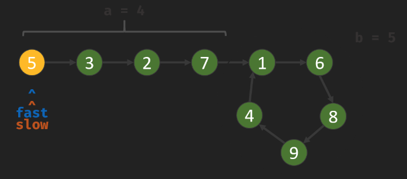

# [141. 环形链表：判断是否有环](https://leetcode.cn/problems/linked-list-cycle/)
# [142. 环形链表 II：找环的第一个节点](https://leetcode.cn/problems/linked-list-cycle-ii/)

# 141. 判断是否有环

「Floyd 判圈算法」（又称龟兔赛跑算法）

三种写法，有某种对称感：
- `while (fast 没碰到 null) { 若 slow 碰到 fast 则有环 }`
- `while (slow 没碰到 fast) { 若 fast 碰到 null 则无环 }`
- `while (true) { 若 fast 碰到 null 则无环；若 slow 碰到 fast 则有环 }`

slow、fast 的初值设置：
- 前两种方法，初值：`slow = head, fast = head->next`。为何不都初始化为 head？因为循环一开始就检查二者是否相同。可以假想 head 之前还有一个 dummy head 节点，慢指针从它移动一步到达 head，快指针从它移动两步到达 `head->next`。若用数组模拟链表，则可用地址 0 当做这个 dummy head 节点。<font color="red">或者 0 其实是真正的 head? to think more.</font>
- 第三种方法，`while (true)` 循环，不是一开始就检查，所以二者可都初始化为 head。

第一种：

```cpp
    bool hasCycle(ListNode *head) {
        if (head == nullptr) { // 不用检查 head->next
            return false;
        }
        ListNode *a = head, *b = head->next;
        while (b != nullptr && b->next != nullptr) {
            if (a == b) {
                return true;
            }
            a = a->next;
            b = b->next->next;
        }
        return false;
    }
```

第二种：
```cpp
    bool hasCycle(ListNode* head) {
        if (head == nullptr) { // 不用检查 head->next
            return false;
        }
        ListNode* a = head, *b = head->next;
        while (a != b) {
            if (b == nullptr || b->next == nullptr) {
                return false;
            }
            a = a->next;
            b = b->next->next;
        }
        return true;
    }
```

第三种：

```cpp
    bool hasCycle(ListNode* head) {
        ListNode *fast = head, *slow = head;
        while (true) {
            if (fast == nullptr || fast->next == nullptr) {
                return false;
            }
            fast = fast->next->next;
            slow = slow->next;
            if (fast == slow) {
                return true;
            }
        }
        return true; // shouldn't be here. to make compiler happy.
    }
```

# 142. 找环的第一个节点

设链表共有 `a+b` 个节点，其中环外（head 到环入口（交叉点），不含环入口（交叉点））a 个，环有 b 个。a、b 未知。如图，`a=4, b=5`。


两指针相遇时，分别走了 f 步、s 步。显然 `f = 2s`。考虑到 fast 比 slow 多走了若干圈，有 `f - s = nb`。所以有：`s = nb, f = 2nb`。

已知环外有 a 个节点，则从 head 出发走 a 步，可达到「环入口」或「交叉点」。则从两指针的相遇点出发，再走 a 步，步数分别为 `a + nb` 或 `a + 2nb`，也可到达「环入口」。但不知道 a 具体是多少。此时再引入一个指针 finder 从 head 出发，与 fast/slow 同走 a 步，恰好都达到「环入口」。（finder 指针也可重复利用 fast 或 slow 之一：让 fast 重新从 head 出发，与 slow 同走 a 步）。<font color="red">注意，若 finder 从虚拟的 dummy head 出发，则有 offset 1 问题。</font>

本人原始写法：

```cpp
    // 双指针
    // 相遇之后，slow 再走到 X，再走若干圈回到 X，ptr 也恰好走到 X
    // 但数学上总担心有 offset 1 问题。而且也不如 hash 法简单。
    ListNode *detectCycle(ListNode *head) {
        ListNode *slow = head, *fast = head;
        while (fast) {
            slow = slow->next;
            if (!fast->next) {
                return nullptr;
            }
            fast = fast->next->next;
            if (fast == slow) {
                ListNode *p = head; // finder 指针 (p)，从 head 出发，与 slow 同走 a 步，相遇
                while (p != slow) {
                    p = p->next;
                    slow = slow->next;
                }
                return slow;
            }
        }
        return nullptr;
    }
```

另一种写法：

```cpp
    ListNode *detectCycle(ListNode *head) {
        ListNode *fast = head, *slow = head;
        while (true) {
            if (fast == nullptr || fast->next == nullptr) {
                return nullptr;
            }
            fast = fast->next->next;
            slow = slow->next;
            if (fast == slow) {
                break;
            }
        }
        fast = head;
        while (slow != fast) {
            slow = slow->next;
            fast = fast->next;
        }
        return fast;
    }
```

## hash 法

```cpp
    // 使用 hash
    ListNode *detectCycle(ListNode *head) {
        unordered_set<ListNode *> m;
        ListNode *p = head;
        while (p) {
            if (m.count(p) != 0) {
                return p;
            }
            m.insert(p);
            p = p->next;
        }
        return nullptr;   
    }
```
