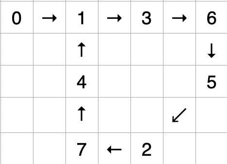

# [`287.` 寻找重复数](https://leetcode.cn/problems/find-the-duplicate-number/)

把这个数组理解为：用数组模拟链表。
- `f[i] = k`，相当于 `i->next = k`
- `f[f[i]]` 相当于 `i->next->next`
- 依此类推。

若 `1 ~ n` 范围内无重复、无遗漏，下标从 0 开始，则会形成 `0 → a₁ → a₂ → a₃ → aₙ → null` 的链表。<font color="red">注意，0 是实际的 head 节点，不是虚拟的 dummy head 节点。</font>

若有重复元素 `f[i] = f[j] = k`，则 `i->next = k, j->next = k`。

```
    value: 1 3 7 6 1 2 5 4
    index: 0 1 2 3 4 5 6 7
     list: 0 1 3 6 5 2 7 4 1 3 ...
```
形成了环，如图，1 是「交点」、「入口」，也是「重复元素」。


法一：
- 找相遇点，fast、slow 初值都为 head 节点 0，用 `while (true)` 循环
- 找环入口，用 `while (true)` 循环，较笨拙

```cpp
    int findDuplicate(vector<int>& nums) {
        int fast = 0, slow = 0;
        while (true) {
            fast = nums[nums[fast]];
            slow = nums[slow];
            if (fast == slow) {
                break;
            }
        }
        int finder = 0;
        while (true) {
            finder = nums[finder];
            slow = nums[slow];
            if (slow == finder) {
                break;
            }
        }
        return slow;
    }
```

法二：
- 找相遇点，fast 初值为 `head->next->next`，slow 初值为 `head->next`，用 `while (slow != fast)` 循环
- 找环入口，用 `while (slow != finder)` 循环，较简捷

```cpp
    int findDuplicate(vector<int>& nums) {
        int slow = nums[0], fast = nums[nums[0]];
        while (slow != fast) {
            fast = nums[nums[fast]];
            slow = nums[slow];
        }
        int finder = 0; // head 节点
        while (slow != finder) {
            finder = nums[finder];
            slow = nums[slow];
        }
        return slow;
    }
```