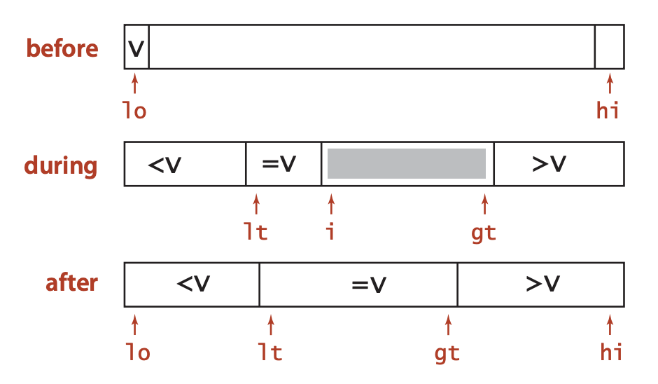
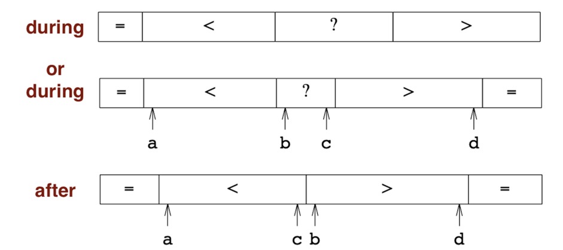

# 快速排序 quick sort

从序列中选一个元素，称为「基准」（pivot）。

partition: 所有比 pivot 值小的元素放到 pivot 前，所有比 pivot 值大的元素放到 pivot 后。（注意：与 pivot 值相等的元素，可放到任何一边，也可放在两边。后面讨论。）

`pivot ['pɪvət]` n. 枢; 枢轴; 中心; 旋转

区分: pivot 值、pivot 位置。

通常用递归，也有用 iterative 方式的。两种方式，都要用到同样的 `partition()`。注意，`partition()` 的返回值是 pivot 的位置，不是值。

递归大致框架如下：

```c++
    void qsort(int a[], int left, int right) {
        if (left >= right) { // 必须是 >= 而不是 ==。有时 pivot == left 或 right，导致下一次调用时 left > right。
            return;
        }
        int pivot = partition(a, left, right);
        qsort(a, left, pivot - 1);
        qsort(a, pivot + 1, right);
    }
```

重点是 `partition()` 的实现方法。两种方式：

法一：Lomuto
- 取最右边元素的值 (k 或 key) 为 pivot 值。
- 整个数组分为三个区，从左到右为：「`<=k` 区」、「`>k` 区」、「未处理区」。或者，依次为「`<k` 区」、「`>=k` 区」、「未处理区」。（注意，与 pivot 相等的元素，只分布在 pivot 的某一侧）
- 在「未处理区」找到 `<=k` 的，放到「`<=k` 区」末尾。（实际实现：与 「`>k` 区」的第一个交换）

to add pic

法二：Hoare（经典双指针法）
- 取最左边元素的值 (k 或 key) 为 pivot 值。
- 先从右往左找第一个 `<k` 的，再从左往右找第一个 `>k` 的，交换二者。重复此过程。
- 整个数组分为三个区，从左到右为：「`<=k` 区」、「未处理区」、「`>=k` 区」。（注意，与 pivot 相等的元素，分布在 pivot 两侧）

对比：
- Lomuto 实现较直观、简单；Hoare 实现的微妙细节较多，容易出错，但更高效。
- 平均情况下，Hoare 的交换次数约为 Lomuto 的三分之一。（「交换」是个很贵的操作）Hoare 更高效。
- Hoare 对重复元素的处理，比 Lomuto 更高效，使 partition 更均衡。(to add: how?)
- <font color="red">Hoare 和 Lomuto 都是不稳定的。</font>
- https://cs.stackexchange.com/questions/11458/quicksort-partitioning-hoare-vs-lomuto/11550

# partition 法一：Lomuto partition scheme

by Nico Lomoto。被收入 Jon Bentley《Programming Pearls》书中。比 Hoare 方法出现得晚。

`qsort()` 和 `partition()` 的范围，都是 `[left, right]` 闭区间。

```c++
    int partition(int a[], int left, int right) {
        int key = a[right]; // 最后一个元素作为 pivot 值
        int p = left - 1;   // 「小于等于区」的右边界
+       for (int j = left; j <= right - 1; j++) {
            if (a[j] <= key) { // 找 <= key 的，放到 pivot 左边
                swap(a[++p], a[j]);
            }
        }
+       swap(a[++p], a[right]);
        return p;
    }

// 还有另外一种写法
    int partition(int a[], int left, int right) {
        int key = a[right];
        int p = left - 1;
+       for (int j = left; j <= right; j++) { // right 而不是 right - 1
            if (a[j] <= key) { // 找 <= key的
                swap(a[++p], a[j]);
            }
        }
        return p;
    }
```

重点在于 `partition()`。

最右边的元素的值 `key = a[right]` 作为 pivot 值。

除此之外，整个数组分为三个部分，从左到右，依次是：
- 小于等于区 (`a[i] <= key`)，范围：`[left, p]`
- 大于区 (`a[i] > key`)，范围：`[p + 1, j]`
- 未处理区，范围: `[j + 1, right - 1]`

注意，代码里 `if (a[j] <= key) { swap(a[++p], a[j]); }`，凡是比 pivot 值小的，都放到 pivot 左边（但这些相等的值不一定连续），则很自然地，pivot 左边就是「小于等于区」，从而右边是「大于」区。如果代码里把 `<=` 改为 `<`，即 `if (a[j] < key) { ... }`，则 pivot 左边是「小于」区，右边是「大于等于」区。区别只在于，与 pivot 值相等的元素，放在 pivot 的哪一边。但不管放哪边，都不影响排序的正确性，因为 pivot 本身的位置都是正确的。

注意其中的两个指针：
- `p`：「小于等于区」的右边界。p 自己是「小于等于区」的。往「小于等于区」放入时，先要 `++p`。
- `j`: 「大于区」的右边界。
- `right – 1`: 未处理区的右边界。

如果从大到小排序：
- 只要把 `if (a[j] <= key)` 改为 `if (a[j] >= key)`，即可。

// to do: 画图

j 在前头扫，p 在后面追。p 的初值设为 `left – 1`，表示，「小于等于区」目前为空。

指针 j，从左往右扫，在「大于区」？内，从 left 到 right – 1，在前方探路，找比 key 小或等的。找到后，把 `a[j]` 挪到前面的「小于等于区」里。

怎么挪？简单的方法，把 `a[j]` 与「大于区」的第一个元素交换位置。这样，j 位置上的「小」元素 `a[j]` 挪到了「小于等于区」的最后，相当于「小于等于区」向右扩大了一位，「大于区」原来第一个挪到了「大于区」的最后位置，但仍然在「大于区」里。当然，这样也导致了排序的不稳定。（如果要稳定，可以类似插入排序，把整个「大于区」右移一位，空出来的位置放 `a[j]` 元素。不过开销较大。）

p 是右边界，`p+1` 是第一个 `>key` 的，交换之后，`p+1` 变成最后一个 `<=key` 的，也就是实现了第一区的边界从 p 扩展到了 p+1。根据 p 的定义，p 的值也要 +1。`swap(a[j], a[++p])` 一句就可以完美完成上述操作。

j 循环结束后，所有元素都处理过，未处理区没了，只有「小于等于区」与「大于区」。再把 pivot 元素（最右元素）与「大于区」的第一个元素交换，就完成了: 「小于等于区」 – pivot – 「大于区」。最后返回 pivot 元素现在的位置。这部分操作由 `swap(a[++p], a[right]); return p;` 完成。注意，交换时，不能用 `swap(a[++p], key)`，尽管 `a[right]` 和 `key` 的值一样。为什么？自己想一下。

## 还有另外一种写法

见上面代码。

区别：最后一个元素 `a[right]` 也纳入 j 的扫描范围。因为 `a[right] == key`，所以判断 `if (a[j] <= key)` 判断时，必然成立，则循环体中对 right 一定会执行 `swap()`，循环体外就不用针对 right 再做 `swap()` 了。效果与上面一致。

这种方法，少写了一句，但多了一次判断，且逻辑上不如上面直观，所以还是推荐上面的方法。


# partition 法二：Hoare partition scheme，经典双指针法

by Tony Hoare，1959-1961。

- 取最左边元素的值 (k 或 key) 为 pivot 值。
- 先从右往左找第一个 `<k` 的，再从左往右找第一个 `>k` 的，交换二者。重复此过程。
- 整个数组分为三个区，从左到右为：「`<=k` 区」、「未处理区」、「`>=k` 区」。（注意，两个区都可能有 `==k` 的）

具体实现：
- i 开始指向最左边位置，j 指向最右边。
- j 从右往左找第一个 `<k` 的，然后 i 从左往右找第一个 `>k` 的。找到后，二者交换，使 `[left ... i]` 都 `<=k`，`[j ... right]` 都 `>=k`。
- 重复此操作，直到 i, j 二者相遇。相遇时，满足 `i == j`。再交换 `a[i]` 与 pivot 值。

<font color="green">注意，让 j 先动手。非常重要。</font>为何？

只考虑最后一次相遇。倒数第二次相遇、交换后，满足：`a[i]<k, a[j]>k`。

此时，j 先走，两种可能：
- j 遇到 i 而停止(此时 `a[j] == a[i] < k`)，然后 i 也直接在这里停止。
- j 找到一个小于 k 的位置而停止，然后 i（因找不到比 k 大的）遇到 j 而停止。

不管哪种情况，最后这一次，j、i 相遇而停止，且 `a[j] == a[i] < key`。此时与 left 交换，完成。

相反，若 i 先走，在 i、j 未相遇前，都正确。最后一步，i 先走，同样两种可能：
- i 遇到 j 而停止（此时 `a[i] == a[j] > k`），然后 j 也直接在这里停止。
- i 找到一个大于 k 的位置而停止，然后 j（因找不到比 k 小的）遇到 i 而停止。

不管哪种情况，最后，j、i 相遇停止，`a[j] == a[i] > key`。此时与 left 交换，出错。

理论上，只要最后一次 j 先动手就行。以前各次，i、j 不相遇，谁先都行。最后一次，二者相遇，若 i 先动手，则相遇时元素值 `>k`，出错。但实际上，无法预知哪次是最后一次，所以都让 j 先动手。

类似地，选最右边元素值做为 pivot 值，也可以。此时应该 i 先动手。

记忆要点：
- pivot 值的对面方向先动手。
- `i`、`j` 相遇后，满足的是「先动手方向」的结束条件。（若 `j` 先动手，则 `a[i] == a[j] < k`; 若 `i` 先动手，则 `a[i] == a[j] > k`。）此时 `a[i]` 再与 pivot 交换恰好不会出错。

如果从大到小排序：
- 变化：i 找小的，j 找大的。
- 不变：最 left 元素值作为 pivot 值。pivot 的对面方向先动手。最后 i 或 j 与 left 交换。

上面的方法中，与 pivot 值相等的元素分布在 pivot 两边。如果放在一边呢？<font color="red">左 <= 右 > 或 左 < 右 > 似乎都可以，但 左< 右>= 似乎不行。to check later</font>


```cpp
// 最左边元素值为 pivot 值。对面 j 先动手。
    int partition(int a[], int left, int right) {
        int key = a[left];
        int i = left, j = right;
        while (i < j) {
            while (i < j && a[j] > key) { j--; } // j 先动手，往左找第一个小于 key 的。
            while (i < j && a[i] < key) { i++; } // i 随后，往右找第一个大于 key 的。
            if (i < j) {
                swap(a[i], a[j]);
            } // { else 会自然 break }
        }
        // 循环结束后，i == j
        a[left] = a[i]; a[i] = key; // 相当于 swap(a[left], a[i]);
        return i;
    }

// 最右边元素值作为 pivot 值。左边 i 先动手。
    int partition(int a[], int left, int right) {
        int key = a[right];
        int i = left, j = right;
        while (i < j) {
            while (i < j && a[i] < key) { i++; }
            while (i < j && a[j] > key) { j--; }
            if (i < j) {
                swap(a[i], a[j]);
            }
        }
        a[right] = a[i]; a[i] = key; // 相当于 swap(a[right], a[i])
        return i;
    }
```

Sedgewick《算法》：左侧扫描，最好遇到 `>= pivot` 时停下。右侧扫描，最好遇到 `<= pivot` 时停下。这样可能会导致不必要的等值元素交换，但某些场景下（所有待排序元素值都一样），可避免运行时间变成 `O(n²)`。（我注：但不是简单在 while 循环中把用 `a[j] >= key` 和 `a[i] <= key` 改为「`>`」或「`<`」就可以了。to do later.）

## 比较「原汁原味」的 Hoare 方法：

初值 i = l-1, j = r+1；循环时先 i++ 或 j-- 再判断，需使用 do ... while 循环。
partition 返回的下标（位置），其值并不一定就是 pivot 值。所以 partition 的结果是分成两部分，而不是三部分。配套的 qsort() 或 qselect() 也与分成三部分的 Lomuto 不同。

```cpp
    // impl 1
    // 来自 wikipedia https://en.wikipedia.org/wiki/Quicksort 和 mit「算法导论」书
    // 两者基本一致，只是 j 循环 和 i 循环 顺序相反。但谁先谁后都可以。
    int partition(vector<int> &nums, int l, int r) {
        int key = nums[l];
        int i = l - 1, j = r + 1;
        while (true) {
            do { i++; } while (nums[i] > key); // wiki: 此句在前
            do { j--; } while (nums[j] < key); // book: 此句在前
            if (i >= j) {
                return j;
            }
            swap(nums[i], nums[j]);
        }
    }

    // impl 2
    // ref: leetcode 215. 数组中的第K个最大元素 官方题解
    int partition(vector<int> &nums, int l, int r) {
        int key = nums[l];
        int i = l - 1, j = r + 1;
        while (i < j) {
            do { i++; } while (nums[i] > key);
            do { j--; } while (nums[j] < key);
            if (i < j) {
                swap(nums[i], nums[j]);
            }
        }
        return j;
    }

    // impl 3
    // 对 impl 1 改进了一点，先 i++/j-- 再对 i/j 做循环，从而把 do ... while 循环变成了 while 循环
    int partition(vector<int> &nums, int l, int r) {
        int key = nums[l];
        int i = l - 1, j = r + 1;
        while (true) {
            i++;
            while (nums[i] > key) { i++; }
            j--;
            while (nums[j] < key) { j--; }
            if (i >= j) {
                return j;
            }
            swap(nums[i], nums[j]);
        }
    }

    // qselect(), qsort() 写法，是两部分的
    void qselect(vector<int>& a, int left, int right, int k) {
        if (left == right) { return; }
        int pivot = partition(a, left, right);
        if (pivot >= k) {
            qselect(a, left, pivot, k);
        } else {
            qselect(a, pivot + 1, right, k);
        }
    }

    void qselect(vector<int>& a, int left, int right, int k) {
        if (left == right) { return; }
        while (left < right) {
            int pivot = partition(a, left, right);
            if (pivot >= k) {
                right = pivot;
            } else {
                left = pivot + 1;
            }
        }
    }
    int findKthLargest(vector<int>& nums, int k) {
        qselect(nums, 0, nums.size() - 1, k-1);
        return nums[k-1];
    }
```

另一种方式 Hoare 方式。分成三段的。初值 i = l, j = r+1。<font color="red">i, j 谁先动手，to check later.</font>

```cpp
    // Sedgewick 'algorithms' 4th ed. p291
    // 好像已经正确处理了 duplicate elements?
    int partition(vector<int>& a, int l, int r) {
        int key = a[l];
        int i = l, j = r + 1;
        while (true) {
            while (a[++i] > key) { if (i == r) break; } // i 向右找第一个大于等于 k 的。
            while (a[--j] < key) { if (j == l) break; } // j 向左找第一个小于等于 k 的。
            if (i >= j) { break; }
            swap(a[i], a[j]);
        }
        a[l] = a[j], a[j] = key; // 相当于 swap(a[l], a[j])
        return j;
    }

    // little turing 标程。初值 l, r；i, j 谁先动手有规律，见上。
    // 好像不能正确处理 duplicate elements?
    int partition(vector<int> &a, int left, int right) {
        int key = a[left];
        int i = left, j = right;
        while (i < j) {
            while (i < j && a[j] <= key) { j--; } // j 先动手，往左找第一个小于 key 的。
            while (i < j && a[i] >= key) { i++; } // i 随后，往右找第一个大于 key 的。
            if (i < j) {
                swap(a[i], a[j]);
            } // { else 会自然 break }
        }
        // 循环结束后，i == j
        a[left] = a[i]; a[i] = key; // 相当于 swap(a[left], a[i]);
        return i;
    }
    // 递归法
    void qselect(vector<int>& a, int left, int right, int k) {
        if (left == right) { return; }
        int pivot = partition(a, left, right);
        if (pivot == k) {
            return;
        } else if (pivot > k) {
            qselect(a, left, pivot - 1, k);
        } else {
            qselect(a, pivot + 1, right, k);
        }
    }
    // 非递归法
    void qselect(vector<int>& a, int left, int right, int k) {
        // if (left == right) { return; } // 此句不用
        while (left < right) {
            int pivot = partition(a, left, right);
            if (pivot == k) {
                return;
            } else if (pivot > k) {
                right = pivot - 1;
            } else {
                left = pivot + 1;
            }
        }
    }
```

# 优化

## 重复元素 repeated elements，以及 3-way partition

Lomuto 法，对重复元素不太友好。与 pivot 值相同的元素，都在 pivot 的某一侧。如果所有元素都相同，则 partition 结果始终是一边为空、一边只减少一个，导致耗时退化为 `O(n²)`。Hoare 法，能较好处理重复元素，与 pivot 值相同的元素，分布在在 pivot 的两侧；尽管多了不必要的交换，但耗时仍为 `O(nlogn)`。

另一种解决 Lomuto 法中重复元素问题的方法，是「3-way partition」。

Dijkstra 3-way partition，以 Edsger Dijkstra 命名，因为他提出的「荷兰国旗问题 Dutch National Flag Problem (DNFP)」（在其 1976 的书《A Discipline of Programming》第 14 章中）。

分成三部分：小于、等于、大于。



改进：fat partitioning，在 Bentley 和 McIlroy 1993 年的论文《Engineering a sort function》中提出。如图，到了「after」状态后，还要把两端的相等元素移到中间来。



3-way partition 的 quicksort，是「信息量最优的」（entropy-optimal，注意这里把 entropy「熵」翻译成了「信息量」）。

时间复杂度：需要 `2ln2 × n × H` 次比较。其中 H 是所有 key 的 Shannon entropy（用于衡量他们的 information content），可认为是常数（<font color="red">需更深入理解</font>）：
```
    H = - Σ(pᵢ × logpᵢ)) = -(p₁ × logp₁ + p₂ × logp₂ + … + pₙ × logpₙ)
```
则，时间复杂度为 `O(nH)` = `O(n)`，是线性的。

若所有元素都相等，则 3-way partition 的时间复杂度为 `O(n)` or `O(1)`？，而 2-way partition 的时间复杂度为 `O(n²)`。

## pivot 之选择

选整个序列的中间值作为 pivot 值，是最优的，可以把序列分成成都大致相等的两部分。

- 选第一个（最左边的）或最后一个（最右边的）。若输入序列是随机的，没问题。若输入序列是已经有序或接近有序的，则 partition 的结果会完全不均衡或接近不均衡，导致耗时退化为 `O(n²)`。对策：排序之前，先 shuffle 一下，随机打乱输入序列。
- 随机选 pivot
- median of three: 选第一个、中间的、最后一个，这三个元素的中间值，作为 pivot 值。希望它尽量接近整个输入序列的中间值。
- Tukey's ninther，又称 median-of-three-medians-of-three 或 pseudomedian of nine 或 median of medians: 使用 median of the median of 3 samples, each of 3 entries. 最初想法来自 1978 年论文。不确定现在是否实用。
- dual-pivot quicksort: 两个 pivot，`p1 < p2`。partitio 结果是分成三部分，分别 `< p1`, `p1 <= && <= p2`, `> p2`。数据少时切换到 insertion sort。时间复杂度：`O(nlog₃n)`，比 single-pivot partition 的 `O(nlog₂n)` 快一些。By Vladimir Yaroslavskiy, 2009。

## 其他优化

当数据较少时，切换到 insertion sort。（也就是 intro sort）

# 稳定性、时间复杂度

<font color="red">Hoare 和 Lomuto 都是不稳定的，因为为了 in-place，要越顶交换。</font>要想稳定，partition 过程中需要额外空间，不 in-place。

下面方法，稳定，来自久远笔记，待整理。<font color="red">to check later</font>

```cpp
    void qsort(int l, int r) {
        int k = a[rand() % (r - l) + l]; // 随机 pivot 值
        int p = l, q = r;
        // tmp[l,p): 比 key 小的；tmp[q, r): 比 key 大的

        for (int i = l; i <= r; i++) {
            if (a[i] < k) {
                tmp[p++] = a[i]; // 比 key 小的放左边
            } else if (a[i] > k) {
                tmp[--q] = a[i]; // 比 key 大的放右边
            }
        }
        for (int i = p; i < q; i++) {
            tmp[i] = k;   // 与 key 一样的。但无法处理复杂结构体？
        }

        for (int i = l; i <= r; i++) {
            a[i] = tmp[i];
        }
        qsort(l, p);
        qsort(q, r);
    }
```

Cache-friendly


# go 语言实现

风格一，`sort()` 和 `partition()` 都用 `(a[], left, right)` 做参数。

[`quick-sort-golang-sol1.go`](code/quick-sort-golang-sol1.go)

风格二，`sort()` 和 `partition()` 都用 `(a[])` 做参数。递归时，要把当前数组切出一块再去调用。

[`quick-sort-golang-sol2.go`](code/quick-sort-golang-sol2.go)


# 非完全递归的实现

```cpp
    void qsort(int a[], int left, int right) {
        if (left >= right) {
            return;
        }
        while (left < right) {
            int pivot = partition(a, left, right);
            qsort(a, left, pivot - 1); // 左侧：递归
            left = pivot + 1; // 右侧：不递归
        }
    }
```

# STL `partition()`

```cpp
    #include <algorithm>
    std::partition(first, last, predicate);
    std::stable_partition(first, last, predicate);
```

根据 predicate 指定的判断条件，将序列划分为两部分，前一部分 predicate 返回 true，后一部分 predicate 返回 false。

返回值：后一部分的第一个元素（第一个 false）的位置。

例：前一部分都是偶数，后一部分都是奇数。

```cpp
    std::vector<int> v{6, 7, 8, 9, 0, 1, 2, 3, 4, 5};
    auto it = std::partition(v.begin(), v.end(), [](int i) {return i % 2 == 0;});
```

用 `std::partition()` 实现 quick sort。注意，partition 分成三部分，中间一部分是「等于 pivot 值」的。

```cpp
    template<typename ForwardIt>
    void quick_sort(ForwardIt first, ForwardIt last) {
        if (first == last) {
            return;
        }

        auto pv = *std::next(first, std::distance(first, last) / 2); // pivot 值，尽量取中间元素的值
        auto p1 = std::partition(first, last, [pv](const auto& em) { return em < pv; }); // p1: 第一个 >= pv 的元素
        auto p2 = std::partition(p1, last, [pv](const auto& em) { return em <= pv; }); // p2: 第一个 > pv 的元素
        quick_sort(first, p1); // [first, p1) 左闭右开区间，都是 < pv 的
        quick_sort(p2, last); // [p2, last) 左闭右开区间，都是 > pv 的
    }

    std::vector<int> v{6, 4, 8, 2, 0, 1, 9, 3, 7, 5};
    quick_sort(v.begin(), v.end());

    std::forward_list<int> fl {1, 30, -4, 3, 5, -4, 1, 6, -8, 2, -5, 64, 1, 92};
    quick_sort(std::begin(fl), std::end(fl));
```

# 快速选择 quick select

在未排序的序列中，找第 k 小的元素。k: 从 0 开始。若从 1 开始 (1-based numbering)，left 初值应该为 1。

To find the kᵗʰ smallest element in an unordered list。

与 qsort 类似，但分成两部分后，只需在 pivot 的某一侧继续找，不用管另一侧。所以，递归调用只用调一次，iterative 方法也不用 stack。

k 在 `[0, len-1]` 范围内。如果 `k > len - 1`，则最后 `assert(left <= right)` 会失败。

```c++
    int qselect(int a[], int left, int right, int k) {
        // assert(left <= right); // 这个 assertion 对 qsort() 不成立
        if (left == right) {
            return a[left];
        }
        int pivot = partition(a, left, right);
        if (pivot == k) {
            return a[k];
        } else if (pivot > k) {
            return qselect(a, left, pivot - 1, k);
        } else {
            return qselect(a, pivot + 1, right, k);
        }
    }

    int a[] = {8, 3, 8, 4, 100, 2, 8, 8, 1, 23, 8, 45, 8, 1, 50, 8};
    int n = sizeof a / sizeof a[0];
    int k = 6;
    int ans = qselect(a, 0, n-1, k); // k 从 0 开始算起。若第二个参数改为 1，则 k 从 1 开始算起。
```

partition 过程耗时 `O(n)`。若 pivot 选得好，每次砍掉一半，则总次数为 `n + n/2 + n/4 + … + 1 = 2n`。故 qselect 平均耗时 `O(n)`.

也可用 heap。参见 [kth largest or top-k 问题](../misc/kth-largest-or-top-k.md)。

# further reading

- https://medium.com/@mykoweb/a-deep-dive-into-golangs-quicksort-2d5d68a3cba4
- https://dracarys.github.io/2019/08/20/Algorithm-club-quicksort/
- https://codeblab.com/wp-content/uploads/2009/09/DualPivotQuicksort.pdf
