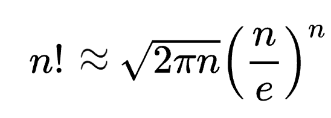

# 基于比较的排序算法

基于比较的排序算法，最好的复杂度是 `O(NlogN)`。

`N` 个元素的序列，可能的排列有 `N!` 种，其中有一种是我们想要的排序结果。

每次比较两个元素的值，可（最多）将解空间减少一半。（所有序列里，有一半是 `a1 > a2` 的，另一半是 `a1 < a2` 的。比较 `a1` 和 `a2` 的值，就可去掉其中一半。）

因此，为了确定唯一的结果排列，最多需要进行 `log(N!)` 次比较，时间复杂度为 `O(log(N!))`。

由「斯特林公式 (Stirling's approximation 或 Stirling's formula)」

取对数，去掉低阶项、常数项，得 `O(log(N!))` 约等于 `O(NlogN)`。

注意，这只是「比较次数」的时间复杂度。还有其他操作，比如「元素交换」、「元素移动」等，这些操作可能也分别需要 `O(N)` 或 `O(NlogN)` 的时间。

# 不基于比较的排序算法

比较排序本质上依赖于二分法。

其他可能：
- 三分法、四分法
- 线性排序：桶排序、计数排序、基数排序

# 性质

stable, unstable

in-place
- in-place: bubble, selection, insertion, quick, heap
- non in-place: merge, counting

recursive, non-recursive (iterative)

- recursive 的：merge, quick
- iterative 的：bubble, insertion, selection, heap

adaptive, non-adaptive

序列越接近有序，则排序越快，则称排序算法是 adaptive 的。
- adaptive 的：bubble, insertion; adaptive heap, adaptive merge, patience, Shell, smooth, splay, Timsort, Cartesian tree
- non-adaptive 的：selection, merge, quick, heap

online, offline

online: 流式输入，不需要拿到整个序列就可以开始排序。按输入顺序，一个接一个地处理输入元素。offline 则必须拿到整个序列才能开始排序。

- online: 只有 insertion
- heapsort: 流式的维护 heap；但在所有元素都入 heap 后（得到整个序列后），还要依次「从堆顶取出一个、调整堆」，这个过程是 offline 的。
- offline: 其他所有

comparison, non-comparison

serial, parallel 是否支持并发

internal, external

# 比较

quick sort:
- 既 in-place，又 `O(nlogn)`。
- 在典型场景下，quick sort 比其他基于比较的排序算法快很多，主要是因为 (1) 内循环简单（只是索引递增、跟某定值比较）(2) 移动次数少。
- 缺点：但不 stable。若要 stable，需要额外空间，就不 in-place 了。
- 缺点：最坏情况下，时间复杂性很糟糕，`O(n²)`
- 缺点：不 adaptive，甚至是 anti-adaptive，数组越接近有序状态，排序反而越慢。完全状态下，也是 `O(nlogn)`。

quick sort vs. merge sort:
- 通常 quick sort 更快。quick sort 比较次数更多，但移动次数更少，综合下来还是更快。

quick sort vs. heap sort
- 实践中通常 quick sort 更快。平均而言，heap sort 的比较次数是 quick sort 的两倍。
- 但最差情况下，quick sort 是 `O(n²)`，而 heap sort 仍然是 `O(nlogn)`，比 quick sort 强。（所以 introsort 里，quick sort 退化时会切换到 heap sort。）

reference:
- [为什么排序算法还是不够快](https://mp.weixin.qq.com/s/byHph8H48SIMmiVu8XTtrQ)
  - heap sort 效率上的挑战，特别是重建最大堆时遇到的不均等概率比较问题；「快速堆排序」策略
  - quick sort 的概率挑战：其 `partition()` 过程中的概率不均衡问题，如何影响排序效率。
  - radix sort

- [快排为什么那样快](https://mindhacks.cn/2008/06/13/why-is-quicksort-so-quick)
- [原文](https://www.inference.org.uk/mackay/sorting/sorting.html)
- 中文翻译：[从信息论的角度分析堆排序和快速排序的性能](https://mp.weixin.qq.com/s/BvxSWnIp9QFkM5GhOZHDPg)

