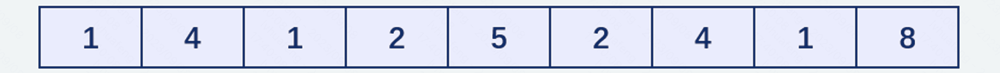
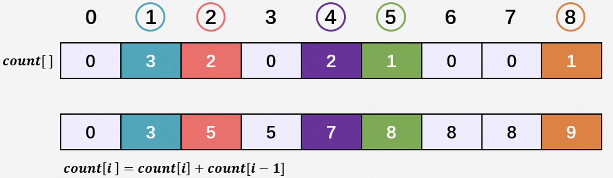

# 计数排序 counting sort

综述：
* 不是基于比较的；not comparison-based
* 排序范围：整数 0-k。
* 时间复杂度：O(n + k)
* 稳定
* 用了临时数组，不是 in-place 的

## 思路

关键点：如果数组中共有 `i` 个元素小于等于 `val`，那么 `val` 的排序后的下标为 `i` （下标从 `0` 开始）。

原数组，未排序的 `a[]` 数组



辅助数组，用来计数的。这是统计完后的 `count[]` 数组（前缀和式的）



排好序的数据，放在 `b[]` 数组中。

count 数组决定了每个元素在结果中的位置范围。用前缀和的思想，比较好理解：

待排序元素 val=2。`count[val] = 5`，表示 <=2 的元素共 5 个；`count[val-1]=3`，表示 <=1 的元素共 3 个。所以 val=2 在最后结果中是在 `[4, 5]` 位置范围。因数组下标从 0 开始，所以在结果数组中对应下标范围是 `[3, 4]`。

待排序元素 val=8。`count[val]=9`，`count[val-1]=8`，最后 val 在结果数组中的下标范围是 `[8, 8]`。

依此类推，val 在结果数组中的下标范围是 `[count[val-1], count[val]-1]`。

代码中，不是一次性填充某个 val 的整个范围，而是遍历每个待排序元素时，遇到一个 val，就在它放到正确的位置。

有两种遍历顺序：
* 逆序遍历：把 val 放到 output 的 `count[val]-1` 下标，然后 `count[val]--`，为下一个 val 做准备。
* 正序遍历：把 val 放到 output 的 `count[val-1]` 下标，然后 `count[val-1]++`，为下一个 val 做准备。

## 具体步骤

1. 找出待排序数的最大值 `k`。所有数的范围是 `[0, k]` 闭区间。

2. 辅助数组 count，大小为 `k + 1`，并且初始化为 `0`，用来记录每个数出现了多少次。
```cpp
    int count[k + 1];
```
`count[i]` 存放数 `i` 出现的次数。例如，若 `4` 出现了 `2` 次，则 `count[4] = 2`。

3. 累加（计数算法核心）

```cpp
    count[i] += count[i - 1];
```

* `count[i]` 表示：`i` 以及比它小的数总共出现了多少次。
* `count[i - 1]` 表示：`i - 1` 及比它小的数共出现了多少次
* 所以，`i` 出现了 `count[i] - count[i - 1]` 次。排序后，`i` 的下标，从 `count[i]` 开始倒数，到 `count[i - 1] + 1` 止。在代码里，是倒着填充的。
* (还可推出，比 `i + 1` 小的数共出现了 `count[i]` 次，所以 `i + 1` 是第 `count[i] + 1` 个数。在下标从 `0` 开始的情况下，(第一个出现的) `i + 1` 的下标是 `count[i]`。排序后，`i + 1` 的下标应该是 `count[i]`，也就是 `b[count[i] + 1] = i + 1`。不过下面的代码并未用到这一点。)

5. 倒序，在 `count[]` 数组中找每个数的下标。

每确定一个数 `a[i]` 的最终位置后，将 `count[a[i]]` 减 `1`。

Why? 若该数出现多次，每将一个 `a[i]` 放入 `b[]` 数组时，都将 `count[a[i]]` 值减 `1`。这样，当下个等于 `a[i]` 的待排序元素出现时，在排序过的 `b[]` 数组中，次数会被放到 `b[i]` 的前一个位置上。这样可以保证排序的稳定性。

## 代码

### 最后逆序遍历原数组

```cpp
#include <string>
#include <iostream>
using namespace std;

struct student {
    string name;
    int age;
};

int main() {
    student arr[] = {
        {"1.first", 1},
        {"4.first", 4},
        {"1.second", 1},
        {"2.first", 2},
        {"5.first", 5},
        {"2.second", 2},
        {"4.second", 4},
        {"1.third", 1},
        {"8.first", 8}
    };
    int n = sizeof arr / sizeof(student);

    int k = 8; // age的最大值，本应遍历arr求得，为简化代码，直接赋值
    int count[k + 1];
    memset(count, 0, sizeof count);
    for (int i = 0; i < n; i++) {
        count[arr[i].age]++;
    }
    for (int i = 1; i <= k; i++) {
        count[i] += count[i - 1];
    }

    student output[n];
    for (int i = n - 1; i >= 0; i--) {
        int age = arr[i].age;
        int idx = count[age] - 1;
        output[idx] = arr[i];
        count[age]--;
    }
    output_result("reverse", output, n);
    return 0;
}
```

### 最后正序遍历原数组

只有 02x、04x、06x 这三句不同：

正序
```cpp
01    student output[n];
02x   for (int i = 0; i < n; i++) {
03        int age = arr[i].age;
04x       int idx = count[age - 1];
05        output[idx] = arr[i];
06x       count[age - 1]++;
07    }
```

逆序
```cpp
01    student output[n];
02x   for (int i = n - 1; i >= 0; i--) {
03        int age = arr[i].age;
04x       int idx = count[age] - 1;
05        output[idx] = arr[i];
06x       count[age]--;
07    }
```

逆序代码：[counting-sort.cpp](code/counting-sort.cpp)

正序代码：[counting-sort-forward.cpp](code/counting-sort-forward.cpp)

一个小技巧，求最大值 k：

```cpp
#include <algorithm> // max_element()

const student* most_senior = max_element(arr, arr + n, 
        [](const student& a, const student& b) { return a.age < b.age; });
int k = most_senior->age;
```