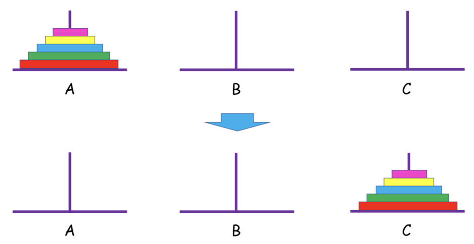

# 汉诺塔问题 (Hanoi Tower)




古印度神庙中，有一种游戏称为汉诺塔。在一块铜板装置上，有三根杆（编号A、B、C），在 A 杆自下而上、由大到小按顺序放置 64 个金盘。游戏目标：把 A 杆上的金盘全部移到 C 杆上，并仍保持原有顺序。操作规则：每次只能移动一个盘子；移动过程中，三根杆上始终保持大盘在下、小盘在上；过程中盘子可以置于任一杆上。

问题分析

三根柱子分别为: src（source, 源）、dest（destination, 目的地）、relay（中继）

金盘开始都在 src 上，要移动到 dest，中间要借助 relay。

1、当 n = 1 时，盘子直接从 src 柱移到 dest 柱上；

2、当 n > 1 时，则
- 设法将前 n–1 个盘子借助 dest ，从 src 移到 relay 柱上；
- 把盘子 n 从 src 移到 dest 柱上；
- 把前 n–1 个盘子从 relay 移到 dest 柱上。

可分成三个子问题：
1. `hanoi(n-1, src, dest, relay)` // 将 src 柱上的 n-1 个圆盘借助 dest 柱移到 relay 柱上。此时 src 柱只剩下第 n 个圆盘。
2. `move(n, src, dest)` // 将 src 柱上的第 n 个移动到 dest 柱。
3. `hanoi(n-1, relay, src, dest)` // 将 src 柱上的 n-1 个圆盘借助 src 柱移到 dest 柱上；

n=1 时可以直接求解


用全局变量记录次数

```cpp
    #include <iostream>
    using namespace std;
    
    int cnt = 0;
    
    void hanoi(int, char, char, char);
    void move(char, int, char);
    
    int main() {
        int n;
        cin >> n;
        hanoi(n, 'a', 'b', 'c');
        cout << cnt << endl;
        return 0;
    }
    
    void hanoi(int n, char src, char relay, char dest) {
        if (n == 1) {
            move(src, n, dest);
        } else {
            hanoi(n - 1, src, dest, relay);
            move(src, n, dest);
            hanoi(n - 1, relay, src, dest);
        }
    }
    
    void move(char src, int n, char dest) {
        cnt++;
        cout << n << ": " << src << " -> " << dest << endl;
    }
```

用局部变量记录次数

```cpp
    #include <iostream>
    using namespace std;
    
    void hanoi(int, char, char, char, int*);
    void move(char, int, char, int*);
    
    int main() {
        int n;
        cin >> n;
        int cnt = 0;
        hanoi(n, 'a', 'b', 'c', &cnt);
        cout << cnt << endl;
        return 0;
    }
    
    void hanoi(int n, char src, char relay, char dest, int *pcnt) {
        if (n == 1) {
            move(src, n, dest, pcnt);
        } else {
            hanoi(n - 1, src, dest, relay, pcnt);
            move(src, n, dest, pcnt);
            hanoi(n - 1, relay, src, dest, pcnt);
        }
    }
    
    void move(char src, int n, char dest, int *pcnt) {
        (*pcnt)++;
        cout << n << ": " << src << " -> " << dest << endl;
    }
```

移动次数作为函数返回值，而不是作为函数参数

```cpp
    #include <iostream>
    using namespace std;
    
    int hanoi(int, char, char, char, int);
    void move(char, int, char);
    
    int main() {
        int n;
        cin >> n;
        int cnt = hanoi(n, 'a', 'b', 'c', 0);
        cout << cnt << endl;
        return 0;
    }
    
    int hanoi(int n, char src, char relay, char dest, int cnt) {
        if (n == 1) {
            move(src, n, dest);
            return cnt + 1;
        } else {
            cnt = hanoi(n - 1, src, dest, relay, cnt);
            move(src, n, dest);
            cnt++;
            cnt = hanoi(n - 1, relay, src, dest, cnt);
            return cnt;
        }
    }
    
    void move(char src, int n, char dest) {
        // (*pcnt)++;
        cout << n << ": " << src << " -> " << dest << endl;
    }
```
