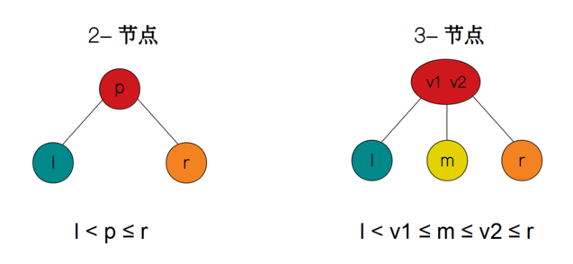

# `B-tree`（B 树）

[reference](https://github.com/wardseptember/notes/blob/master/docs/B树和B+树详解.md)

b-tree 中存储大量 `(key, value)` 键值对。称 `(key, value)` 为 payload；称其 value 部分为「卫星数据」（satellite data）」或简称「数据 data」。

用于 db 时，
- key：db 的（clustered index 的）primary key 或（secondary index 的）「索引列 indexed column」。
- value：db 的 row record 或其引用。

b-tree 的 一个 node 可包含多个 `(key, value)` 对，可称为「大节点」。目的：放在外存中，减少访问外存的次数。

a B-tree of order m (m 阶 B 树)。阶 order 又称为 branch factor。

node 的 children 数量
- 每个 node 有最多 m 个 children
- root node 有至少 2 个 children
- 每个 internal node（非 root，非 leaf）有至少 ⌈m/2⌉ 个 children（每个 node 至少 half-full）

node 的 key 数量
- non-leaf node，key 数量比 children 数量少 1。`keys = children - 1`

是个 self-balanced tree；所有 leaves 都在同一层，完全平衡。

lookup: 与 BST 的 lookup 相似。区别：从外存调入「大节点」，然后在「大节点」中找。在任何时刻，通常只有「当前节点」在内存中（从外存中调入地），其他节点还放在外存中。

lookup 时间复杂度：从外存调入内存、在内存中查找。后者耗时可忽略不计。前者：node 间的跳转，作为一次外存访问。所以，只需统计查找过程中访问了多少 node。最多，从 root 到 leaf，访问的节点数，就是树的高度 `O(logm(n))`。m 阶、共 n 个节点。

# `2-3 tree`（2-3 树）

2-3 树是 B-tree 的特例（a B-tree of order 3）。

3-节点：每个节点，最多有 3 个子节点；每个节点，最多存放两个值。

# `B+ tree`（B+ 树）

B-tree 的变种。更适用于文件索引系统、数据库系统等。

严格说，不属于 tree，因 leaf node 之间有连接。

与 b-tree 的主要区别：
- payload（或 data）只放在 leaf node 中。上层节点中，只放索引 key，作为 router 指引去 leaf。
- non-leaf node，既然只作为 router，node 中只包含其子树的最大或最小的 keys。（不用像普通 b-tree 一样，放多个 key）
- 最后一层所有 node，也就是所有 leaf node，包含所有的 keys（和 data/values）。每个 node 内部有序；node 之间按升序相连；所有 node 用双向链表串起来。

# `B* tree`

在 B+ tree 基础上，
- 为「内部节点」也增加指向其 sibling 的指针。使除了 root 的每层节点（内部、leaf）都成为单链表。
- 内部节点，key 个数至少为 `(2/3)*m`，节点的利用率提高（对比 B+ tree 的 `1/2`）

代价：deletion 操作很复杂。

two-to-three split：使每个节点的 key 数量至少为 `(2/3)*m`。

B-start insertion

用处？

# `B*+ tree`

有这个东西吗？