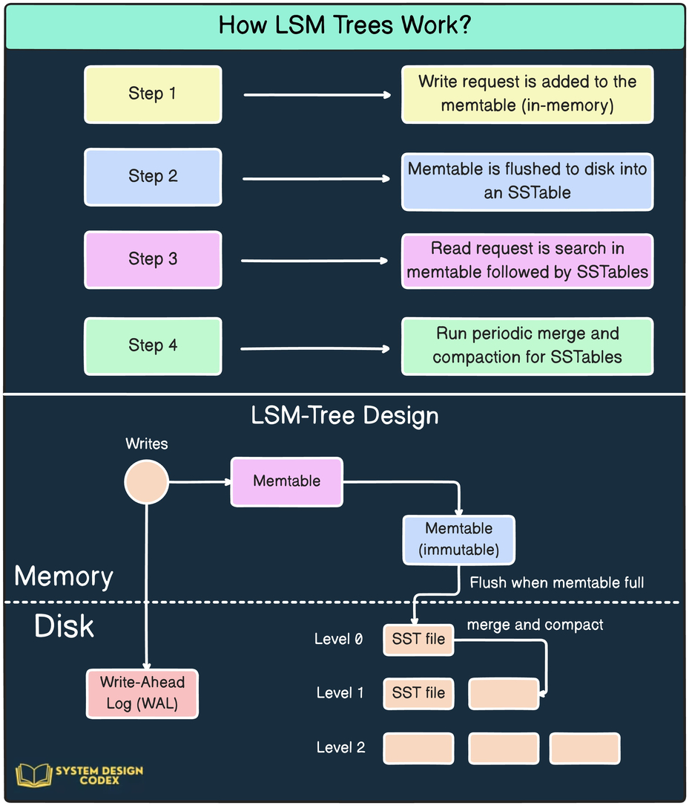

# log-structured merge-tree (LSM tree)

工作原理示意图
- 写请求首先被存储在内存中的 memtable；当 memtable 满时，数据会刷新到磁盘上的 SSTable，同时写操作被记录在预写日志（WAL）中以确保数据安全。
- 读请求会优先查找 memtable，然后查找 SSTable。
- LSM 树采用分层设计，通过周期性的合并和压缩将 SSTable 文件逐步从上层移到下层，以优化磁盘存储和查询性能。

sorted run:
- 数据放在若干个 sorted run 里。一个 sorted run 包括一个或多个数据文件（sstable file）。每个数据文件只能属于一个 sorted run。
- 一个数据文件中的数据，按 key 排序。一个 sorted run 中，数据的 key 不能 overlap。
- 不同 sorted run 中的数据的 key，可能 overlap 或相同。

ref:
- https://dev.to/creativcoder/what-is-a-lsm-tree-3d75
- https://www.ruilog.com/notebook/view/efa5fa66c09f.html

放大：三者就像 CAP 定理一样，需要做好权衡和取舍
- read amplification：从新到旧（从上到下）一层层找，直到找到想要的数据。特别是 range query。
- write amplification：正常情况下，HDD/SSD 观察到的写入数据多于上层程序写入的数据。
- space amplification：所有写入都是 append-only 的，不是 in-place update，所以，过期的、删除的数据，仍然占用存储空间

RocksDB 的 compaction 带来的写放大：
- HDD 存储：问题不明显
  - HDD 顺序读写性能远远优于随机读写性能，足以抵消写放大带来的开销。
  - HDD 的写入量基本不影响其使用寿命。
- SSD 存储：显得越来越严重。SSD 上，LSM-Tree 的写放大非常值得关注
  - SSD 顺序读写比随机读写性能好一些，但差距并没有 HDD 那么大。顺序写相比随机写带来的好处，能不能抵消写放大，不确定。
  - SSD 的使用寿命和其写入量有关，写放大太严重会大大缩短 SSD 的使用寿命。

对比 b+ tree
- write amplification：每次写请求，(1) 除了记录本身，还要更新 metadata（节点的 move/split/merge 等）；(2) 每次写入以 page 为单位，多写很多。

memtable

sstable (sorted string table)
- L0: 是 memtable 直接 dump 得到的，有多个文件；不同文件可能含有重复的 key
- L1 及以下：不同文件不能含有重复的 key

见手写笔记

Classically, LSM-trees support two merging policies: leveling and tiering. In leveling, each level may have at most one run, and every time a run in Level i − 1 (i ≥ 1) is moved to Level i, it is greedily sort-merged with the run from Level i, if it exists. With tiering, every level must accumulate T runs before they are sort-merged. Recently hybrid compaction policies (e.g., the hybrid compaction as follows) fuse leveling and tiering in a single tree to strike a balance between the read and write throughput based on workload specifications. To amortize data movement, and thus, avoid latency spikes, state-of-the-art LSM-engines organize data into smaller files, and perform compactions at the granularity of files instead of levels. If Level i grows beyond a threshold, a compaction is triggered and one file (or a subset of files) from Level i is chosen to be compacted with files from Level i + 1 that have an overlapping key-range. This process is known as partial compaction.

传统上，lsm tree 支持两种 merging policy: leveling, tiering.

leveling:

full compaction: 每次 compact 相邻两层的全部数据。compact 之后，上层空，下层含两层所有数据。

partial compaction:

more complex example is RocksDB which applies 1-leveling (tiering for level 1 and leveling for others) (data layout) and compactions are performed at the granularity of one or more files (granularity) according to the level saturation, file staleness and spalce amplification (trigger). RocksDB supports various data movement policy including Least Overlapping, Coldest, Oldest and Tombstone Density.

https://www.alibabacloud.com/blog/an-in-depth-discussion-on-the-lsm-compaction-mechanism_596780

Size-tiered compaction stratey: 优化了 write 操作，write ampl. 较小，但 read/space ampl. 还是较高。例：Scylla

- Memtable periodically flushes data to a sstable.
- 每个 level，可包含多个 ordered run。这些 run 的数据大小尽量接近。
- 某 level 的数据量达到限额，则该 level 的所有 run 合并，成为 next level 的一个新的 sstable/run。若 next level 新增 sstable/run 后也超过限额，则也合并…… （也有说 level 的 run 数量达到 T 后才开始合并）

Leveled compaction strategy: 减少 read/space ampl. 例 levelDB。

- 若干 level，相邻两 level 的数据量的比例是常数 T。T 为常数，则 write ampl. 最小。
- 每个 level，是一个 ordered run，包含若干 sstable 文件。
- 某个 level 的 size 达到限额，则 本 level 与 next level 的 run 进行 merge。

Time windowed compaction strategy - Used for time series databases. In this strategy, a time window is used post which compaction is triggered.

The above are not the only strategies and various systems have developed their own such as the hybrid compaction strategy in ScyllaDB.

hybrid compaction 混合的压缩策略

## rocksDB

https://www.alibabacloud.com/blog/an-in-depth-discussion-on-the-lsm-compaction-mechanism_596780

1. leveled：实际是 leveled 和 tiered 的结合。

从 memtable 到 level 0 是 tired：memtable 写成一个 sstable 文件；L0 有多个 sstable 文件，可能有 overlap。
下面各层是 level policy。每个 level 可有多个 sstable 文件。

2. tired (universal): 没太看明白

3. 混合方式 1：leveled-N

4. 混合方式 2：tiered + leveled

## hbase

memtable 对应 hbase 的 MemStore

sstable file 对应 hbase 的 StoreFile (hfile)

K-D Tree

## mergetree vs. lsm tree

ClickHouse's MergeTree is based on the Log-Structured Merge-Tree (LSM-Tree) data structure, but they have some differences:
- Data storage: MergeTree writes data directly to the filesystem, while LSM-Trees accumulate writes in memory and batch them before flushing to disk.
- Data manipulation: MergeTree uses a merge process to combine smaller data parts into larger ones, which can affect query performance. LSM-Trees reduce the number of random disk writes by buffering writes in memory, which enhances performance.
- Data insertion: MergeTree is more suitable for inserting data in batches, but it's not ideal for frequently inserting small amounts of rows. LSM-Trees are optimized for write-intensive workloads and are designed to handle a large volume of writes.

https://posthog.com/handbook/engineering/clickhouse/data-storage

