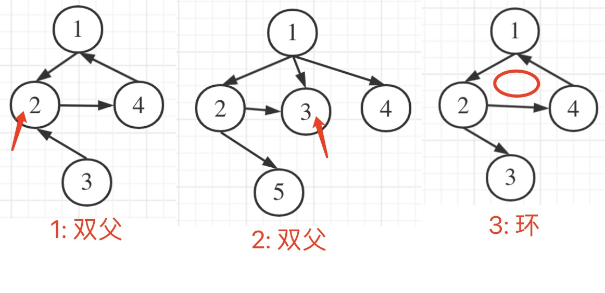

# 并查集 problem list

## [leetcode 547. 省份数量](https://leetcode.cn/problems/number-of-provinces/)

标准模版，不多说。注意，`parent[]`、`rank[]`、`merged_cnt` 等是全局变量（类的成员变量）。

- 标准并查集方法 [`number-of-provinces-leet-547-union-find.cpp`](code/number-of-provinces-leet-547-union-find.cpp)
- 我的 bfs 方法 [`number-of-provinces-leet-547-bfs.cpp`](code/number-of-provinces-leet-547-bfs.cpp)

## [leetcode 839. 相似字符串组](https://leetcode.cn/problems/similar-string-groups/)

若两个字符串相似，则认为其连通。标准模版方法，不多说。注意，`parent[]`、`rank[]`、`merged_cnt` 等是局部变量，作为参数传给 `find()`、`unite()` 等函数。

- 标准并查集方法 [`similar-str-groups-leet-839.cpp`](code/similar-str-groups-leet-839.cpp)

## [leetcode 684. 冗余连接](https://leetcode.cn/problems/redundant-connection/)

树是一个连通且无环的无向图。树中多了一条额外的边后，就会出现环，因此这条额外的边即为导致环出现的边。

正常的树，edge 数量比 node 数量少 1。现在多了一条边，则输入的 edge 数量就是 node 数量。

法一，并查集，我的「逐步增加 CC 法」：

开始，每个顶点都不在任何 CC 中。

依次遍历每条边。某边的两个顶点，有几种情况：
- 两顶点均不在任何 CC 中：这两个顶点形成一个新的 CC
- 一个顶点属于某 CC，一个顶点不属于任何 CC：后者加入前者所在 CC
- 两个顶点分属两个 CC：这两个 CC 合并
- 两个顶点属于同一 CC：有问题！这就是导致环的那条 edge！

用 bfs 略有麻烦，因为找某个 vertice 相邻的顶点不太方便。（当然也可以预处理输入的各 edge，形成邻接表，再用 bfs 方式）所以用并查集方法。

每次输入一条 edge。`parent[i]` 先初始化为 0（无 root）而不是 i（自己是 root）。每次来一条 edge，直接处理两个顶点，parent 定义、`find()`、`union()` 都有所改动。

法二，标准并查集：

每个顶点先初始化为单独的 CC。然后遍历每条 edge：
- 若两顶点不在同一 CC，则合并这两个 CC；
- 若两顶点已在同一 CC，则有问题：增加此 edge 将导致 cycle！

感觉：我的「逐步增加 CC 法」逻辑上更好理解，但标准并查集法似更简捷。

- 法一，并查集，「逐步增加 CC 法」：[`redundant-edge-leet-684.cpp`](code/redundant-edge-leet-684.cpp)
- 法二，并查集，标准法：[`redundant-edge-leet-684-regular.java`](code/redundant-edge-leet-684-regular.java)
- [多种方法，非并查集法 by yukiyama](https://leetcode.cn/problems/redundant-connection/solutions/1594870/-by-yukiyama-mlqi/)

## [leetcode 685. 冗余连接 II](https://leetcode.cn/problems/redundant-connection-ii/)

跟上一题的区别：本题的 edge 是有向的。注意，题目说「每个 edge `[ui, vi]` 表示有向图中 ui 是 vi 的一个父节点」。<font color="red">从图的角度，u -> v，u 是父节点。但从并查集中树的角度来看，v 才是父节点。代码中 `parent[]` 中采用并查集中树的角度。</font>

如图，可能是有 in-degree 为 2 的节点（有两个父节点），也可能是有有向环。（为何不看 out-degree？因任何一个父节点都可能 out-degree > 1）。



先统计各节点的 in-degree。若某个节点入度为 2，它对应两条边，则必定要删除这两条边之一。若删了一条，图变成合法的树，则这条 edge 就是答案。

若不存在入度为 2 的节点，则必定存在有向环。依次把各 edge 加入，若不是树了，则刚加入的 edge 就是答案。

并查集用来在上面两种情况下判断是否是树。新来一个 edge，其两个顶点已经在并查集中，且 root 相同，则添加这个新 edge 一定会构成环，不再是树了。

代码：[`redundant-edge-ii-leet-685.cpp`](code/redundant-edge-ii-leet-685.cpp) 注意，初始化并查集的过程，不像前一题那样，依次加入每条 edge 对应的两个顶点，而是一开始就把所有 node 都加入并查集并设置其 parent 为自己。

## [leetcode 399. 除法求值](https://leetcode.cn/problems/evaluate-division/)

法一，并查集，「逐步增加 CC 法」：

与「`leetcode 684.` 冗余连接」有点像，都是逐条 edge 输入。

写代码写到 union 两棵不同的树时，发现，被合并的树上，每个顶点的 val 都要更新，完全可以每个顶点都直接挂到 ur 上去。这样，始终不会形成链表，`find(i)` 可以直接用 `parents[i]` 得到，也不需要 `rank[]` 数组了。

法二，常规并查集方法。

先遍历一遍所有 equations，把每个变量都作为一个单独的 CC，其 parent 就是自己，val 为 1.0。

再遍历一遍所有 equations，看每个 equation 的两个变量的 CC 是否能合并，并更新 val。

注意一点区别。法一中，去掉了 `find()` 函数，直接用 `parents[i]` 得到。法二中，还是得用 `find()` 函数。<font color="red">to think later</font>。

- 我的「逐步增加 CC」并查集法 [`eval-division-leet-399.cpp`](code/eval-division-leet-399.cpp)
- 常规并查集法 [`eval-division-leet-399-regular.cpp`](code/eval-division-leet-399-regular.cpp)
- [yukiyama 的解法](https://leetcode.cn/problems/evaluate-division/solutions/1536352/yukiyama-by-yukiyama-geql/)

## [leetcode 1631. 最小体力消耗路径](https://leetcode.cn/problems/path-with-minimum-effort/)

每个 edge，定义其「耗体力值」为：两个节点的「高度差绝对值」。

按 edge 「耗体力值」从小到大，依次把 edge 的两个顶点加入 union-find。

当加入某 edge 后，发现起点和终点连通了（`find()` 结果相同）。此时，最后加入的这条 edge，就是所求路径上「耗体力值」最大的 edge，即为所求。

- 并查集方法 [path-with-min-effort-leet-1631.cpp](code/path-with-min-effort-leet-1631.cpp)
- [yukiyama 的解法](https://leetcode.cn/problems/path-with-minimum-effort/solutions/1536361/yukiyama-by-yukiyama-qboz/)

## 用 bfs 方法更简便

- [200. 岛屿数量](https://leetcode.cn/problems/number-of-islands/)
- [695. 岛屿的最大面积](https://leetcode.cn/problems/max-area-of-island/)
  - 并查集解法 [max-area-of-islands-leet-695.java](code/max-area-of-islands-leet-695.java) 把二维坐标 (i,j) 转成一维坐标 k，用 k 做并查集。rank[] 改为 area[] 记录每个连通区域的面积
- [785. 判断二分图](https://leetcode.cn/problems/is-graph-bipartite/) 看我代码注释
```cpp
// color: 0: 未染色; 1,2: 两种颜色
// 遍历每个节点。若该节点已染色，说明以前处理过，skip。
// 若还未染色，则先任意染一种色，再从它开始 bfs，把整个连通分量都染。
//     每次遇到节点 j: 未染色，则染色，并放入 q 待扩展；已染色，看颜色对否，对则skip，不对则返回 false
// 若有多个连通分量，只要每个分量的染色不冲突即可。(that's why 任意染一种色)
```

- [128. 最长连续序列](https://leetcode.cn/problems/longest-consecutive-sequence/) 注意，这里说的「序列」可以是乱序的；我开始还以为是不能打乱原顺序的。
  - 官方题解代码、精选题解评论代码、以及错误的dp代码：[longest-consecutive-sequence-leet-128.cpp](code/longest-consecutive-sequence-leet-128.cpp)
  - [yukiyama 并查集解法](https://leetcode.cn/problems/longest-consecutive-sequence/solutions/1375510/by-yukiyama-e3th/)。代码同上。

- [leet 56. 合并区间](https://leetcode.cn/problems/merge-intervals/) 排序后顺序遍历 [merge-intervals-leet-56.cpp](code/merge-intervals-leet-56.cpp)
